# PHOENIX Foundation Alpha — Prototype Functional Documentation

| Item                                   | Detail                                                                                                                                                                      |
| -------------------------------------- | --------------------------------------------------------------------------------------------------------------------------------------------------------------------------- |
| Document                               | Functional reference for the PHOENIX Foundation Alpha working prototype                                                                                                     |
| Prototype entry point                  | `index.html` (open in a modern desktop or mobile browser; no server or build step needed)                                                                                   |
| Source of truth for intended behaviour | _PHOENIX Foundation Alpha – Functional Specification, Role Workflows and Process Flowcharts_, v1.0 (2 October 2026) — referred to here as **the specification** or **spec** |
| How this document was produced         | Reverse-engineered from the prototype source code (`assets/js/**`), verified by running the prototype in a headless browser: a route-and-tab audit for every role assignment at three screen widths, and end-to-end tests of the workflows (50 checks for the October 2026 changes) |
| Prototype data date                    | Seed data is dated around **1–2 October 2026**. "Today" inside the prototype is your device's real date.                                                                    |

## How to read this document

- **Implemented** means the behaviour exists in the prototype and was exercised.
- **Simulated** means the prototype imitates an external system (email, payment provider, AI model, file scanning, LMS) with buttons or canned results. Nothing leaves the browser.
- **UI-only** means a control is shown but has no functional effect beyond a message.
- **Partial** means some of the specified behaviour exists, but not all of it.
- **Missing** means the specification asks for it but the prototype does not have it.
- **Assumed rule · OI-nn** is an amber tag shown inside the prototype wherever the specification leaves a decision open (Appendix C of the spec). The prototype applies a stated assumption; it is not a confirmed rule.
- Names in `code font` are internal identifiers (route names, action names, data fields). They help a developer find the code; a business reader can ignore them.
- "Who → Where → Input → Validation → System response → State change → Next → Error path" is used for every important action (Sections 8 and 9).

## Contents

0. What changed in this version
1. Product overview
2. Roles
3. Role permission matrix
4. Complete user journey
5. Every screen
6. Every feature (cross-cutting UI behaviour)
7. Forms and fields
8. End-to-end workflows
9. Cross-role workflows
10. Chat and communication
11. Notifications, search, filters, sorting, pagination, uploads, downloads, settings, profile
12. Statuses and state changes
13. Data entities and relationships
14. Errors, empty, loading, success and edge cases
15. Navigation map
16. Flowcharts (Mermaid)
17. Prototype vs intended functionality
18. Missing requirements, ambiguities and assumptions
19. QA checklist
20. Feature inventory and glossary
21. Specification coverage check

---

# 0. What changed in this version (data version 5, October 2026)

This section summarises the October 2026 change request. The rest of the document has been updated to match. Opening the prototype after this update resets the browser's stored data to the new seed, because the storage key changed to `phoenix-alpha-proto-v5`.

| #   | Area                          | What changed                                                                                                                                                                                                                                                                                                       | Where (Section) |
| --- | ----------------------------- | ------------------------------------------------------------------------------------------------------------------------------------------------------------------------------------------------------------------------------------------------------------------------------------------------------------------ | --------------- |
| 1   | Pathway                       | **View activity** on every pathway, for the participant and for the people who propose, adapt and approve. Every proposal, adaptation, approval, return, change request, revision, acceptance, supersession, step completion and completion is logged with who and when. Completing a step opens a form for an optional note and supporting files. | 5.6, 0.2        |
| 2   | Circles                       | A project owner can create the Circle for their own accepted project. Member selection is a searchable multi-select. Join requests are always recorded, shown as Pending, sent to the facilitator and project owner, and decided in the Members tab.                                                                 | 5.11, 5.12, 0.3 |
| 3   | Opportunity Cards from Circles | Cards created from a Circle default to that Circle's members. The creator can widen the audience to the whole programme or to named people. The card links back to its Circle. Match Briefs for the card are reviewed by the Circle's facilitator.                                                                   | 5.17, 0.4       |
| 4   | Rope Team invitations         | Only the project owner or an assigned Faculty/Steward can invite. Mentors and members no longer see the Invite button, and the guard blocks the action if it is attempted anyway.                                                                                                                               | 5.14            |
| 5   | Space roles                   | Each person has a role inside each Circle, Rope Team and Action Room: Project owner, Facilitator, Member, Mentor, Partner, Reviewer or Observer. What they see and can do in that space follows this role, on top of their platform role.                                                                         | 0.1             |
| 6   | Mentor Requests               | **Details** opens the project title, problem, objectives, current stage, owner, steward, the exact help needed and the expected time commitment. The mentor can accept or decline from there. A new optional field, *Expected time commitment*, is on the request form.                                         | 5.13            |
| 7   | Opportunities                 | *Save for later* and the *Saved* tab are removed.                                                                                                                                                                                                                                                                  | 5.17            |
| 8   | Naming                        | The execution space is called **Action Room** everywhere, in every pack. The label is no longer configurable. *Project Room* and *Coherence Cell* no longer appear.                                                                                                                                              | 1.3             |
| 9   | Tasks and My tasks            | Any task can be assigned to any active member of the Action Room. **My tasks** on My PHOENIX lists every task assigned to you across all your Action Rooms, with an overdue flag and an **Open task** link.                                                                                                       | 5.1, 0.5        |
| 10  | Action Room chat              | Action Rooms have the same group chat as Circles and Rope Teams: real-time messages, attachments, questions, replies, moderation, read receipts, member-only visibility and notifications. They also appear in Messages.                                                                                         | 10              |
| 11  | Evidence by project           | Evidence is grouped by project. A project page shows its evidence, linked to the project or to its Circle, Rope Team or Action Room. The Evidence module shows the project for every item, in the list and in the detail view.                                                                                    | 5.10, 5.19      |
| 12  | API keys                      | The API keys tab and its actions are removed from Platform administration.                                                                                                                                                                                                                                         | 5.26            |
| 13  | Task board                    | The task table is replaced by a Kanban board (Proposed, To do, In progress, Done) with drag and drop, reordering, a task detail panel, filters and a list view.                                                                                                                                                  | 0.5             |
| 14  | Visual design                 | Content uses the full screen width (centred, capped at 1680 px). Tabs are a one-line underline bar with a **More** overflow menu. Circles, Rope Teams and Action Rooms have a workspace header (icon, type, name, state, purpose, your role, member avatars, who leads, linked project, and quick actions such as **Open in Messages**). Tables have light headers, status pills are soft tinted chips, links are quiet until hovered, and row actions look like buttons. The styles are in `assets/css/design.css`, loaded last. | 6.1             |

## 0.1 Space roles (project-wise roles)

**Role in a space vs platform role.** A person's platform role (Participant, Facilitator/Steward, Mentor and so on) decides which modules they can open. Inside a specific Circle, Rope Team or Action Room, their **space role** decides what they see and can do there. The header of every space shows "Your role here: <role>". Observers also see a banner explaining that they are read-only.

**Where the role comes from.**

- The structural fields always decide their own role. The Circle's facilitator is *Facilitator*. The project owner of a Circle or Rope Team, and the lead of an Action Room, is *Project owner*. A Rope Team's mentor is *Mentor*.
- Everyone else has the role stored on their membership. People added through the member picker start with a role based on their platform role: Facilitator/Steward → Facilitator, Mentor → Mentor, Partner → Partner, Organization Representative → Observer, everyone else → Member. The inviter can choose a single role for everyone in the invitation instead.
- Older free-text roles in existing data are mapped automatically. For example, *Project Lead* becomes Project owner, *Participant* becomes Member, *Mentor (invited)* becomes Mentor, *Collaborator — GIS* becomes Partner (the requirement is kept as the member's responsibility), and *Reviewer / approver* becomes Reviewer.
- Whoever manages membership in the space can change roles in the **Members** tab. That is the Circle's facilitator or project owner, the Rope Team's project owner or Faculty/Steward, or the Action Room's project owner or facilitator. The person is notified, and a system line is added to the chat.

**What each role can do** (✓ = allowed; enforced in the guard layer as well as in the UI):

| Action                                                        | Project owner | Facilitator | Member | Mentor | Partner | Reviewer | Observer |
| ------------------------------------------------------------- | ------------- | ----------- | ------ | ------ | ------- | -------- | -------- |
| **Circle** — post in chat, add reflections/commitments/concerns | ✓           | ✓           | ✓      | ✓      | ✓       | ✓        | —        |
| Circle — vote in weighted polls                               | ✓ (double weight) | —       | ✓      | —      | —       | —        | —        |
| Circle — open, close, re-poll a vote                          | ✓             | ✓           | —      | —      | —       | —        | —        |
| Circle — sessions, decisions, lifecycle, moderation, review assigned work | — | ✓          | —      | —      | —       | —        | —        |
| Circle — invite, approve/decline join requests, change roles, remove | ✓      | ✓           | —      | —      | —       | —        | —        |
| Circle — create an Opportunity Card from the Circle (also needs a platform role that creates cards: Participant, Partner or Organization Representative) | ✓ | ✓ | ✓ | ✓ | ✓ | ✓ | — |
| **Rope Team** — post in chat, ask for support                 | ✓             | ✓           | ✓      | ✓      | ✓       | ✓        | —        |
| Rope Team — share work for mentor review                      | ✓             | —           | ✓      | —      | —       | —        | —        |
| Rope Team — check-ins, reviews, private notes, contributions, engagement review | — | —     | —      | ✓ | — | — | —        |
| Rope Team — manage support requests, see support indicators   | —             | ✓           | —      | ✓      | —       | —        | —        |
| Rope Team — invite, approve/decline join requests, change roles, remove | ✓   | ✓ (an assigned Faculty/Steward) | — | — | — | — | — |
| Rope Team — close the Rope Team, moderate chat                | —             | ✓           | —      | ✓      | —       | —        | —        |
| **Action Room** — post in chat and updates, propose tasks, record decisions/risks/resources/wins, compose Change Objects, upload evidence | ✓ | ✓ | ✓ | ✓ | ✓ | ✓ | — |
| Action Room — create and assign tasks directly, approve proposals, move any task, milestones, decision/dependency states, approve wins, members, close | ✓ | ✓ | — | — | — | — | — |
| Action Room — move your own assigned task                     | ✓             | ✓           | ✓      | ✓      | ✓       | ✓        | —        |
| Action Room — submit contributions against a responsibility   | —             | —           | ✓      | ✓      | ✓       | —        | —        |
| Action Room — review contributions, mark Change Objects reviewed, validate evidence-linked milestones | — | ✓ | — | — | — | ✓ | — |
| Action Room — moderate chat                                   | ✓             | ✓           | —      | —      | —       | —        | —        |

**Programme-level authority that still applies.** Organization Representatives keep management rights over Circles in their own context. Programme Administrators keep lead rights in Action Rooms and can still approve activation. Approving a Change Object still needs a Faculty/Steward or Programme Administrator. Someone with the *Reviewer* bundle can still validate milestones. None of these people become members of a space unless they are added.

## 0.2 Pathway activity and step evidence

- **Completing a step.** The participant presses **Mark complete**, which opens *Complete step n*. The form has the pathway and step, an optional **Note**, and **Supporting files** (several files allowed, each up to the file limit; a file over the limit is refused with a message). Saving records the step as done with *doneBy*, *doneAt*, the note and the file list. It also notifies the person who proposed the pathway, adds a profile candidate, and adds an activity entry such as "Completed step 2 'Define and submit a project' with a note and 1 file". When the last step is done, the pathway becomes Completed and that is logged too.
- **What both sides see.** On the participant's current pathway, each done step shows the completion date, who completed it, the note and the file cards. On the facilitator, mentor and administrator table, the current pathway shows "Last step completed <date> by <name> · n files".
- **View activity** is on proposed pathways, the current pathway, every row of the participant's pathway history, every pathway in the facilitator/mentor/administrator table, and every item in the Reviewer's approval list. It opens a wide panel with participant, mode, proposer and state, a **Steps** table (step, status, completed by, completed on, note and files) and a chronological **History** with who and when.
- **Who can view.** The participant, the proposer, Facilitators/Stewards, Programme Administrators, Reviewers, and mentors of a Rope Team the participant is in. The button is hidden for anyone else, and the guard refuses the action.
- **New review steps.** **Return** (Reviewer, mode 3) now asks for the reason, which is logged and sent to the drafter. A pathway sent back as *Draft*, by a change request or a Reviewer return, shows **Revise and re-propose** to the person who proposed it. They edit the 3–5 steps and say what changed. Mode 3 goes back to a Reviewer; modes 1–2 go straight back to the participant.

## 0.3 Circle creation and join requests

- **Who can create.** Facilitators, Organization Representatives and Participants. A participant who owns an accepted project with no Circle sees a banner on the Circles list and **Create Circle** on the project page. Linking that project makes the Circle **Active** straight away. A Faculty/Steward assigned to the project becomes its facilitator and member, and is notified. A participant's Circle with no linked project still starts as *Pending Review*. The guard refuses a participant who tries to create a Circle for someone else's project, or for one that is not accepted.
- **Member picker.** This is a searchable multi-select listing every eligible person in the context (Participants, Facilitators, Mentors, Partners, Organization Representatives), with name, platform role and organization. Typing filters by name or role. Enter toggles the first match. Chosen people appear as removable chips, with a count. The same picker is used to invite people to a Circle or Rope Team, and to choose named people on an Opportunity Card.
- **Join requests (Circles and Rope Teams).** The Circles list shows *Your Circles* and *Other Circles in this programme*. Members-only Circles show only their name, purpose and facilitator to non-members, with **Request to join**. A Rope Team linked to a Circle you belong to appears under *Rope Teams linked to your Circles*. A request is stored on the membership with status *Requested* and a date. The requester sees **Pending** with **Withdraw request**, and the space page says the request is pending. The facilitator and project owner (and for Rope Teams the Faculty/Steward) are notified. The request appears at the top of the **Members** tab with **Approve** and **Decline**, and the requester is notified of the outcome either way. After a decline, a removal or an ended membership, the person can **Request to join again**.

## 0.4 Opportunity Cards created from a Circle

1. **Create from the Circle.** A contributing member of the Circle (not an Observer, and only roles that can create cards) uses **Create Opportunity Card from this Circle** on the About tab. The source Circle is fixed on the card.
2. **Choose the audience.** The default is *Members of <Circle> (default)*. The other options are *Everyone in this programme*, *Named people only* (opens the people picker, at least one person required) and *Only me (draft)*.
3. **Publish.** People in the audience are notified (Circle members or named people). A system line in the Circle chat records the new card.
4. **Discovery.** A card restricted to Circle members is visible only to active members of that Circle. Named-people cards are visible only to the people named. The owner always sees their card. Facilitators and Programme Administrators see all cards in the context for stewardship.
5. **Expression of interest → Match Brief.** The Match Brief is assigned to the **source Circle's facilitator** for steward review. For other Circles' cards, only that facilitator sees **Nominate a match**.
6. **Mutual consent → introduction**, as before.
7. **Traceability.** The card header shows "From Circle: <name>" and its audience. Details include *Created from* (a link for people who can open the Circle) and *Steward for introductions*. The Circle's About tab lists every card created from it.

## 0.5 Task board and My tasks

- **Board.** The *Tasks & milestones* tab shows a board with columns **Proposed** (only when proposals exist), **To do**, **In progress** and **Done**. Each column shows its count. Each card shows the title, a priority colour bar and label (Urgent, High, Medium, Low), a key (room initials plus a number, for example *W3C-4*), the due date (red when overdue), the activity count and the assignee's avatar.
- **Drag and drop.** You can drag a card to another column or to a new position in the same column. A placeholder shows where it will land, and columns you cannot drop into are dimmed. The project owner or facilitator can move any task, and dropping a proposal into a column approves it. Other people can drag only tasks assigned to them, and not proposals. Every move is logged on the task, posted as a system line in the room chat and sent to the assignee and leads. The guard enforces the same rules if a move is attempted another way.
- **Create.** **Create task** (project owner, facilitator) or **Propose task** (other contributing members) is in the toolbar, with **+ Create task** at the foot of the To do and In progress columns. Fields are title, assignee (any active member), due date, priority and description.
- **Task detail** opens when you click a card or press Enter or Space on it. The project owner and facilitator can edit the title, description, status, assignee, priority and due date. The assignee can edit the status and description. Everyone else sees it read-only. The panel includes the activity history, and **Decline proposal** for proposals. This is also the keyboard and touch way to move a task, because HTML5 drag and drop does not work on touch screens.
- **Toolbar.** Search (filters as you type), assignee avatars (click to filter), **Only my tasks**, **Overdue**, a priority filter, and a **Board / List** switch. The list view is a table sorted by due date.
- **My tasks** is on My PHOENIX for Participants, Facilitators, Mentors and Partners who belong to an Action Room. It shows open tasks first, with overdue tasks at the top, and a collapsible list of completed tasks. Columns are Task (key and priority), Action Room, Due (with an Overdue pill), Status and **Open task**, which opens the room's board with the task panel. An overdue task also becomes the **Next action** when nothing more urgent is waiting.

---

# 1. Product overview

## 1.1 What PHOENIX is

PHOENIX Foundation Alpha is a **collaboration platform for learning-to-action programmes** run by universities, NGOs and community organisations. One person can belong to several programmes ("contexts") and hold different roles in each. The platform takes a person from **joining** (invitation or registration, agreement, consent, purpose) to **collaborating** (Circles, Rope Teams, Action Rooms), **acting** (tasks, milestones, evidence), **learning** (Learning Harvests, profile evolution) and **being funded** (stage-wise sponsor funding), with consent, human review and audit applied throughout.

The prototype is a **clickable, stateful, single-browser simulation** of that platform. Every role, screen and workflow can be demonstrated with seeded sample data. All changes are saved in the browser's local storage, so they persist across page reloads on the same device until **Reset demo data** is used.

## 1.2 Purpose of the prototype

1. Demonstrate the complete specified workflow end to end for all eight roles.
2. Make the governance rules visible: who may do what, what needs approval, what needs consent, what is recorded in the audit log.
3. Provide a reference for wireframes, acceptance tests and open decisions (open items are tagged on screen).

It is **not** a production system: there is no backend, no real authentication, no real email, payment, AI model, file storage or LMS integration (see Section 17).

## 1.3 Core concepts in one page

| Concept                                                                           | Meaning in the prototype                                                                                                                                            |
| --------------------------------------------------------------------------------- | ------------------------------------------------------------------------------------------------------------------------------------------------------------------- |
| **Person**                                                                        | One human identity (name, display name, email).                                                                                                                     |
| **Context**                                                                       | A programme, cohort or the platform itself, e.g. _Excelsior Climate Programme_. Belongs to an organisation and uses a use-case pack.                                |
| **Role assignment**                                                               | Person + role + context + status (+ optional specialist bundles and mandate). A person can hold several. The active assignment decides what they see.               |
| **Use-case pack**                                                                 | Configuration for a context: enabled flows, evidence types, metrics and the Circle and Rope Team labels. The execution space is always called **Action Room**. |
| **Project**                                                                       | A participant's Need, Opportunity or Project Idea that goes through AI-assisted definition, steward review and the three-stage path.                                |
| **Circle**                                                                        | Stage 1 collaboration space: discussion, sessions, commitments, concerns, decisions, weighted voting, real-time chat.                                               |
| **Rope Team**                                                                     | Stage 2 support space: mentor guidance, work reviews, check-ins, support requests, finalising requirements, real-time chat.                                         |
| **Action Room** ("Action Workspace")                                               | Stage 3 execution space: charter, task board, milestones, decisions, risks, dependencies, resources, wins, Change Objects, contributions, evidence, updates and group chat. |
| **Opportunity Card**                                                              | A published Need, Asset, Offer or Opportunity with audience and expiry.                                                                                             |
| **Match Brief**                                                                   | An explainable proposal to introduce two parties; needs steward approval and both parties' consent.                                                                 |
| **Evidence**                                                                      | An uploaded artefact linked to spaces and a claim, reviewed with a status and an Evidence Support Level E0–E4; release to new audiences is a separate decision.     |
| **Learning Harvest**                                                              | Governed reflection record (8-section template), optionally AI-drafted, completed by an authorised human.                                                           |
| **Purpose Compass / North Star**                                                  | Reflective questionnaire (PC1–PC12). PC2 (goal) is shown as the participant's North Star. Never scored.                                                             |
| **Profile claim / change candidate**                                              | Each profile item is a claim with provenance; system- or AI-suggested changes are candidates the participant accepts, edits, defers or rejects.                     |
| **Sponsor funding**                                                               | A sponsor funds a project in three tranches (Circle, Rope Team, Action Room stage), each released against an owner progress summary.                                |
| **Entitlement / seat**                                                            | Commercial access (paid, sponsored seat, admin grant). Never grants authority.                                                                                      |
| **Audit log**                                                                     | Every consequential action and every denied attempt is recorded.                                                                                                    |

## 1.4 Modules (as presented to users)

Users do not see the twelve specification epics as twelve menus. They reach features from **My PHOENIX** (the role-aware dashboard) and from the left navigation, which changes by role.

| Module (navigation label)                                                                                                          | Route(s)                                                                   | Spec epic / flow     |
| ---------------------------------------------------------------------------------------------------------------------------------- | -------------------------------------------------------------------------- | -------------------- |
| My PHOENIX (dashboard)                                                                                                             | `home`                                                                     | Section 9            |
| Messages                                                                                                                           | `messages`                                                                 | E04, D-04            |
| Pathway                                                                                                                            | `pathway`                                                                  | E03, F04             |
| Projects / Project reviews                                                                                                         | `projects`, `newproject`, `project`                                        | Section 5.1–5.2, 6.2 |
| Circles                                                                                                                            | `circles`, `circle`                                                        | E04, F05, D-03       |
| Rope Teams                                                                                                                         | `ropeteams`, `rope`                                                        | E04, F05, 6.3        |
| Action Rooms                                                                                                                       | `rooms`, `room`                                                            | E07, F07             |
| Opportunities                                                                                                                      | `opportunities`, `newcard`, `card`                                         | E05, F06             |
| Match Briefs                                                                                                                       | `matches`, `match`                                                         | E06, F06             |
| Evidence / Approved evidence                                                                                                       | `evidence`, `newevidence`                                                  | E09, F08             |
| Repository                                                                                                                         | `repository`                                                               | E08                  |
| Learning Harvests                                                                                                                  | `harvests`, `harvest`                                                      | E09, F08             |
| Funding / Projects & funding                                                                                                       | `funding`                                                                  | 5.5, D-02, F10       |
| Access & billing / Seats & payments / Products & payments                                                                          | `billing`                                                                  | E11, F10             |
| Organization workspace                                                                                                             | `org`                                                                      | 6.5                  |
| Programme admin                                                                                                                    | `admin`                                                                    | 6.7, E12, F12        |
| Review inbox                                                                                                                       | `inbox`                                                                    | Section 9            |
| Resources & guidance                                                                                                               | `resources`                                                                | PGA-05, FCS-02       |
| Report a concern / Incidents & concerns                                                                                            | `incidents`                                                                | F11                  |
| Metrics & reports                                                                                                                  | `metrics`                                                                  | E09, E12             |
| Audit log / Audit & logs                                                                                                           | `audit`                                                                    | E12                  |
| Platform health, Contexts & tenants, Roles & bundles, Integrations, Security & access, Health & alerts, Storage & backups          | `home` (T), `platform` (tabs)                                              | 6.8                  |
| Notifications (bell)                                                                                                               | `notifications`                                                            | E12                  |
| Profile (avatar)                                                                                                                   | `profile`                                                                  | E03, F03             |
| Privacy & consent                                                                                                                  | `privacy`                                                                  | E02, F02             |
| Ask PHOENIX                                                                                                                        | `ask`                                                                      | E10, F09             |
| Public screens: Sign in, Forgot password, Register, Invitation, Verify email, Pending approval, LMS arrival, Two-step verification | `login`, `forgot`, `register`, `invite`, `verify`, `pending`, `lms`, `mfa` | E01, F01, 7.13       |
| Onboarding wizard                                                                                                                  | (shown automatically)                                                      | F01–F03              |

## 1.5 Overall workflow in one paragraph

A person **joins** by direct registration (Participants and Sponsors only) or invitation (every role), **verifies email**, waits for **role approval** if the role is sensitive, **accepts the agreement** for their role and context, chooses **optional consents**, completes a **minimum profile** and (participants) the **minimum Purpose Compass**, then lands on **My PHOENIX**. A participant **defines a project** with AI-drafted sections, submits it, the **Faculty/Steward** clarifies and accepts it, creates a **Circle**, the Circle discusses and **decides by weighted vote**, the steward raises a **Mentor Request**, a **Mentor** accepts and a **Rope Team** forms, the mentor **reviews work** and **finalises requirements**, the steward creates the **Action Room**, the team executes **tasks and milestones**, uploads **evidence** that reviewers grade **E0–E4**, issues can be **returned** to the Rope Team or Circle, **collaborators** can join via steward-reviewed matches, a **Sponsor** can fund the project in **three tranches** against progress summaries, the owner submits **final deliverables**, the steward **approves and closes** the project, a **Learning Harvest** captures learning and **profile change candidates** are offered to participants. Around this, administrators manage invitations, roles, agreements, packs, products, seats, incidents, metrics, exports and platform operations.

## 1.6 Technical shape (for orientation only)

| Aspect          | Prototype implementation                                                                                                                                                                                                |
| --------------- | ----------------------------------------------------------------------------------------------------------------------------------------------------------------------------------------------------------------------- |
| Delivery        | Static files: `index.html`, `assets/css/app.css`, `assets/css/features.css`, `assets/js/*.js`, `assets/js/views/*.js`                                                                                                   |
| Rendering       | Client-side. Every interaction re-renders the page from in-memory state (`S`) and UI state (`UI`).                                                                                                                      |
| Persistence     | Browser `localStorage` key `phoenix-alpha-proto-v4`. Cleared by **Reset demo data**. Different browsers/devices have separate data.                                                                                     |
| Navigation      | Internal routes (no URL change). Browser Back button does **not** move between screens (see Section 14).                                                                                                                |
| Authorization   | A guard layer (`guards.js`) checks every consequential action independently of what the UI shows; denials show a red toast and are written to the audit log. Route access follows the role × module matrix (Section 3). |
| Responsiveness  | Desktop (left sidebar), tablet (collapsed icon rail), phone (bottom navigation + "More" menu). Tables become stacked cards on narrow screens.                                                                           |
| Font / branding | Plus Jakarta Sans; navy/teal/purple palette; "P" logo mark. Prototype branding, not final.                                                                                                                              |

## 1.7 How to run and demo

1. Open `index.html`.
2. On **Sign in**, expand **Demo accounts (password: demo1234)** and click a person for one-click sign-in, or sign in with email + `demo1234`.
3. Administrators (Programme Administrator, Platform Administrator) signing in with email and password are asked for a two-step code: **123456**. One-click demo sign-in skips this.
4. Use **Reset demo data** (link under the sign-in card, also in the Reset confirmation) to restore the seed.

### Demo accounts (seed)

| Person                | Email                      | Role (context)                                                                   | Specialist bundles                                                           | Notes                                                                                                                       |
| --------------------- | -------------------------- | -------------------------------------------------------------------------------- | ---------------------------------------------------------------------------- | --------------------------------------------------------------------------------------------------------------------------- |
| Mary Ellis            | mary@demo.phoenix          | Participant (Excelsior Climate Programme); also Participant (Riverside Seva Hub) | —                                                                            | Owns project "Community cooling map for Ward 7"; two contexts to demo the switcher                                          |
| Dr Asha Rao           | asha@demo.phoenix          | Facilitator / Steward (Excelsior)                                                | Reviewer, Project Lead                                                       | Steward of all seeded projects; facilitates Circles                                                                         |
| Samuel Osei           | samuel@demo.phoenix        | Mentor / Advisor (Excelsior); Participant (Riverside Seva Hub)                   | —                                                                            | Mentor of "Cooling Map Rope Team"; has a pending Mentor Request                                                             |
| Leah Park             | leah@demo.phoenix          | Partner / Collaborator (Excelsior), GreenGrid Ltd                                | —                                                                            | Valid mandate to 30 Jun 2027                                                                                                |
| James Okoro           | james@demo.phoenix         | Organization Representative (Excelsior University)                               | —                                                                            | Valid mandate; institution seat pool                                                                                        |
| Helen Ward            | helen@demo.phoenix         | Sponsor / Funder (Hartwell Foundation)                                           | —                                                                            | Funds Mary's project; has a pitch                                                                                           |
| Priya Nair            | priya@demo.phoenix         | Programme Administrator (Excelsior)                                              | Finance Owner, Trust/Data Steward, Incident/Safety Owner, AI Owner, Reviewer | MFA on password sign-in                                                                                                     |
| Tom Byrne             | tom@demo.phoenix           | Platform Administrator (PHOENIX platform)                                        | —                                                                            | MFA on password sign-in                                                                                                     |
| Ravi Shah             | ravi@demo.phoenix          | Participant (Excelsior)                                                          | —                                                                            | Onboarding unfinished (Purpose Compass)                                                                                     |
| Grace Mbeki           | grace@demo.phoenix         | Mentor (Excelsior) — **Pending role approval**                                   | —                                                                            | Shows the pending-approval screen                                                                                           |
| Daniel Kim, Ana Lopez | daniel@ / ana@demo.phoenix | Participants (Excelsior)                                                         | —                                                                            | Not in the demo list but can sign in with email + demo1234; Ana owns "Ward 3 tree canopy survey" and leads its Project Room |

### Seed contexts and packs

| Context                             | Organisation               | Pack                   | Workspace label                 |
| ----------------------------------- | -------------------------- | ---------------------- | ------------------------------- |
| Excelsior Climate Programme (c1)    | Excelsior University       | University / Community | Action Room                     |
| Riverside Seva Hub (c2)             | Riverside Seva Trust       | Seva Hub               | Action Room                     |
| Women's Enterprise Circle 2026 (c3) | Women's Enterprise Network | Women's Empowerment    | Action Room                     |
| PHOENIX platform (cP)               | —                          | —                      | — (Platform Administrator only) |

A fourth pack "Fourth pack (extensibility)" exists in **Draft** and can be activated by the Programme Administrator.

### Seed records worth knowing

| Record                                            | State at start                                                                                                                 | Useful for demonstrating                                                                                |
| ------------------------------------------------- | ------------------------------------------------------------------------------------------------------------------------------ | ------------------------------------------------------------------------------------------------------- |
| Project "Community cooling map for Ward 7" (Mary) | Accepted, stage **Rope Team**; Circle _Ward 7 Cooling Circle_; Rope Team _Cooling Map Rope Team_; no Room yet; funded by Helen | Stage journey, Circle → Rope Team, mentor reviews, finalising requirements, creating the Room, tranches |
| Project "Campus food waste tracker" (Daniel)      | **Submitted**                                                                                                                  | Steward review, clarification, acceptance                                                               |
| Project "Rainwater harvesting at Hall B" (Ana)    | **Clarification requested**                                                                                                    | Participant resubmission                                                                                |
| Project "Ward 3 tree canopy survey" (Ana)         | Accepted, stage **Room** (Rope Team skipped); Room _Ward 3 canopy survey_                                                      | Room overview, milestones, contributions, Change Objects, pitch to sponsor                              |
| Project "Shade structures for bus stops" (Mary)   | **Draft**                                                                                                                      | Editing a draft                                                                                         |
| Circle _Ward 7 Cooling Circle_                    | Active; open poll; chat with questions and attachments                                                                         | Voting, chat, records                                                                                   |
| Match Briefs                                      | One in steward review, one awaiting consent, one blocked (no matching consent)                                                 | Steward decision, consent, "do not introduce yet"                                                       |
| Evidence                                          | Approved E2, Submitted E0, Needs Revision E1, Approved E4 with funder release                                                  | Review, release, disclosure review                                                                      |
| Invitations                                       | Pending, Expired, Revoked, Accepted, Pending (existing email), Resent                                                          | Invitation lifecycle; demo invitation codes on the Invitation screen                                    |
| Agreement "Participant Agreement v3"              | Draft, material change                                                                                                         | Publishing a material change forces re-acceptance                                                       |
| Incident in1                                      | Under review                                                                                                                   | Incident workflow                                                                                       |
| Payment events                                    | Includes a duplicate webhook                                                                                                   | Webhook de-duplication, reconciliation                                                                  |

---

# 2. Roles

## 2.1 Identity, roles, context and bundles

- **One person, many assignments.** A person record can hold several context-scoped role assignments (e.g. Samuel is a Mentor in Excelsior and a Participant in Riverside Seva Hub). No duplicate accounts are created.
- **Active assignment.** At any time one assignment is active. Everything — navigation, dashboard, permissions — follows that assignment.
- **Role/context switcher.** The context chip at the top left of the top bar opens **Switch role or context** if the person holds more than one assignment. Choosing one resets the screen state and opens My PHOENIX for that assignment. With only one assignment a warning toast says "You hold one role in one context."
- **Specialist permission bundles** add rights on top of a role, not new personas: **Reviewer, Project Lead, Trust/Data Steward, Finance Owner, AI Owner, Incident/Safety Owner**.
- **Mandate.** Partners and Organization Representatives can hold a mandate (scope + valid-until) — authority to bind the organisation. Some join cases require it.
- **Assignment statuses:** Registered (email unverified) → Pending role approval (sensitive roles) → Active; or Role not activated (declined); or Deactivated.
- **Sensitive roles** (need approval before activating): Facilitator, Mentor, Partner, Organization Representative, Programme Administrator.

## 2.2 Role summary

| Code | Role                                        | Joins by                                           | Seed example | Sidebar entries (in order)                                                                                                                                                                                                                                                                                                                                                            |
| ---- | ------------------------------------------- | -------------------------------------------------- | ------------ | ------------------------------------------------------------------------------------------------------------------------------------------------------------------------------------------------------------------------------------------------------------------------------------------------------------------------------------------------------------------------------------- |
| P    | Participant / Learner / Practitioner        | Direct registration or invitation                  | Mary Ellis   | My PHOENIX, Messages*, Pathway, Projects, Circles, Rope Teams, *Action Rooms**, Opportunities, Match Briefs, Evidence, Repository, Learning Harvests, Funding, Access & billing, Resources & guidance, Report a concern                                                                                                                                                                 |
| F    | Facilitator / Faculty / Circle Steward      | Invitation (sensitive)                             | Dr Asha Rao  | My PHOENIX, Messages*, Pathway, **Project reviews**, Circles, Rope Teams, *Action Rooms**, Opportunities, Match Briefs, Evidence, Repository, Learning Harvests, Funding (view), Review inbox, Resources & guidance, Report a concern, Metrics & reports                                                                                                                                |
| M    | Mentor / Advisor / Community Custodian      | Invitation (sensitive)                             | Samuel Osei  | My PHOENIX, Messages*, Pathway, Circles, Rope Teams, *Action Rooms**, Opportunities (view), Match Briefs (view), Evidence (view), Repository, Learning Harvests, Resources & guidance, Report a concern, Metrics & reports                                                                                                                                                              |
| C    | Project / Community Partner / Collaborator  | Invitation (sensitive)                             | Leah Park    | My PHOENIX, Messages*, Circles, *Action Rooms**, Opportunities, Match Briefs, Evidence, Repository, Learning Harvests, Resources & guidance, Report a concern, Metrics & reports                                                                                                                                                                                                        |
| O    | Organization / University Representative    | Invitation (sensitive)                             | James Okoro  | My PHOENIX, Messages*, Projects (read-only), Circles, Rope Teams, *Action Rooms**, Opportunities, Approved evidence, Repository (view), Learning Harvests (released), Access & billing, **Organization workspace**, Resources & guidance, Report a concern, Metrics & reports, **Audit log**                                                                                            |
| S    | Sponsor / Funder                            | Direct registration or invitation                  | Helen Ward   | My PHOENIX, Approved evidence, Learning Harvests (released), **Projects & funding**, **Seats & payments**, Resources & guidance, Report a concern, Metrics & reports                                                                                                                                                                                                                  |
| A    | Programme Administrator                     | Assigned (invitation or Platform Admin assignment) | Priya Nair   | My PHOENIX, Messages*, Pathway, Projects, Circles, Rope Teams, *Action Rooms**, Opportunities, Match Briefs (view), Evidence, Repository, Learning Harvests, Funding (view), **Products & payments**, **Programme admin**, Review inbox, Resources & guidance, **Incidents & concerns** (with Incident/Safety Owner bundle; otherwise "Report a concern"), Metrics & reports, Audit log |
| T    | Platform Administrator / Technical Operator | System-provisioned                                 | Tom Byrne    | **Platform health**, Contexts & tenants, Roles & bundles, Integrations, Security & access, Health & alerts, Storage & backups, Audit & logs, Notifications                                                                                                                                                                                                                            |

\* **Messages** appears only when the person is an active member of at least one Circle, Rope Team or Action Room in the current context.
Every role except Platform Administrator also has **Account → Privacy & consent**; all roles have **Profile** and **Log out** at the bottom of the sidebar.
On phones the first four unique entries appear in a bottom bar with a fifth **More** button (opens a menu with the remaining entries, **Ask PHOENIX** when allowed, Privacy & consent and Log out).

## 2.3 Role detail

### P — Participant

| Aspect                 | Prototype behaviour                                                                                                                                                                                                                                                                                                                                                                                                                                                                                                                                                                                                                                                                                                                                                                                                                                                                                    |
| ---------------------- | ------------------------------------------------------------------------------------------------------------------------------------------------------------------------------------------------------------------------------------------------------------------------------------------------------------------------------------------------------------------------------------------------------------------------------------------------------------------------------------------------------------------------------------------------------------------------------------------------------------------------------------------------------------------------------------------------------------------------------------------------------------------------------------------------------------------------------------------------------------------------------------------------------ |
| Responsibilities       | Onboard and set purpose; define and submit projects; collaborate in Circles, Rope Teams and Rooms; vote; publish cards; consent to matches; upload evidence and decide releases; pitch sponsors and submit progress summaries; submit final deliverables; decide on profile change candidates; track progress.                                                                                                                                                                                                                                                                                                                                                                                                                                                                                                                                                                                         |
| Dashboard (My PHOENIX) | Header buttons **Post a need or offer**, **Start a project**. **My North Star** card (PC2 goal, PC1, PC5, "Only you", Edit Purpose Compass). **Next action** card. Four stat tiles (My projects, Collaborations with Circle/Rope Team/Room counts, Pending decisions, Evidence approved). **Pending decisions** (profile candidates, match consents, open votes, evidence release requests, proposed pathways, mentor feedback needing action). **My pathway** (progress bar and steps). **Collaborations** (Circles, Rope Teams, Rooms with unread-message badges). **Opportunities for you** (up to 3 visible Active cards). **My projects** table (status, stage, next step). **Evidence and progress** table. **Ask PHOENIX** strip with preset question.                                                                                                                                          |
| Can                    | Create/edit own projects (AI drafting needs AI consent); create a Circle as group owner (starts **Pending Review**); post chat messages, attachments, questions; add reflections, commitments, concerns; vote (if Project owner or Member); propose tasks; record decisions/risks in a Room; post Room updates; propose a Room (if pack allows); publish Opportunity Cards; express interest; propose Route B collaboration; consent/decline introductions; upload evidence; authorise releases; pitch sponsors; submit tranche summaries; submit final deliverables; contribute to Harvests; accept/edit/defer/reject profile candidates; accept or request change to pathways; draft own pathway (goes to Reviewer); complete pathway steps; manage consents, export own records, make privacy requests; report incidents; appeal decisions; use Ask PHOENIX (with AI consent); buy access products. |
| Cannot                 | Accept/review projects; manage Circle lifecycle or membership; record sessions; validate milestones; review evidence; see other participants' private data; access admin, org, platform, metrics (nav hidden).                                                                                                                                                                                                                                                                                                                                                                                                                                                                                                                                                                                                                                                                                         |
| Workflow               | Section 8.1–8.8, Figure 16.2                                                                                                                                                                                                                                                                                                                                                                                                                                                                                                                                                                                                                                                                                                                                                                                                                                                                           |

### F — Facilitator / Faculty / Circle Steward

| Aspect                            | Prototype behaviour                                                                                                                                                                                                                                                                                                                                                                                                                                                                                                                                                                                                                                                           |
| --------------------------------- | ----------------------------------------------------------------------------------------------------------------------------------------------------------------------------------------------------------------------------------------------------------------------------------------------------------------------------------------------------------------------------------------------------------------------------------------------------------------------------------------------------------------------------------------------------------------------------------------------------------------------------------------------------------------------------- |
| Responsibilities                  | Review submissions, request clarification, accept projects and choose support path; create and run Circles; assign responsibilities and review work; raise Mentor Requests and collaborator matches; approve Match Briefs; create Rooms; review evidence and contributions; validate milestones (with Reviewer rights); review Change Objects and Room activation; complete Harvests; final review and closure.                                                                                                                                                                                                                                                               |
| Dashboard                         | Header **Open review inbox**. Programme purpose card; Next action; stats (Project submissions, Match Briefs awaiting review, Evidence to review, Review inbox). Cards: Project submissions, Participants needing attention (from Rope Team indicators), Upcoming commitments, Unresolved concerns.                                                                                                                                                                                                                                                                                                                                                                            |
| Can (beyond P-like collaboration) | Everything in Section 3.2 marked F; notably: `clarify`, `acceptProj`, create Circle for a project, record sessions, record decisions, assign responsibilities, accept/return work, open/close polls, pause/resume/complete/archive Circles (facilitator of that Circle), moderate chat, raise Mentor Requests (direct or open), find collaborators, create Rooms, approve Room activation and elevated joins, review/approve Change Objects, review evidence (not own), validate milestones, review contributions, approve Harvests, nominate matches, approve/reject/edit Match Briefs, view funding, AI Circle summary, propose pathways (Reviewer bundle approves mode 3). |
| Cannot                            | Accept a project they are not a steward of; buy products or see billing (no payments access); administer users, agreements or platform.                                                                                                                                                                                                                                                                                                                                                                                                                                                                                                                                       |

### M — Mentor / Advisor

| Aspect           | Prototype behaviour                                                                                                                                                                                                                                                                                                                                                                               |
| ---------------- | ------------------------------------------------------------------------------------------------------------------------------------------------------------------------------------------------------------------------------------------------------------------------------------------------------------------------------------------------------------------------------------------------- |
| Responsibilities | Accept or decline Mentor Requests; guide the Rope Team; review shared work; record check-ins/sessions, contributions, private notes; manage support requests; view support indicators; escalate concerns; finalise requirements; send guidance report to the Room; review engagement (continue/exit); feedback to facilitator; suggest opportunities; propose pathways for assigned participants. |
| Dashboard        | Header **Messages**. Next action; **Work awaiting your review**; **Mentor Requests** (Accept/Decline inline); **Assigned Rope Teams**; **Authorised progress and support indicators**; **Open support requests**; **Concerns you raised**.                                                                                                                                                        |
| Cannot           | See projects list; vote in Circles (not an eligible voter); see participants' private profile or hurdle; access funding or billing; exit without facilitator confirmation. After exit the mentor loses access to that Rope Team.                                                                                                                                                                  |

### C — Partner / Collaborator

| Aspect           | Prototype behaviour                                                                                                                                                                                                                                                                                                    |
| ---------------- | ---------------------------------------------------------------------------------------------------------------------------------------------------------------------------------------------------------------------------------------------------------------------------------------------------------------------- |
| Responsibilities | Maintain organisation profile; publish cards; discover/save opportunities; consent to Match Briefs and collaborator invitations; join/create Rooms within authority; submit contributions against a defined responsibility; upload evidence; request cross-organisation sharing.                                       |
| Dashboard        | Header **Publish a card**. Next action; **Mandate** card (status, scope, valid until, buttons Organization profile, Request cross-organization sharing); Published cards; Match Briefs and invitations; _Action Rooms*_; **Contributions and history** (room contributions with status and "used in", plus own evidence). |
| Cannot           | Access Rope Teams (matrix "–"), Projects list, Pathway (hidden), funding, billing, admin. Cannot review contributions.                                                                                                                                                                                                 |

### O — Organization Representative

| Aspect           | Prototype behaviour                                                                                                                                                                                                                                                                                                                                                               |
| ---------------- | --------------------------------------------------------------------------------------------------------------------------------------------------------------------------------------------------------------------------------------------------------------------------------------------------------------------------------------------------------------------------------- |
| Responsibilities | Invite and track cohort; approve roles in own context; grant/revoke mandates; manage bundles (lower-trust only); configure labels/templates within pack envelope; view projects and spaces (aggregate); create institutional Rooms and Circles; manage institution seats; request packages, cohorts, cross-organisation sharing; reports and exports; view audit for own context. |
| Dashboard        | Header **Organization workspace**. Stats: Invitations pending, Circle participation, Milestones completed, Institution seats. **Circle and Room activity** (aggregate table), **Aggregated evidence** (approved counts by type).                                                                                                                                                  |
| Cannot           | See individual participant private records; assign high-trust bundles (Finance Owner, AI Owner, Trust/Data Steward, Incident/Safety Owner are disabled); invite Sponsors or Programme Administrators; act outside own context.                                                                                                                                                    |

### S — Sponsor / Funder

| Aspect           | Prototype behaviour                                                                                                                                                                                                                                                                                                                               |
| ---------------- | ------------------------------------------------------------------------------------------------------------------------------------------------------------------------------------------------------------------------------------------------------------------------------------------------------------------------------------------------- |
| Responsibilities | Set funding interests; discover interest-matched projects or review pitches; save/decline/express interest; submit funding request with three tranches; sign agreement; release tranches; accept summaries or put on hold; sponsor seats, donate; monitor approved aggregate outcomes and transactions.                                           |
| Dashboard        | Header **Projects & funding**. Next action; **Projects matching your interests** (filtered by interests); **Pitches received**; **Funding and tranche status**; **Seat utilisation**; **Approved outcomes** (released Harvests, funder-released evidence, milestones in funded projects); **Transactions**; banner "What sponsors never receive". |
| Cannot           | Join any workspace (attempts are recorded as declined join requests); see participant-level records, unreleased evidence, private discussions; approve funding requests (Finance Owner does).                                                                                                                                                     |

### A — Programme Administrator

| Aspect           | Prototype behaviour                                                                                                                                                                                                                                                                                                                                                                                                                                                                |
| ---------------- | ---------------------------------------------------------------------------------------------------------------------------------------------------------------------------------------------------------------------------------------------------------------------------------------------------------------------------------------------------------------------------------------------------------------------------------------------------------------------------------- |
| Responsibilities | Users, invitations (bulk), role approvals, agreements and consent purposes, pathway library, packs and configuration, voting rule, configuration versions, metrics registry, AI sources and job log, announcements, cross-organisation approvals, sponsor initiatives, support and privacy requests, products, entitlements, seat pools, payment events, disclosure review of releases, assign stewards, deletion approvals, resource moderation, Harvest funder-release approval. |
| Dashboard        | Header **Programme admin**. Stats: Review inbox, Role requests, Open incidents, Payments in grace. **Programme metrics** (starter registry values), **Pilot scope and your permissions**, **Inactive or incomplete users** (Send reminder).                                                                                                                                                                                                                                        |
| Bundles in seed  | Finance Owner (approve products, funding requests, reconcile, activate invoice seat pools), Trust/Data Steward, Incident/Safety Owner (incident cases), AI Owner (AI sources, Class C outputs), Reviewer.                                                                                                                                                                                                                                                                          |
| Cannot           | Platform operations (contexts, integrations, keys).                                                                                                                                                                                                                                                                                                                                                                                                                                |

### T — Platform Administrator

| Aspect                        | Prototype behaviour                                                                                                                                                                                                                                                                                                                                                                                |
| ----------------------------- | -------------------------------------------------------------------------------------------------------------------------------------------------------------------------------------------------------------------------------------------------------------------------------------------------------------------------------------------------------------------------------------------------- |
| Responsibilities              | Contexts and tenants (create, assign administrators, create cohort contexts from requests), roles and bundles reference, role × module matrix, integrations and provider settings (incl. simulate AI outage), security events, revoke all sessions, health and alert rules, backups and restore tests, storage, LMS deep-link configuration and test, audit log. |
| Dashboard ("Platform health") | Integration health, Security events, Storage and backups, AI gateway (status, quota used, refused requests).                                                                                                                                                                                                                                                                                       |
| Cannot                        | See participant content (no default content access); Privacy & consent page; incidents (matrix "T").                                                                                                                                                                                                                                                                                               |

---

# 3. Role permission matrix

## 3.1 Module access (default, from spec Table 30 as implemented)

Legend: **O** own records · **C** create/contribute · **R** review/approve · **V** view within scope · **A** approved aggregate only · **M** manage/configure · **T** technical only (no content; treated as _no access_ to the module screen) · **–** no access. Routes guarded by a module show an "You do not have access to this area" screen (and record the attempt) when the active role has – or T.

| Module (internal)                     | Participant | Facilitator / Faculty / Circle Steward | Mentor / Advisor | Partner / Collaborator | Organization Representative | Sponsor / Funder | Programme Administrator | Platform Administrator |
| ------------------------------------- | ----------- | -------------------------------------- | ---------------- | ---------------------- | --------------------------- | ---------------- | ----------------------- | ---------------------- |
| Dashboard (home)                      | O           | O                                      | O                | O                      | O                           | O                | O                       | O                      |
| Identity & invitations                | O           | C                                      | –                | C                      | M                           | O                | M                       | M                      |
| Agreements & consent (privacy)        | O           | O                                      | O                | O                      | O                           | O                | M                       | T                      |
| Profile                               | O           | V                                      | V                | O                      | A                           | –                | M                       | –                      |
| Learning pathways                     | O/C         | C/R                                    | C                | C                      | R                           | –                | M                       | –                      |
| AI requirement gathering (newproject) | C           | V                                      | –                | –                      | –                           | –                | –                       | –                      |
| Projects                              | C           | R                                      | –                | –                      | V                           | –                | M                       | –                      |
| Circles + chat                        | C           | M                                      | C                | C                      | M                           | –                | V/M                     | –                      |
| Weighted voting                       | C           | C                                      | –                | –                      | –                           | –                | –                       | –                      |
| Rope Teams + chat                     | C           | C                                      | C                | –                      | M                           | –                | V/M                     | –                      |
| Action Rooms                          | C           | M                                      | C                | M                      | M                           | –                | M                       | –                      |
| Opportunity Cards                     | C           | R                                      | V                | C                      | C                           | –                | M                       | –                      |
| Matching                              | C           | R                                      | V                | C                      | –                           | –                | V                       | –                      |
| Repository                            | C           | C                                      | C                | C                      | V                           | –                | M                       | T                      |
| Evidence                              | C           | R                                      | V                | C                      | A                           | A                | M                       | T                      |
| Learning Harvest                      | C           | R                                      | C                | C                      | A                           | A                | C                       | –                      |
| AI / Ask PHOENIX                      | C           | C                                      | C                | C                      | C                           | C                | M                       | T                      |
| Payments & entitlements               | O           | –                                      | –                | –                      | C                           | C                | M                       | T                      |
| Sponsor funding                       | C           | V                                      | –                | –                      | –                           | M                | V                       | –                      |
| Metrics & reports                     | O           | V                                      | V                | V                      | A                           | A                | M                       | T                      |
| Governance / incidents                | C           | R                                      | C                | C                      | C                           | C                | M                       | T                      |
| Administration (org/admin)            | –           | –                                      | –                | –                      | M                           | –                | M                       | M                      |
| Platform operations                   | –           | –                                      | –                | –                      | –                           | –                | –                       | M                      |

Screens with module "any" (open to every signed-in role): Messages, Notifications, Profile, Review inbox (content filtered by role), Resources & guidance, Audit (but the screen itself only renders for A, O, T).
Additional screen-level checks: `org` only renders for O; `admin` only for A; `circle` for members, invited users, the facilitator, O, A, or anyone when visibility is "Programme"; `rope` for members, O, A; `room` for members, invited users, O, A; `project` hides other people's projects from P; `match` only for parties, the assigned steward, A; `evidence` detail for owner, F, Reviewer, A, or members of a linked space when Approved (S and O never see item detail).

## 3.2 Action-level matrix (who can do what)

"Owner" = the project owner; "Fac." = facilitator of that Circle (or O in own context for Circle management); "Lead" = Room Project Lead (or A, or F who is a member); "Mentor" = the Rope Team's mentor; "Steward" = assigned project steward (or A for project review actions); "Member" = active member of that space. ✓ = allowed, — = not allowed, (cond.) = condition.

| Action                                                               | Participant                           | Facilitator / Faculty / Circle Steward | Mentor / Advisor                             | Partner / Collaborator | Organization Representative | Sponsor / Funder | Programme Administrator    | Platform Administrator |
| -------------------------------------------------------------------- | ------------------------------------- | -------------------------------------- | -------------------------------------------- | ---------------------- | --------------------------- | ---------------- | -------------------------- | ---------------------- |
| Register directly                                                    | ✓                                     | —                                      | —                                            | —                      | —                           | ✓                | —                          | —                      |
| Create / bulk invite                                                 | —                                     | —                                      | —                                            | —                      | ✓ own ctx; not S or A roles | —                | ✓                          | —                      |
| Resend / revoke invitation                                           | —                                     | —                                      | —                                            | —                      | ✓ own ctx                   | —                | ✓                          | —                      |
| Approve / decline sensitive role                                     | —                                     | —                                      | —                                            | —                      | ✓ own ctx                   | —                | ✓                          | —                      |
| Activate / deactivate user                                           | —                                     | —                                      | —                                            | —                      | ✓ own ctx, not self         | —                | ✓ not self                 | —                      |
| Assign bundles                                                       | —                                     | —                                      | —                                            | —                      | ✓ lower-trust only          | —                | ✓                          | —                      |
| Grant / revoke mandate                                               | —                                     | —                                      | —                                            | —                      | ✓                           | —                | ✓                          | —                      |
| Create / edit / submit own project                                   | ✓                                     | — (no entry)                           | —                                            | —                      | —                           | —                | —                          | —                      |
| Request clarification / accept project                               | —                                     | Steward                                | —                                            | —                      | —                           | —                | ✓                          | —                      |
| Assign stewards                                                      | —                                     | —                                      | —                                            | —                      | —                           | —                | ✓                          | —                      |
| Create Circle                                                        | ✓ for own accepted project (Active); otherwise Pending Review | ✓ | — | — | ✓ | — | — | — |
| Approve / pause / resume / complete / archive Circle                 | —                                     | Fac.                                   | —                                            | —                      | ✓ own ctx                   | —                | —                          | —                      |
| Invite / remove / assign space role; decide join requests (Circle)   | Project owner of the Circle | Facilitator of the Circle | — | — | ✓ own ctx | — | — | — |
| Request to join Circle                                               | ✓                                     | —                                      | ✓                                            | ✓                      | —                           | —                | —                          | —                      |
| Post in chat                                                         | Member of active space                | Member                                 | Member                                       | Member                 | Member                      | —                | Member                     | —                      |
| Hide (moderate) chat message                                         | —                                     | Fac. (Circle); Rope facilitator        | Mentor (Rope)                                | —                      | ✓ own-ctx Circles           | —                | —                          | —                      |
| Mark chat question answered                                          | Asker                                 | Asker/moderator                        | Asker/moderator                              | Asker                  | Asker/moderator             | —                | Asker                      | —                      |
| Record session                                                       | —                                     | Fac. (active Circle)                   | —                                            | —                      | ✓                           | —                | —                          | —                      |
| Add reflection / commitment / concern                                | Member (active)                       | ✓                                      | Member                                       | Member                 | ✓                           | —                | —                          | —                      |
| Assign responsibility; accept / return work                          | —                                     | Fac.                                   | —                                            | —                      | ✓                           | —                | —                          | —                      |
| Record Circle decision                                               | —                                     | Fac.                                   | —                                            | —                      | ✓                           | —                | —                          | —                      |
| Resolve / escalate concern                                           | —                                     | Fac.                                   | —                                            | —                      | ✓                           | —                | —                          | —                      |
| Open / close / re-poll                                               | Circle owner                          | Fac.                                   | —                                            | —                      | ✓                           | —                | —                          | —                      |
| Vote                                                                 | Project owner or Member of the Circle | Only if listed as Member/owner         | —                                            | —                      | —                           | —                | —                          | —                      |
| Raise Mentor Request                                                 | —                                     | ✓                                      | —                                            | —                      | —                           | —                | —                          | —                      |
| Accept / decline Mentor Request                                      | —                                     | —                                      | Addressee, or any mentor for an open request | —                      | —                           | —                | —                          | —                      |
| Record check-in / private note / contribution; finalise requirements | —                                     | —                                      | Mentor                                       | —                      | —                           | —                | —                          | —                      |
| Share work for review                                                | Rope member (not mentor)              | Rope member                            | —                                            | —                      | —                           | —                | —                          | —                      |
| Review shared work                                                   | —                                     | —                                      | Mentor                                       | —                      | —                           | —                | —                          | —                      |
| Propose mentor exit / confirm exit                                   | —                                     | Confirm (Rope facilitator)             | Propose                                      | —                      | —                           | —                | —                          | —                      |
| Manage support requests                                              | Create                                | Create/manage (Rope fac.)              | Manage                                       | —                      | —                           | —                | —                          | —                      |
| Close Rope Team                                                      | —                                     | Rope facilitator                       | Mentor                                       | —                      | —                           | —                | —                          | —                      |
| Send stage report                                                    | Circle/Rope owner                     | Circle facilitator                     | Rope mentor                                  | —                      | —                           | —                | —                          | —                      |
| Return issue to earlier stage                                        | Member of active Room/Rope            | Member                                 | Member                                       | Member                 | —                           | —                | Member                     | —                      |
| Create Room                                                          | Propose only (if pack allows)         | ✓                                      | —                                            | ✓                      | ✓                           | —                | ✓                          | —                      |
| Approve Room activation / elevated join                              | —                                     | ✓                                      | —                                            | —                      | —                           | —                | ✓                          | —                      |
| Add task / milestone / dependency                                    | Propose task (Member); Lead adds      | Lead/member                            | Member proposes                              | Member proposes        | —                           | —                | Lead                       | —                      |
| Approve proposed task                                                | Lead                                  | Lead                                   | —                                            | —                      | —                           | —                | ✓                          | —                      |
| Change task status                                                   | Task owner or Lead                    | ✓                                      | Owner                                        | Owner                  | —                           | —                | ✓                          | —                      |
| Change decision / risk / dependency state                            | Lead or item owner                    | ✓                                      | Owner                                        | Owner                  | —                           | —                | ✓                          | —                      |
| Validate milestone (evidence approved)                               | —                                     | ✓                                      | —                                            | —                      | —                           | —                | Reviewer bundle            | —                      |
| Review / approve Change Object                                       | —                                     | Review, approve                        | —                                            | —                      | —                           | —                | Approve                    | —                      |
| Submit contribution                                                  | ✓ member                              | —                                      | ✓ member                                     | ✓ member               | ✓ member                    | —                | ✓ member                   | —                      |
| Review contribution                                                  | —                                     | ✓ (member)                             | —                                            | —                      | —                           | —                | ✓                          | —                      |
| Publish Opportunity Card                                             | ✓                                     | —                                      | —                                            | ✓                      | ✓                           | —                | (route allowed, no button) | —                      |
| Express interest                                                     | ✓ (not own, Active)                   | —                                      | ✓                                            | ✓                      | ✓                           | —                | ✓                          | —                      |
| Nominate match                                                       | —                                     | ✓                                      | —                                            | —                      | —                           | —                | —                          | —                      |
| Find collaborator for requirement                                    | —                                     | Steward                                | —                                            | —                      | —                           | —                | —                          | —                      |
| Approve / reject / edit Match Brief                                  | —                                     | Assigned steward                       | —                                            | —                      | —                           | —                | —                          | —                      |
| Consent to introduction                                              | Party                                 | —                                      | Party                                        | Party                  | —                           | —                | —                          | —                      |
| Upload evidence                                                      | ✓                                     | ✓                                      | —                                            | ✓                      | —                           | —                | ✓                          | —                      |
| Review evidence                                                      | —                                     | ✓ (not own)                            | —                                            | —                      | —                           | —                | Reviewer bundle (not own)  | —                      |
| Authorise release / withdraw evidence                                | Owner                                 | Owner                                  | —                                            | Owner                  | —                           | —                | Owner                      | —                      |
| Disclosure review (release / withhold)                               | —                                     | —                                      | —                                            | —                      | —                           | —                | ✓                          | —                      |
| Start / contribute to Harvest                                        | ✓                                     | ✓                                      | ✓                                            | ✓                      | —                           | —                | ✓                          | —                      |
| Approve / reject Harvest; offer candidates                           | —                                     | ✓                                      | Reviewer/Project Lead bundle                 | —                      | —                           | —                | Reviewer bundle            | —                      |
| Approve Harvest funder release                                       | —                                     | —                                      | —                                            | —                      | —                           | —                | ✓                          | —                      |
| Propose pathway                                                      | —                                     | ✓                                      | ✓                                            | —                      | —                           | —                | —                          | —                      |
| Approve mode-3 pathway                                               | —                                     | Reviewer bundle                        | —                                            | —                      | —                           | —                | Reviewer bundle            | —                      |
| Accept pathway / complete step                                       | Participant owner                     | —                                      | —                                            | —                      | —                           | —                | —                          | —                      |
| Pitch sponsor; submit progress summary                               | Owner                                 | —                                      | —                                            | —                      | —                           | —                | —                          | —                      |
| Funding request; sign; release tranche; accept/hold summary          | —                                     | —                                      | —                                            | —                      | —                           | ✓                | —                          | —                      |
| Approve funding request                                              | —                                     | —                                      | —                                            | —                      | —                           | —                | Finance Owner              | —                      |
| Draft product                                                        | —                                     | —                                      | —                                            | —                      | —                           | —                | ✓                          | —                      |
| Release / retire product; reconcile; activate invoice seat pool      | —                                     | —                                      | —                                            | —                      | —                           | —                | Finance Owner              | —                      |
| Grant / revoke entitlement; create seat pool                         | —                                     | —                                      | —                                            | —                      | —                           | —                | ✓                          | —                      |
| Assign / suspend / reactivate / release seat                         | —                                     | —                                      | —                                            | —                      | Own pool                    | Own pool         | ✓                          | —                      |
| Checkout (buy / donate)                                              | ✓                                     | —                                      | —                                            | —                      | ✓ (invoice)                 | ✓                | —                          | —                      |
| Report incident                                                      | ✓                                     | ✓                                      | ✓                                            | ✓                      | ✓                           | ✓                | ✓                          | —                      |
| Triage / pause / decide / close / reopen incident                    | —                                     | —                                      | —                                            | —                      | —                           | —                | Incident/Safety Owner      | —                      |
| Appeal incident decision                                             | Reporter                              | Reporter                               | Reporter                                     | Reporter               | Reporter                    | Reporter         | Reporter                   | —                      |
| Publish agreement; configure packs; announcements; AI sources        | —                                     | —                                      | —                                            | —                      | Config within envelope      | —                | ✓ (AI sources: AI Owner)   | —                      |
| Platform operations                                                  | —                                     | —                                      | —                                            | —                      | —                           | —                | —                          | ✓                      |
| Delete repository record                                             | Request (owner)                       | Request                                | Request                                      | Request                | —                           | —                | Approve                    | —                      |

**Delete in general:** the prototype has almost no hard delete. Records are withdrawn, revoked, retired, closed or archived (audit preserved). The only true deletion is an approved repository-record deletion by the Programme Administrator.

---

# 4. Complete user journey

## 4.1 Journey overview

```
Entry (Sign in screen)
 ├─ Sign in (email + password) ── admin? → Two-step verification (123456) ─┐
 ├─ One-click demo account ────────────────────────────────────────────────┤
 ├─ Create an account (Participant or Sponsor only) → Verify email ────────┤
 ├─ I have an invitation link → Invitation screen → Register / Sign in ────┤
 └─ Arrive from the LMS (demo) → Sign in ──────────────────────────────────┤
                                                                           ▼
                                          Gate checks on the active role assignment
                                           ├─ Email unverified → Verify email screen
                                           ├─ Pending role approval → Pending screen
                                           ├─ Role not activated → Declined screen
                                           ├─ Deactivated → Deactivated screen
                                           ├─ Onboarding incomplete or agreement re-acceptance due → Onboarding wizard
                                           └─ All clear → My PHOENIX (role dashboard) → activities → completion
```

The gate checks run on **every** render, so if something changes (for example an administrator publishes a material agreement change) the person is routed back to the relevant step the next time the screen refreshes.

## 4.2 Entry: the Sign in screen

Layout: left brand panel ("From purpose to collaboration, action, evidence and learning." plus two privacy statements; hidden on tablet/phone, where a small brand header appears instead) and the sign-in card.

| Element                                                           | Behaviour                                                                                                                         |
| ----------------------------------------------------------------- | --------------------------------------------------------------------------------------------------------------------------------- |
| Email address (required, email format)                            | Validation messages: "This field is required." / "Enter a valid email address, like name@example.org."                            |
| Password (required)                                               | Not remembered in the form between renders.                                                                                       |
| Keep me signed in (checkbox)                                      | **UI-only.** Sessions always persist in local storage until Log out.                                                              |
| Forgot password?                                                  | Opens the Forgot password screen.                                                                                                 |
| Sign in                                                           | Looks up the email (case-insensitive) and compares the password. See outcomes below.                                              |
| Create an account                                                 | Opens Register. Caption: "Participants and Sponsors can register directly. Every other role joins by invitation."                 |
| I have an invitation link                                         | Opens the Invitation screen.                                                                                                      |
| Arrive from the LMS (demo deep link)                              | Opens the LMS arrival screen.                                                                                                     |
| Demo accounts (password: demo1234)                                | Collapsible list of 10 seed people; clicking one starts a session immediately (no MFA).                                           |
| Prototype · data is stored only in this browser · Reset demo data | Opens a confirmation modal; **Reset** wipes local storage and restores the seed, returns to Sign in with toast "Demo data reset." |

**Sign-in outcomes**

| Situation                                                                               | System response                                                                                                                                                                                                                                                                                             |
| --------------------------------------------------------------------------------------- | ----------------------------------------------------------------------------------------------------------------------------------------------------------------------------------------------------------------------------------------------------------------------------------------------------------- |
| Email not found or wrong password                                                       | Red banner "Email or password is incorrect"; failure counted per email; audit "Sign-in failed" (denied).                                                                                                                                                                                                    |
| 5th or later failure for the same email                                                 | Red banner "Account temporarily locked — Try again in 15 minutes or reset your password." **The lock is display-only**: a correct password still signs in (see Section 18). The counter is held in memory and resets on page reload.                                                                        |
| Person status Deactivated                                                               | Banner "This account is deactivated — Contact your programme administrator."                                                                                                                                                                                                                                |
| Email not verified                                                                      | Opens Verify email for that person.                                                                                                                                                                                                                                                                         |
| Person holds an active Programme or Platform Administrator assignment                   | Opens **Two-step verification**.                                                                                                                                                                                                                                                                            |
| Otherwise                                                                               | Session starts with the person's first Active assignment (or first assignment if none active); audit "Signed in"; opens My PHOENIX (subject to gate checks).                                                                                                                                                |
| Arrived from an invitation for an email that already has an account (`addRole` pending) | On successful sign-in the new scoped role is added to the existing person record (status Pending role approval for sensitive roles, otherwise Active); invitation marked Accepted; Programme Administrators notified for approvals; toast "<Role> role added to your existing account — awaiting approval." |

## 4.3 Two-step verification (administrators)

| Field                   | Rule                                                                                                                                                              |
| ----------------------- | ----------------------------------------------------------------------------------------------------------------------------------------------------------------- |
| 6-digit code (required) | Must be exactly 6 digits ("Enter the 6 digits from your app."). Any 6 digits other than **123456** → "That code is not valid. Try again." and audit "MFA failed". |

Correct code → session starts. **Back to sign in** returns to Sign in.

## 4.4 Forgot password

Email (required, valid format) → **Send reset link** → screen "Check your email — If an account exists for that address, we have sent a reset link. It expires in 30 minutes." with **Back to sign in**. Audit "Password reset requested". **Simulated**: no email, no reset form, password unchanged.

## 4.5 Registration (direct route — Decision D-01)

| Field                     | Required                | Validation / allowed values                            | Notes                                                                                                                               |
| ------------------------- | ----------------------- | ------------------------------------------------------ | ----------------------------------------------------------------------------------------------------------------------------------- |
| I am joining as           | Yes                     | **Participant** or **Sponsor / Funder** (choice cards) | Hidden when arriving from an invitation (role comes from the invitation). Caption: other roles join by invitation only.             |
| Full name                 | Yes                     | non-empty                                              | Visibility hint "You and authorised administration".                                                                                |
| Display name              | Yes                     | non-empty                                              | "Your collaboration contexts".                                                                                                      |
| Email address             | Yes                     | valid email                                            | Read-only and pre-filled when from an invitation.                                                                                   |
| Password                  | Yes                     | ≥ 10 characters and contains a digit                   | Error "Password must be at least 10 characters and include a number." Tag: Assumed rule · policy for Technical Operator to confirm. |
| Confirm password          | Yes                     | must equal Password                                    | "Passwords do not match."                                                                                                           |
| Programme you are joining | Yes (direct route only) | any Active non-platform context                        | Tag: Assumed rule · OI-04.                                                                                                          |

Errors show inline and as a red summary banner "Check N fields".

**Create account** outcomes:

- **Email already belongs to a person** → banner "This email already has a PHOENIX account — Sign in and we will add this role to your existing record. No second account is created." with **Sign in to continue**. The role is added after sign-in (see 4.2). Audit "Registration matched existing record".
- **New email** → person created (unverified); assignment created with status **Registered (email unverified)** in the chosen/invited context; all optional consents set to Declined; invitation (if any) marked Accepted; audit "Account registered"; opens Verify email.

## 4.6 Invitation route

**Open your invitation** screen: Invitation code (required) → **Continue**; demo chips list every seed token plus `TKN-UNKNOWN`.

| Token state                         | Screen                                                                                                                                                                                                    |
| ----------------------------------- | --------------------------------------------------------------------------------------------------------------------------------------------------------------------------------------------------------- |
| Unknown                             | "Invitation link not valid — This link is not valid" + "Request a new invitation" form.                                                                                                                   |
| Expired (or Pending past expiry)    | "This invitation has expired" + request form.                                                                                                                                                             |
| Revoked                             | "This invitation was withdrawn" + request form.                                                                                                                                                           |
| Already used (Accepted)             | "This link has already been used — Each invitation link works once. If it was you, sign in instead." + **Sign in** + request form.                                                                        |
| Valid, new email                    | "You have been invited" with Context, Role, Invited by, Email, Valid until; amber banner "This role needs approval" for sensitive roles; **Accept and create account** → Register (role and email fixed). |
| Valid, email already has an account | Blue banner "You already have a PHOENIX account" + **Sign in to accept** → Sign in with role-addition pending.                                                                                            |

Every denial is audited once ("Invitation link denied"). **Request a new invitation**: email (required, valid), message (optional) → notifies all Programme Administrators, audit, screen "Request sent". **Simulated**: no email delivery.

## 4.7 Verify email

"Check your email — We sent a verification link to <email>." Prototype panel **Prototype — simulate the email** with:

- **Open verification link** → person verified; assignment becomes **Active** (or **Pending role approval** for sensitive roles, with approval request notifications to Programme Administrators); session starts; toast "Email verified."; then gate checks.
- **Open an expired link** → "Verification link expired" with **Send a new link**.
- **Resend verification email** → banner "New link sent — Earlier links no longer work." (simulated).

## 4.8 Pending, declined and deactivated screens

| Assignment status     | Screen content                                                                                                                                                         | Actions                                        |
| --------------------- | ---------------------------------------------------------------------------------------------------------------------------------------------------------------------- | ---------------------------------------------- |
| Pending role approval | "Your role is awaiting approval" + 4-step tracker (Registered ✓, Email verified ✓, Role approval (current), Agreement) + "We will notify you when a decision is made." | Switch to another role (if multiple), Sign out |
| Role not activated    | "Role not activated — The approver did not approve the <role> role" + last approval note; "Your account still exists; other roles are unaffected."                     | Switch, Sign out                               |
| Deactivated           | "Access deactivated" — consent, correction and export rights continue                                                                                                  | Switch, Sign out                               |

## 4.9 LMS arrival (7.13)

Static screen: "Deep link received for **Ward 7 Cooling Circle**. PHOENIX checks your own sign-in and permissions — the LMS does not grant access." Shows the configured return URL. **Sign in to continue** → Sign in. **Partial**: after sign-in the user lands on My PHOENIX, not on the deep-link destination, and no return-to-LMS button exists.

## 4.10 Onboarding wizard (F01 steps 5–7, F02, F03)

Shown full-screen (own header with logo, step tracker, **Switch context** if multiple assignments, **Save and exit** = log out) whenever the active Active-status assignment has an incomplete step or an agreement needing re-acceptance.

Steps: **Account** (always done) → **Agreement** → **Permissions** → **Profile** → **Purpose Compass** (Participants only). The wizard always opens at the first incomplete step (resume rule).

### Step 2 — Agreement

| Element                                                                    | Behaviour                                                                                                                                                                              |
| -------------------------------------------------------------------------- | -------------------------------------------------------------------------------------------------------------------------------------------------------------------------------------- |
| Re-acceptance banner (when a newer Active agreement has not been accepted) | "This agreement has changed — please review and re-accept. … Functions in this context are paused until you re-accept. Your agreements in other contexts are not affected."            |
| Agreement facts                                                            | Agreement type, Version, Context, Effective date                                                                                                                                       |
| Agreement text box (scrollable)                                            | Five sections (collection, visibility, optional purposes, rights, retention) + "What changed in vN" when a summary exists                                                              |
| Download PDF                                                               | Toast "Downloaded: <name>" (**simulated**)                                                                                                                                             |
| Compare with vN-1                                                          | Modal comparing the two version summaries (only when a previous version exists)                                                                                                        |
| I have read and accept <agreement> for <context> (required checkbox)       | "Tick to accept the agreement."                                                                                                                                                        |
| I accept the PHOENIX service terms (required checkbox)                     | "Tick to accept the service terms."                                                                                                                                                    |
| Not now                                                                    | Audit "Agreement not accepted (not now)"; info banner "You can come back to this later — Access to this context starts once you accept." No other screen is available in that context. |
| Accept and continue                                                        | Stores an acceptance receipt (pid, agreement, timestamp, receipt id); audit; toast "Agreement accepted. Receipt stored."; next step                                                    |

If no Active agreement exists for that role and context, the step is skipped automatically.

### Step 3 — Permissions (consent)

"Needed to run the service" (Name/email/sign-in; Role and context — Required). **Optional purposes**, each a toggle with explanation and Granted/Declined pill:

| Purpose key | Label                      | Effect when Granted                                                                                              |
| ----------- | -------------------------- | ---------------------------------------------------------------------------------------------------------------- |
| ai          | AI processing              | AI drafting, summaries, Ask PHOENIX allowed                                                                      |
| matching    | Matching                   | Profile can be considered for steward-reviewed matches; missing consent becomes a "do not introduce yet" blocker |
| research    | Research and evaluation    | Required for the "Research-related access" Room join case                                                        |
| xorg        | Cross-organisation sharing | (recorded only)                                                                                                  |
| public      | Public or funder release   | Required before authorising an evidence release                                                                  |
| ext         | External-system exchange   | (recorded only)                                                                                                  |

**Back** returns to Agreement (un-marks it). **Save and continue** writes the choices with history entries "<key>: from → to" and "Choices confirmed at onboarding", audit, next step. Declining never blocks the collaboration core.

### Step 4 — Minimum profile

| Field                      | Required                   | Notes                                                                                             |
| -------------------------- | -------------------------- | ------------------------------------------------------------------------------------------------- |
| Full name                  | read-only                  | from registration                                                                                 |
| Display name               | Yes                        |                                                                                                   |
| Organisation / affiliation | read-only                  | organisation or context name                                                                      |
| Preferred language         | Yes ("Choose a language.") | English, Spanish, Hindi, Polish, French, Arabic; "Stored only; interface translation is Phase 3." |
| Short biography            | No                         | ≤ 400 characters                                                                                  |
| Interests                  | No                         | comma-separated; saved as a Self-declared "Interests" claim                                       |
| Funding interests          | **Yes for Sponsors**       | comma-separated; drives sponsor project matching                                                  |

**Save and continue** creates profile version history entry "Minimum profile saved", audit, next step (or My PHOENIX for non-participants).

### Step 5 — Purpose Compass (Participants)

Six required questions PC1–PC6, one per screen, with "Question N of 6", "% complete" and a matching progress bar. Each shows a pill (e.g. "PC1 · Orientation and meaning") and its visibility ("Private", "High-restriction · explicit sharing only", …).

| Q   | Question                                                                  | Input                                                      |
| --- | ------------------------------------------------------------------------- | ---------------------------------------------------------- |
| PC1 | What matters most to you right now…?                                      | text (required)                                            |
| PC2 | What would you like to accomplish… over the next 3–6 months? (North Star) | text                                                       |
| PC3 | What is the main hurdle…?                                                 | text (high-restriction)                                    |
| PC4 | How much time can you realistically commit?                               | number (required, > 0) + unit (hours per week / per month) |
| PC5 | One meaningful milestone in the next 2–4 weeks?                           | text                                                       |
| PC6 | What would help you know you are making progress?                         | text                                                       |

Errors: "Please answer this question to continue. A short answer is fine." / "Enter a number of hours." Buttons: **Back** (to Profile) or **Previous**, **Save and finish later** (logs out; answers so far are saved and the wizard resumes at the first unanswered question), **Next** / **Finish and go to My PHOENIX** (final: marks compass complete, audit "Minimum Purpose Compass completed", toast "Welcome to PHOENIX. Your North Star is set."). PC7–PC12 are optional and edited later in Profile → Purpose Compass.

## 4.11 After onboarding: activities and completion

| Role            | Typical "activities"                                                                                                                                           | What "completion" means                                                                                               |
| --------------- | -------------------------------------------------------------------------------------------------------------------------------------------------------------- | --------------------------------------------------------------------------------------------------------------------- |
| Participant     | Project definition → Circle → Rope Team → Room → evidence → funding summaries → final deliverables; or learning pathway; or contributing via cards and matches | Project **Closed** after final approval; Learning Harvest approved; profile candidates decided; pathway **Completed** |
| Facilitator     | Reviews, Circle facilitation, mentor/collaborator coordination, evidence and contribution review                                                               | Final deliverables approved; Circle completed/archived with Harvest                                                   |
| Mentor          | Requests, guidance, reviews, finalise requirements, reports                                                                                                    | Engagement exited (confirmed) or Rope Team closed                                                                     |
| Partner         | Cards, matches, contributions                                                                                                                                  | Contribution accepted and used; collaboration history                                                                 |
| Org Rep         | Invitations, roles, configuration, seats, reports                                                                                                              | Cohort active; exports produced                                                                                       |
| Sponsor         | Discovery, funding, tranches, seats                                                                                                                            | Funding **Fully released**; outcomes reported                                                                         |
| Programme Admin | Configuration, approvals, oversight                                                                                                                            | Continuous (no end state)                                                                                             |
| Platform Admin  | Operations                                                                                                                                                     | Continuous                                                                                                            |

---

# 5. Every screen

Each screen entry lists: **purpose · who can access · what it shows · fields · buttons/actions · navigation · modals · states**. Public and onboarding screens are covered in Section 4.

## 5.0 Application shell (all signed-in screens)

| Part                           | Content and behaviour                                                                                                                                                                                                                                                                                                                                                                                                                                           |
| ------------------------------ | --------------------------------------------------------------------------------------------------------------------------------------------------------------------------------------------------------------------------------------------------------------------------------------------------------------------------------------------------------------------------------------------------------------------------------------------------------------- |
| Sidebar (desktop ≥ 1024 px)    | Brand mark (click → My PHOENIX); role-specific navigation grouped under headings Work, Discover, Records, Access, Administration, Support, Insights, Platform, Account; active item highlighted; **count badges** on Messages (unread messages), Project reviews (submitted projects for F), Match Briefs (consents awaiting you), Rope Teams (pending Mentor Requests for M), Review inbox (items). Bottom: Privacy & consent (not T), Profile, Log out (red). |
| Icon rail (tablet 600–1023 px) | Same items as icons with tooltips; badge pinned to the icon corner.                                                                                                                                                                                                                                                                                                                                                                                             |
| Bottom bar (phone < 600 px)    | First four unique items + **More** (modal menu with remaining items, Ask PHOENIX if allowed, Privacy & consent, Log out).                                                                                                                                                                                                                                                                                                                                       |
| Top bar                        | Context chip (context name, role, "+N bundles"; chevron if multiple assignments) → role switcher; **Ask PHOENIX** button (desktop text, tablet icon; hidden on phone and for roles without AI access); notification bell with unread count → Notifications; avatar + display name → Profile.                                                                                                                                                                    |
| Page header                    | Breadcrumbs (detail pages), H1 title, status pill(s), subtitle, header actions.                                                                                                                                                                                                                                                                                                                                                                                 |
| Toasts                         | Bottom-centre; green (success), amber (warning), red (error/denied); auto-dismiss after 4.2 s; × to dismiss.                                                                                                                                                                                                                                                                                                                                                    |
| Modals                         | Centered dialog with title and ×; closes on ×, Escape, or clicking the dim backdrop; first field focused; action row sticky at bottom on long forms.                                                                                                                                                                                                                                                                                                            |
| Busy overlay                   | "Drafting a summary…" style spinner for simulated AI work.                                                                                                                                                                                                                                                                                                                                                                                                      |
| Access-denied panel            | "You do not have access to this area" with the effective permission text and **Back to My PHOENIX**; the attempt is audited.                                                                                                                                                                                                                                                                                                                                    |

## 5.1 My PHOENIX — `home`

Purpose: single role-aware home and orientation layer (spec Section 9). All roles. Content per role is described in Section 2.3. Common elements:

- **Next action** card: one item chosen by fixed rules (not AI), with **Open →** button and caption "Chosen by rule from your pending steps, tasks, decisions and reviews — not an AI ranking." Rules in priority order:

| Role           | Rule order                                                                                                                                                                                                                                                                                                                                                                                                  |
| -------------- | ----------------------------------------------------------------------------------------------------------------------------------------------------------------------------------------------------------------------------------------------------------------------------------------------------------------------------------------------------------------------------------------------------------- |
| Participant    | Match Brief awaiting your consent → project clarification → evidence release decision → submit stage progress summary (released tranche) → act on mentor feedback (Changes recommended, not yet resubmitted) → complete/revise an assigned Circle responsibility → vote in an open poll → finish an overdue Action Room task → review a profile candidate → review a proposed pathway → complete next pathway step → "Define your first project" |
| Mentor         | Pending Mentor Request → review shared work → pick up an open support request → first review-inbox item                                                                                                                                                                                                                                                                                                     |
| Partner        | Match Brief awaiting consent → collaborator / Room invitation → revise a contribution (changes or more evidence requested)                                                                                                                                                                                                                                                                                  |
| Sponsor        | Progress summary to review → new pitch → sign funding agreement                                                                                                                                                                                                                                                                                                                                             |
| Org Rep        | Role approval in own context → expired invitations                                                                                                                                                                                                                                                                                                                                                          |
| Platform Admin | Integration needing attention                                                                                                                                                                                                                                                                                                                                                                               |
| Any (fallback) | Overdue Action Room task assigned to you → first item in the role's review inbox → "You are up to date" |

- **My tasks** (Participants, Facilitators, Mentors, Partners in an Action Room): every task assigned to you across your Action Rooms with Action Room, due date, Overdue pill, status and **Open task** (Section 0.5).
- **Stat tiles** are clickable and navigate to the related module.
- Programme Administrator: **Send reminder** on each inactive/incomplete user → notification to that person, toast "Reminder sent to <name>".
- Participant: **What should I do next to reach my milestone?** opens Ask PHOENIX with the question pre-filled.

## 5.2 Messages — `messages`

Purpose: real-time chat hub for Circles, Rope Teams and Action Rooms (D-04). Any signed-in role, but only lists spaces where the user is an active member in the current context. Observers can read but not post. Full details in Section 10.

Layout: left **conversation list** (title, search box, filter chips All / Unread / Circles / Rope Teams / Action Rooms, conversations sorted by latest message with avatar tile, name, time, preview, unread badge or state); right **conversation** (header with back button on phone, name, type, member count, member avatars, "N open" questions chip, AI summary button, **Open Circle/Rope Team**; message list; composer). Empty state "Choose a conversation".

## 5.3 Notifications — `notifications`

All roles. Tabs **All (n)** / **Unread (n)**; header **Mark all as read** (when unread exist). Each notification is a row with bell tile, text, date and unread dot; clicking marks it read and opens its target screen. Chat notifications are aggregated per conversation ("3 new messages in <space>"). Empty states: "No notifications yet" / "No unread notifications".

## 5.4 Profile — `profile`

All roles. Tabs:

| Tab                                | Content and actions                                                                                                                                                                                                                                                                                                                                                                                                                                                                                                                                                                                                                                                                                                                                                                                                                                                                                                                                                                                                 |
| ---------------------------------- | ------------------------------------------------------------------------------------------------------------------------------------------------------------------------------------------------------------------------------------------------------------------------------------------------------------------------------------------------------------------------------------------------------------------------------------------------------------------------------------------------------------------------------------------------------------------------------------------------------------------------------------------------------------------------------------------------------------------------------------------------------------------------------------------------------------------------------------------------------------------------------------------------------------------------------------------------------------------------------------------------------------------- |
| **Profile**                        | (Partners/Org Reps) **Organization profile** card (name, sector, about, website) + **Edit organization profile** modal. **Basic information** (full name, display name, email "Private; released only for an approved introduction", language, biography, active role) + **Edit basics** modal (display name, preferred language, bio ≤ 400). **Profile claims** table: Field, Value, Provenance pill (Self-declared / Activity-derived / Evidence-supported / Reviewer-verified / AI-proposed / Corrected), **Visibility** dropdown (Only me, My collaboration contexts, Authorised discovery, Matching/pathway roles only, Named users — changing it saves a new version, toast "Visibility updated. New version saved."), **Correct** (modal: new value + reason, required) and **Revoke** (confirmation). **Add claim** modal (Field select: Skills, Experience, Capability, Interests, Languages, Availability, Relationships / resources, Preferences, Goals, Contributions, Constraints; Value; Visibility). |
| **Purpose Compass** (Participants) | Form with PC1–PC12; PC1–PC6 required (PC4 as number + unit); each shows visibility; **Save new version** → toast "Purpose Compass saved as a new version."                                                                                                                                                                                                                                                                                                                                                                                                                                                                                                                                                                                                                                                                                                                                                                                                                                                          |
| **Change candidates (n)**          | Each candidate: field: value, source, provenance (AI-proposed shown with dashed AI tag), status; for Pending: **Reject**, **Defer**, **Edit** (modal → accept edited value), **Accept** (creates a claim with visibility Only me and a new profile version).                                                                                                                                                                                                                                                                                                                                                                                                                                                                                                                                                                                                                                                                                                                                                        |
| **Versions**                       | Table Version, Date, What changed, By, Why, Source (newest first).                                                                                                                                                                                                                                                                                                                                                                                                                                                                                                                                                                                                                                                                                                                                                                                                                                                                                                                                                  |
| **Collaboration history**          | Circles, Rope Teams and Rooms the person belongs to with role and status; note that private discussions and restricted evidence are never copied.                                                                                                                                                                                                                                                                                                                                                                                                                                                                                                                                                                                                                                                                                                                                                                                                                                                                   |

Viewing someone else's profile: from a Circle's Members tab (name link) — modal with display name, role in context, email hidden, shared claims only (Only me excluded; Matching/pathway-only claims shown to F and M), the goal (PC2) for F/M, and a banner that raw Purpose Compass and hurdles are hidden. Audited "Profile viewed".

## 5.5 Privacy & consent — `privacy`

All roles except Platform Administrator. Tabs:

| Tab                       | Content                                                                                                                                                                                                                                                                                                                                       |
| ------------------------- | --------------------------------------------------------------------------------------------------------------------------------------------------------------------------------------------------------------------------------------------------------------------------------------------------------------------------------------------- |
| **Permissions**           | Six optional purposes with toggle (Granted ↔ Withdrawn). Withdrawing AI cancels the person's queued/draft AI jobs (toast "N queued AI job(s) cancelled."); withdrawing matching adds a "No matching consent from <name>" blocker to open Match Briefs (granting removes it). Every change is notified and audited. **Consent history** table. |
| **Agreements & receipts** | Re-acceptance banner (lists agreements needing re-acceptance in any context — "Switch to that context to review it"); table Agreement, Version, Context, Status, Accepted date, Receipt (button → toast "Downloaded").                                                                                                                        |
| **Data held about me**    | Items, source, audiences, purpose (name/email, role/context, each claim, Purpose Compass, evidence count, consent settings). **Export my authorised records (JSON)** downloads `phoenix-my-records.json` (person, claims, compass, consents, evidence summary). **Request a correction** → Requests tab.                                      |
| **Requests**              | Form: Request type (Correction, Permitted export, Deletion request, Withdraw from programme) + Details (both required) → **Submit request** notifies Programme Administrators (Support & requests tab). **My requests** table with status (Open → Completed by admin).                                                                        |

## 5.6 Pathway — `pathway`

| Viewer                                                                              | Content                                                                                                                                                                                                                                                                                                                                                                                                                                                                                                             |
| ----------------------------------------------------------------------------------- | ------------------------------------------------------------------------------------------------------------------------------------------------------------------------------------------------------------------------------------------------------------------------------------------------------------------------------------------------------------------------------------------------------------------------------------------------------------------------------------------------------------------- |
| Participant                                                                         | Header **Draft my own pathway** (modal: name, 3–5 steps → status In review for a Reviewer). **Proposed** pathway cards with steps, mode, proposer; **View activity**, **Request a change** (modal: reason → state Draft, proposer notified, logged) / **Accept pathway** (becomes Current; previous Current → Superseded; both logged). **Current** pathway with progress bar and steps; **Mark complete** opens *Complete step n* (optional note, several supporting files) → step records who and when, proposer notified, profile candidate "Completed milestone"; done steps show date, completer, note and file cards; when all steps are done → Completed + candidate "Completed learning activity". **Pathway history** table: pathway, mode, proposed by, state (Change requested shown), **View activity**. |
| Facilitator, Mentor (participants in own Rope Teams, plus anyone they proposed a pathway to), Org Rep, Programme Admin | Table Participant, Current pathway (name · done/total · last step completed date, by whom, file count · **View activity**), Other pathways with state, **View activity** and — for the proposer of a Draft — **Revise and re-propose**; **Propose pathway** (F, M). A: **Template library** button. Reviewer bundle: **Awaiting your approval (mode 3)** list with **View activity**, **Return** (reason required → Draft, drafter notified) / **Approve** (→ Proposed to participant). **View activity** is shown only to people allowed to see the pathway (Section 0.2). |

Propose pathway modal: Mode (1 Pre-approved template / 2 Adapted / 3 Custom) + **Update** button to refresh the form for the chosen mode; Template (modes 1–2); Pathway name (mode 3); Steps 3–5 (modes 2–3). Mode 3 → In review (Reviewers notified); modes 1–2 → Proposed to participant.

## 5.7 Ask PHOENIX — `ask`

All roles with AI access (not T). Banners when AI is unavailable or AI consent is off (input disabled). Conversation of question/answer bubbles; each answer shows sources, uncertainty and the tag "AI · Class A private assist". Behaviour in Section 6.9.

## 5.8 Projects list — `projects`

P (own projects, title "My projects"), F ("Projects" — submissions and projects stewarded; all non-draft in context), O (read-only, non-draft), A (all). Tabs **All / Under review / Active / Closed** with counts. Columns: Project, Type, Owner, Status, Stage, Stewards, **Open**. Header **Start a project** (P). Empty: "You have no projects yet. Start one from an idea, need or opportunity."

## 5.9 Define a project — `newproject` (intake and sections)

Participant only (route allows Facilitator view-level but there is no entry point; editing another person's project is denied).

**Intake** form: Type choice cards (Need / Opportunity / Project idea), Working title, Description, Areas of interest chips, Location or programme area, Funding requirement, Context (read-only). Buttons **Cancel**, **Save draft**, **Draft sections with PHOENIX** (or **Continue to sections** when AI is off/unavailable). Side panel explains the 8 AI-drafted sections or shows "AI processing is off" / "AI is unavailable" with a link to Privacy & consent; "What happens next".

**Sections review**: left rail of 8 sections (Problem or need; Objectives and expected outcomes; Requirements, scope and initial research; Skills and resources needed; Issues and risks; Tasks and milestones; Project documentation; Summary for reviewers) with status pills (To review, Accepted, Edited, Rejected) and "n of 8 reviewed" progress; editor with AI tag; buttons **Regenerate** (AI only), **Reject**, **Save my edits**, **Accept**; bottom **Back to idea** and **Continue to review and submit** (disabled until all 8 are Accepted or Edited).

## 5.10 Project detail — `project`

Owner, stewards, O, A, F (P cannot open others'). Shows:

1. Header: title, "Type · owner · context", status pill and role actions (see 8.2).
2. **Lifecycle timeline** (9 steps: Draft, Submitted, Under review, Accepted, Circle, Rope Team, Action Room, Final review, Closed).
3. **Project journey** stage track (once a Circle exists) — Section 6.12.
4. Banners: unresolved clarification requests, final deliverables submitted (in Final review), changes requested.
5. **Project summary** — the 8 sections with status pills (or the description when no sections).
6. Side cards: **Before you submit** (owner, Draft or Clarification requested: readiness warning + two confirmation checkboxes + Submit/Resubmit), **Reports along the chain** (when any), **Evidence** (every item linked to the project or to its Circle, Rope Team or Action Room that the viewer may see, with review and level pills; **Upload** pre-links the latest space), **Linked spaces** (Circle, Rope Team, Action Room, Sponsor funding with **Open**), **Stewards and support path**, **History** (newest first). Header action **Create Circle** for the steward or the owner once the project is accepted and has no Circle.

## 5.11 Circles list — `circles`

P, F, M, C, O, A (not S, T). **Your Circles**: Circles where you are a member, invited or have a pending request (A/O: all), with Circle, Purpose, Facilitator, active Members, **Your role** (space role, Pending or Invited), State and **Open** / **Respond to invite** / **Withdraw request**. **Other Circles in this programme**: name, purpose, facilitator, visibility and state of every other open Circle, with **Open** (Programme visibility) and **Request to join** / **Pending** / **Request to join again** (active Circles). A banner invites a participant whose project is accepted to create its Circle. Header **Create Circle** (F, O, P).

## 5.12 Circle detail — `circle`

States: Invited view ("You have been invited to this Circle" + purpose, facilitator, agreement, visibility + **Decline** / **Accept and join**); Requested view ("Your request to join is pending", who decides, request date, **Withdraw request**); Members-only locked view for non-members (purpose, outcome, facilitator, project owner, member count, **Request to join**); otherwise the full view. Header: name, purpose, state pill, breadcrumbs, **Your role here** tag (and **Request to join** for non-members of a Programme-visible Circle), Observer banner, amber banner when Paused/Repair, **Project journey** track when linked to a project.

| Tab                                | Content and actions                                                                                                                                                                                                                                                                                                                                                                                                                                                                                                                                |
| ---------------------------------- | -------------------------------------------------------------------------------------------------------------------------------------------------------------------------------------------------------------------------------------------------------------------------------------------------------------------------------------------------------------------------------------------------------------------------------------------------------------------------------------------------------------------------------------------------- |
| **Chat** (unread count)            | "Open in Messages"; facilitator **Draft Circle summary with AI**; embedded conversation (Section 10).                                                                                                                                                                                                                                                                                                                                                                                                                                              |
| **Sessions (n)**                   | Table Session, Date, Agenda, Attended, Check-ins, Status; facilitator **Record session** (active Circle only).                                                                                                                                                                                                                                                                                                                                                                                                                                     |
| **Reflections & commitments**      | **Responsibilities and commitments** (assignee, assigned-by, due, Overdue tag, change-request note, status; **Mark done** / **Submit as done** / **Request changes** / **Accept work**; **Assign or add** (facilitator) or **Add commitment**). **Reflections** (+ Add). **Concerns** (anonymous option; returned issues marked; facilitator **Resolve** / **Escalate**; members **Raise concern**). **Decisions** history (facilitator **Record decision**).                                                                                      |
| **Decisions & votes (open count)** | Weighted vote cards: question, state, closing date, voters/eligible count, total eligible weight, per-option weight and percentage bars, **Vote** / **Your vote**, result line, **Close poll and record result** (owner/facilitator, open poll), **Modify and re-poll** (not approved). **New poll** (owner/facilitator, active Circle). Caption explains relative weights and the Assumed rule · OI-01.                                                                                                                                           |
| **Members (n)**                    | **Join requests** (person, platform role, requested date; facilitator or project owner **Approve** / **Decline**). **Members**: member (profile link) with platform role, **Role in this Circle** (dropdown of the seven space roles for the facilitator and project owner; fixed for the facilitator and project owner rows), Status, **Remove** (confirmation); **Invite** opens the searchable people picker with an optional role for all invitees. |
| **About & lifecycle**              | AI summary draft review card (facilitator: **Reject** / **Approve and share**); **About** details; **Lifecycle** actions (Approve Circle when Pending Review; Pause and repair; Resume; Complete Circle — requires an approved Harvest, otherwise opens Start Harvest; Archive with confirmation); **Forward** stage gate and **Reports along the chain** (project Circles); **Move toward action** (Create Opportunity Card from this Circle, Create or link Action Room for non-project Circles, Start a Learning Harvest); **Opportunity Cards from this Circle** (title, type, audience, owner, status, **Open**); **Returned issues**. |

Read-only rules: Paused/Repair, Completed, Archived/Closed, or non-member viewers → no adding records, no chat posting, no voting. Observers can read everything but cannot post, add records or vote. All other actions follow the space-role table in Section 0.1.

## 5.13 Rope Teams list — `ropeteams`

P, F, M, O, A. **Mentor Requests** table (visible to requester, addressee, and — for open requests — all mentors in context who have not declined it): Need (+ expected time commitment), Project, From, To ("Open request" pill), Status, **Details** (project title, problem, objectives, current stage, owner, Faculty/Steward, Circle, help needed with detail, expected time commitment; **Decline** / **Accept and join the Rope Team** for the mentor), **Decline**/**Accept**. **Rope Teams** table: name (+ unread badge), Mentor, Linked to (Circle · Project), **Your role**, State, **Open** / **Respond to invite** / **Withdraw request**. **Rope Teams linked to your Circles**: teams you can ask to join, with **Request to join**.

## 5.14 Rope Team detail — `rope`

Members, O, A, and the project owner or assigned Faculty/Steward. Requested view (pending + **Withdraw request**), Invited view (**Decline** / **Accept and join**), and a locked view with **Request to join** for members of the linked Circle. Header + **Your role here** + **Project journey**. Tabs:

| Tab                                                                | Content and actions                                                                                                                                                                                                                                                                                                                                                                                                                                                         |
| ------------------------------------------------------------------ | --------------------------------------------------------------------------------------------------------------------------------------------------------------------------------------------------------------------------------------------------------------------------------------------------------------------------------------------------------------------------------------------------------------------------------------------------------------------------- |
| **Chat**                                                           | Embedded conversation + "Open in Messages".                                                                                                                                                                                                                                                                                                                                                                                                                                 |
| **Work reviews** (awaiting count)                                  | Items: title, author, date, status (Awaiting review / Looks good / Changes recommended), description, attachment card, mentor response; mentor **Review** (modal: Outcome + review text ≥ 10 chars); author **Resubmit after changes**; project owner and members **Share work for review** (modal: title, context, optional file ≤ 100 MB).                                                                                                                                             |
| **Check-ins & sessions**                                           | Table Date, Type (Check-in / One-to-one guidance session / Group guidance session), By, Note, Pacing; mentor **Record check-in or session**.                                                                                                                                                                                                                                                                                                                                |
| **Support requests**                                               | Request (Returned tag), From, Owner, Status; mentor/facilitator **Take ownership**, **Resolve**; members **Ask for support**.                                                                                                                                                                                                                                                                                                                                               |
| **Support indicators** (mentor & facilitator only)                 | Pacing, Workload, Availability, Support needs, Absence per participant ("Never a score").                                                                                                                                                                                                                                                                                                                                                                                   |
| **Private notes** (mentor & facilitator only to view; mentor adds) | "Never copied to profiles, Harvests or sponsor reports."                                                                                                                                                                                                                                                                                                                                                                                                                    |
| **Members** (request count)                                       | **Join requests** with **Approve** / **Decline** and **Members** with **Role in this Rope Team** dropdown and **Remove** — for the project owner or an assigned Faculty/Steward only. **Invite** (people picker) is shown only to them; the guard refuses anyone else, including the mentor. |
| **Contributions**                                                  | Mentor contributions table; mentor **Record contribution**, **Feedback to facilitator**, **Suggest an opportunity**; facilitator sees **Mentor feedback**.                                                                                                                                                                                                                                                                                                                  |
| **Charter & stage**                                                | Charter (charter, mentor, owner, Circle, project, state, members with space roles; link to **Members**); **Forward: Rope Team → Action Room** gate (incl. Mark requirements finalised / Create Action Room, backward Return matter to Circle); **Authorised project context** (first four project sections only); **Reports along the chain**; **Mentor engagement** (Review engagement; facilitator Continue instead / Confirm mentor exit; Escalate a concern; Close Rope Team); **Returned issues**. |

## 5.15 Action Rooms list — `rooms`

P, F, M, C, O, A. Columns: Action Room (+ unread chat badge), Lead, **Your role**, Origin (type · object), Members, State, **Open** / **Respond to invite**. Header **Create Action Room** (F, C, O, A, Project Lead bundle) or **Propose an Action Room** (P, when the pack allows).

## 5.16 Action Room detail — `room`

Members, invited users, O, A. Invited view shows charter and, for collaborator invitations, project, requirement matched, expected contribution, lead and the "accept or decline without obligation" note, with **Decline** / **Accept**. Header + **Your role here** + amber "Awaiting approval" banner (Pending approval) + **Project journey**.

| Tab                                     | Content and actions                                                                                                                                                                                                                                                                                                                                                          |
| --------------------------------------- | ---------------------------------------------------------------------------------------------------------------------------------------------------------------------------------------------------------------------------------------------------------------------------------------------------------------------------------------------------------------------------- |
| **Overview** (default)                  | KPI tiles (Tasks done, Milestones achieved, Open risks, Next due); **Milestone timeline**; **Forward: Action Room → final review** gate (Submit final deliverables for the owner; backward Return issue to Rope Team / Circle); **Visible wins**; **Shared updates** (post form + feed); **Reports along the chain**; **Returned issues**.                                     |
| **Tasks & milestones** (proposed count) | **Task board** (Proposed / To do / In progress / Done) with drag and drop, reordering, task detail panel, search, assignee/overdue/priority filters and Board/List switch; **Create task** (project owner, facilitator) / **Propose task** (other contributing members); any active member can be the assignee (Section 0.5). Milestones table (evidence link + review pill); **Link evidence**; **Validate as achieved** (Reviewer or Facilitator in the room, or Reviewer bundle; needs approved evidence); **Add milestone** (lead). |
| **Chat** (unread count)                 | Group chat for room members, same as Circle and Rope Team chat (Section 10); moderated by the project owner and facilitator; Observers read only. "Open in Messages". |
| **Contributions** (submitted count)     | Contribution items with status, attachment, "How it was used", history; Reviewer or Facilitator in the room **Review contribution**; author **Revise and resubmit**; Members, Partners and Mentors in the room **Submit a contribution**. |
| **Decisions**                           | Draft → Proposed → Approved → Superseded → Closed buttons (lead); **Record decision** (members).                                                                                                                                                                                                                                                                             |
| **Risks & dependencies**                | Risks with Mitigated/Accepted/Escalated/Closed (lead or owner; Escalated notifies facilitators); Dependencies with Open/Confirmed/Blocked/Resolved (lead).                                                                                                                                                                                                                   |
| **Resources & wins**                    | Resources (From, Status Committed); Visible wins (lead **Approve**).                                                                                                                                                                                                                                                                                                         |
| **Change Objects**                      | Cards with context, intended change, stakeholders, success conditions, risks, version history; lifecycle buttons per state and role; **Revise (new version)**; **Compose Change Object** (wide modal).                                                                                                                                                                       |
| **Evidence**                            | Linked evidence (Level, Review, Release) + **Upload evidence** (pre-links this Room).                                                                                                                                                                                                                                                                                        |
| **Members**                             | Members with platform role, **Role in this Action Room** (dropdown for the project owner and facilitator), responsibility for matched partners, **Remove** (lead, confirmation); **Join requests** table with Decline/Approve (F, A or the room lead); **Invite or add** (join-case modal). |
| **Charter & lineage**                   | Charter, origin, related objects, linked learning activities/records + **Link by reference**; Lifecycle (Activate / Decline back to Draft / Approve activation / Re-propose, decline reason banner, Start a Learning Harvest, Close for non-project Rooms).                                                                                                                  |

## 5.17 Opportunities — `opportunities`, `newcard`, `card`

List: tabs **Discover / My cards (n)**; filters: Search (title + description, applied on change), Type, Status, Category, Sort (title / expiry); columns Card (title + description), Type, Category, Owner (+org), Audience (plain-language, e.g. "Members of Ward 7 Cooling Circle", with a link to the source Circle), Expires, Status, **Open**. Header **New card** (P, C, O). Expired cards are auto-marked on every visit.

New/Edit card form (Section 7): from a Circle the audience defaults to that Circle's members; *Named people only* opens the people picker (Section 0.4). Card detail: "From Circle" and audience tags; Details (description, owner, audience, expiry, linked project, created from with link, steward for introductions, expressions of interest for owner); owner **Manage** (Edit, status buttons, Withdraw with confirmation); non-owners **Interested?** (**Express interest** → Match Brief drafted for the source Circle's facilitator; "You expressed interest" when done); F **Nominate a match** (for Circle cards, only that Circle's facilitator); P/C **Direct collaboration (Route B)**; **Direct collaboration proposal** cards with Accept/Decline and **Create or link Action Room** after acceptance.

## 5.18 Match Briefs — `matches`, `match`

List: steward sees own briefs; A sees all; parties see briefs past steward review (plus own expressions of interest). Columns: Parties, Origin, Status, Blockers ("N do-not-introduce"), **Open**.

Detail: parties before approval see only "Under steward review". Otherwise: red **Do not introduce yet** banner with blockers; collaborator banner (project, requirement, expected contribution) for requirement matches; **Why suggested — fit dimensions** table (+ AI rationale tag); **Readiness** (gaps, uncertainty, questions, next human action, consent status of each party, outcome); steward **Edit brief**, **Request clarification**, **Reject**, **Approve and request consent** (disabled while blockers exist); party **Your consent** (Decline / Consent to introduction); after introduction **What next?** (Close / Continue conversation / Link existing Action Room / Create new Action Room) or **Collaborator invitation** card; **Introduction** card with both emails.

## 5.19 Evidence — `evidence`, `newevidence`

Sponsor/Org view: **Approved evidence** aggregate table Type, Approved items (sponsor sees "Suppressed (fewer than 2)" for small groups), Highest level. No item detail.
Others: tabs **My evidence / Review queue** (F, Reviewer) **/ Visible to me**; **Project** filter (each project, or "Not linked to a project") and layout switch **Group by project** (default: one card per project with stage pill and **Open project**, then unlinked items) / **Single list** (adds a **Project** column); columns Evidence, Type, Claim, Owner, Linked to, Level, Review, Release, **Open**; header **Upload evidence**. The upload form shows each space's project, and the project is stored on the evidence.
Detail: full record (claim, **project**, file, owner, source, purpose, consent, sensitivity, visibility, retention, linked spaces, review status, level with meaning, reviewer, limitations, lifecycle, release); reviewer **Review** form (status, level, limitations required, comment); owner **Revise and resubmit** (Needs Revision), **Release to a new audience** (pending requests with Decline/Authorise; **Authorise funder / public release**), **Withdraw evidence** (confirmation); A **Disclosure review** (Withhold / Release); **History**.

## 5.20 Repository — `repository`

Roles with repository access (O view-only). Storage banner for A (MB used of 50 GB, warning threshold 80%). Search box (title, type, tags, linked space names). Columns: Record (version, note), Type, Linked to, Owner, Sensitivity, Consent, State, **Details** (not for Quarantined). **Upload record** (not O). Details modal: metadata, versions, AI-extraction blocked banner when recording consent is missing, **Export with metadata**, **Upload corrected version**, **Request deletion** (confirmation), A **Approve deletion**.

## 5.21 Learning Harvests — `harvests`, `harvest`

List: members of the scope space, F, A, personal Harvests, and S/O only Released ones. Columns: Harvest, Trigger, State, AI, Release, **Open**. **Start a Harvest** (not S/O).
Detail: 8-section template form (editable in Draft/Review by creator or completers): **Save edits**, **Send for review** (Draft), **Reject**/**Approve** (completers). Side: **Contributions** (+ Contribute: Reflection/Lesson/Dissent/Question/Missing voice), **Release** (Request funder release → A **Approve release**), **Profile candidates** (Offer to participants, after approval), **Rejected** card (**Revise and redraft**), **Previous versions**.

## 5.22 Funding — `funding`

Sponsor: tabs **Discover projects** (filters Show: Matching my interests / All eligible; Area; Stage; Funding requirement; project cards with sponsor brief, **Save**, **Express interest**), **Pitches** (pitch text + brief; Decline / Save / Fund this project), **My funding** (funding cards), **Initiatives** (published summaries with Sponsor seats / Browse projects).
Participant, Facilitator (stewarded), A: funding cards for visible projects; participant header **Pitch a sponsor**; **Pitches sent** table.
Funding card: released amount bar, set-up panel (request status, approver; Finance Owner **Approve funding request**; sponsor **Sign funding agreement**), tranche table (Tranche, Stage, Amount, State, Owner progress summary, action: Release tranche / waiting reason / Submit progress summary / Add information / Put on hold / Accept summary), Assumed rule · OI-02/OI-03 notes.

## 5.23 Access & billing — `billing`

Tabs by role: **My access** (all with access): no-access banner, My entitlements (Billing portal for subscriptions), Receipts and transactions, Get access (Choose / Donate), "Never dependent on payment" banner. **Seat pools & donations** (S) / **Institution seats** (O): seat pools with holders (Suspend/Reactivate, Release seat), **Assign seat**, package request form (O) or Buy a seat pool / Donate (S), Transactions. **Products**, **Entitlements**, **Seat pools**, **Payment events** (A) with Finance Owner actions.

## 5.24 Organization workspace — `org` (O only)

Tabs: **Invitations** (lifecycle table, Invite users), **Users & roles** (users in own context, Manage), **Configuration** (pack-envelope config form, templates form, Request a new cohort + requests table), **Projects & spaces** (projects with stage/status; Create institutional Action Room), **Reports & exports** (metrics, 3 authorised exports, cross-organization sharing requests + Request sharing).

## 5.25 Programme administration — `admin` (A only)

Tabs: **Users**, **Invitations**, **Role approvals (n)**, **Agreements & consent**, **Pathway library**, **Packs & configuration** (packs table + Activate draft pack, config form, templates, voting rule, configuration versions with Restore / Save current / Export, metrics registry with Hide/Show), **AI sources & queue** (approved sources with AI Owner Approve/Withdraw; AI job log), **Notifications** (announcement form; notification events table), **Cross-org approvals (n)**, **Sponsor initiatives** (Publish initiative), **Support & requests (n)** (support queries Mark resolved; privacy requests Complete), **Reports & exports** (metrics + 6 exports).

## 5.26 Platform administration — `platform` (T only)

Tabs: **Contexts & tenants** (contexts table, Assign administrator, Create context, Cohort requests → Create context, isolation banner), **Roles & bundles** (role join routes, bundles, role × module matrix), **Integrations** (statuses; Simulate provider outage / Restore provider; AI quota; Provider settings form), **Security & access** (security events; authentication policy; Revoke all sessions), **Health & alerts** (uptime, p95, error log, alert rule toggles), **Storage & backups** (backups; Run backup now; Run restore test; storage figures),  Revoke, Issue key), **LMS deep links** (Return URL, Default destination, Test incoming deep link, Save).

## 5.27 Incidents — `incidents`

All roles except T. Reporter sees own reports ("Report a concern"); Incident/Safety Owner sees all ("Incidents & concerns"). List: Incident (kind + description excerpt), Where, Reported, State (+ "Emergency pause" pill), **Open**. **Report an incident** modal. Case detail: description, reporter (or "You"), assignee, pause, decision; **Timeline**; owner actions by state (Triage, Apply emergency pause, Assign to me & review, Record decision / remedy, Close case, Reopen); reporter **Appeal decision** after a decision.

## 5.28 Review inbox — `inbox`

Unified list for F, A and bundle holders (nav shown for F, A, Reviewer, Incident/Safety Owner). Columns Type, Item, Detail, **Open**. Item sources by role:

| Item type                                                 | Who sees it                 |
| --------------------------------------------------------- | --------------------------- |
| Project review (Submitted) / Final deliverables           | Assigned steward F; A (all) |
| Evidence review (Submitted, not own)                      | F, Reviewer                 |
| Pathway approval (mode 3)                                 | Reviewer                    |
| Match Brief (In steward review / Clarification requested) | Assigned steward F          |
| Learning Harvest (Draft / Review)                         | F, A                        |
| AI output (Class C, In review)                            | F, AI Owner                 |
| Contribution review                                       | F who is a Room member      |
| Circle work review (Awaiting review)                      | Circle facilitator          |
| Action Room activation (Pending approval)                 | F, A                        |
| Change Object (Proposed / Reviewed)                       | F, A                        |
| Elevated join (Pending)                                   | F, A                        |
| Role approval                                             | A                           |
| Incident (not Closed)                                     | Incident/Safety Owner       |
| Disclosure review                                         | A                           |

Below the list (F, AI Owner): **AI outputs awaiting review (Class C)** with Reject / Approve release.

## 5.29 Metrics & reports — `metrics`

F, M, C, O, S, A (not P in nav). Starter metrics table (Metric, Category, live Value, Gate) and **Authorised exports** buttons (non-admins: Participation summary, Evidence summary, Learning Harvests; A additionally Audit log, Payments & entitlements, Full configuration). Metric definitions in Section 11.9.

## 5.30 Audit log — `audit`

A, O (own context entries only), T. Filter box (matches any field), table When, Who, Action, Object, Detail, Result (Done / Rejected for denials); first 200 rows; **Export**.

## 5.31 Resources & guidance — `resources`

All roles. Facilitators see the pack template card. Table Resource, Type, Audience, Status, action: **Open** (modal) for non-admins; A **Publish**/**Reject** (In review), **Unpublish**. Header **Add resource** (A, publishes immediately and becomes an approved AI source) or **Suggest a resource** (F, M → In review).

---

# 6. Every feature (cross-cutting UI behaviour)

## 6.1 Navigation and routing

- Clicking any navigation item, link or "Open" button switches the internal route, closes any open modal, re-renders and scrolls to the top.
- Detail screens remember the **tab** last chosen per record during the session; a link can also deep-link to a tab (e.g. notifications open "Decisions & votes").
- Breadcrumbs appear on detail screens (e.g. _Circles › Ward 7 Cooling Circle_).
- There are no browser URLs per screen; **browser Back/Forward and bookmarks do not navigate inside the prototype**.

## 6.2 Role/context switching

Context chip → modal **Switch role or context** listing each assignment (context name, role, bundles, status; current one marked) → click → screen state reset, audit "Context switched", My PHOENIX for the new assignment. A pending/declined/deactivated assignment can be selected and shows its status screen.

## 6.3 Toasts, banners and pills

- **Toast** colours: success (green), warning (amber), error (red). Denied actions always produce "Not permitted: <reason>".
- **Banner** types: info (blue), warning (amber), error (red), success (green), AI (dashed).
- **Pill** colours encode status families: teal/green = active/positive, amber = waiting/attention, red = blocked/negative, grey = closed/neutral, navy = submitted/released, purple = Circle-related, dashed = AI.
- **Assumed rule · OI-nn** flag marks unconfirmed rules.
- **AI tag** (dashed, sparkle icon) marks AI-generated content ("AI draft", "AI-proposed", "AI · Class A private assist").

## 6.4 Modals and confirmations

- All create/edit actions open a modal form. Escape, × or a backdrop click closes it without saving.
- **Confirmation dialog** ("Please confirm") precedes destructive or hard-to-reverse actions: remove Circle/Room member, archive Circle, withdraw card, withdraw evidence, revoke claim, request record deletion, deactivate user, revoke invitation, revoke mandate, retire agreement, retire product, suspend/release seat, revoke all sessions, apply emergency pause. **Cancel** closes; the red button runs the action, which is still permission-checked.

## 6.5 Tables

Header row in navy; row hover highlight; action column right-aligned and **sticky** when the table scrolls sideways (tablet); on narrow screens tables turn into stacked cards with field labels, and empty action cells are hidden. Empty tables show a dashed box with a message (e.g. "Nothing to show.").

## 6.6 Tabs

Underline tab bar on a single line, with optional count badges. Tabs that do not fit move into a **More** menu at the end of the bar (it shows the total count of the hidden tabs); the selected tab always stays visible. The bar re-fits when the window is resized. Esc closes the menu.

## 6.7 Form behaviour (all forms)

- Required fields carry a red asterisk. Validation runs on submit; errors appear under fields (red, with icon) and some forms show a summary banner "Check N fields".
- Typed values are preserved across re-renders while the same screen/modal is open; passwords and file inputs are not.
- Date fields marked _date_ must be today or later ("Choose a date that is today or later.").
- Number fields marked _num_ must be > 0 ("Enter a number greater than 0.").
- Minimum lengths show "Enter at least N characters."
- File uploads are checked client-side for the 100 MB limit (and in evidence/chat for blocked types).

## 6.8 Audit logging

Every consequential action writes an audit entry (when, who, context, action, object, detail, result). Denied actions and route-guard denials are written with result "denied". Viewable by A, O (own context) and T on the Audit screen and exportable.

## 6.9 AI features (all simulated, rule-based)

| Feature                        | Where                               | Class              | Preconditions                         | Behaviour                                                                                                                                                                                                                                                                                                                                                                                                                                                                                                                        |
| ------------------------------ | ----------------------------------- | ------------------ | ------------------------------------- | -------------------------------------------------------------------------------------------------------------------------------------------------------------------------------------------------------------------------------------------------------------------------------------------------------------------------------------------------------------------------------------------------------------------------------------------------------------------------------------------------------------------------------- |
| Project requirement drafting   | Define a project                    | B (workflow draft) | AI consent Granted, AI available      | Generates 8 template-based sections from title/description/type; each must be accepted, edited or rejected; **Regenerate** per section; AI job logged                                                                                                                                                                                                                                                                                                                                                                            |
| Ask PHOENIX                    | Ask page, top bar, dashboard preset | A (private)        | Consent, available, quota not reached | Keyword rules: questions about evidence/E0/E4/level → explanation of Evidence Support Levels (source: Evidence guidance); "next"/"milestone" → next pathway step + current next action (source: pathway, handbook; moderate uncertainty); otherwise "Approved sources do not support a confident answer…" (high uncertainty). Questions naming another person, or prompt-injection phrases (ignore previous, system prompt, reveal, bypass) → **refused** and audited. Each request counts toward the daily quota and is logged. |
| Circle summary                 | Circle Chat tab (facilitator)       | B                  | Consent, available                    | Busy overlay, then draft (counts of messages, sessions, decisions, open commitments, unresolved concerns) shown on About tab for **Reject** / **Approve and share** (approved text becomes a reflection)                                                                                                                                                                                                                                                                                                                         |
| Summarise unresolved questions | Conversation header (sparkle icon)  | A                  | Member, consent, available            | Modal listing open questions in the conversation; nothing saved                                                                                                                                                                                                                                                                                                                                                                                                                                                                  |
| Harvest draft                  | Start a Harvest (checkbox)          | B                  | Consent, available                    | Pre-fills Context, What happened (decisions), Evidence and outcomes (approved evidence), Learning placeholder, Forward movement (open commitments), AI transparency (sources used, records excluded for missing recording consent)                                                                                                                                                                                                                                                                                               |
| Match rationale                | Match Brief                         | B/C                | Party AI consent                      | Seeded/generated briefs flagged "Rationale drafted by AI — steward must review"; released when the steward approves                                                                                                                                                                                                                                                                                                                                                                                                              |
| Class C review queue           | Review inbox                        | C                  | —                                     | F / AI Owner approve or reject consequential AI outputs                                                                                                                                                                                                                                                                                                                                                                                                                                                                          |

When the AI provider is set to unavailable (Platform → Integrations → Simulate provider outage) all AI entry points show "AI is unavailable" and core flows continue.

## 6.10 Exports and downloads (all simulated unless stated)

| Control                                                                              | Result                                                                                                             |
| ------------------------------------------------------------------------------------ | ------------------------------------------------------------------------------------------------------------------ |
| Export my authorised records (JSON)                                                  | **Real browser download** of `phoenix-my-records.json`                                                             |
| Authorised exports (metrics page, org, admin)                                        | Real download of a small JSON file (`<name>.json`) containing context, timestamp and metric values; audit "Export" |
| Audit log Export                                                                     | Same JSON export mechanism (metrics content; **does not contain audit rows** — see Section 18)                     |
| Repository Export with metadata                                                      | Toast only                                                                                                         |
| Download PDF (agreement), receipt buttons, chat/review/contribution attachment cards | Toast "Downloaded: <name>" only                                                                                    |

## 6.11 Notifications

In-app only (email is described in captions but not simulated). See Section 11.1.

## 6.12 Project journey (stage track)

A horizontal track shown on Project, Circle, Rope Team and Room pages for project-linked spaces: **1. Circle → 2. Rope Team → 3. Action Room → Final review**. Each step shows space name (link if the viewer may open it), state pill, or "Not created yet" / "Skipped — Not used for this project · Assumed rule · OI-12"; completed steps are tinted with a tick; the current stage has a navy outline; "You are here" marks the page's own space; returned-issue counts appear per step and an amber strip lists open returned issues.

## 6.13 Stage gates and backward movement

Gate cards (Section 8.4–8.6) list conditions with tick/clock icons and show the forward action only when allowed (otherwise a disabled button with the reason). Backward buttons (Return issue to Rope Team / Circle, Return matter to Circle) appear for active members of an active space.

## 6.14 Responsive behaviour

Desktop sidebar → tablet icon rail → phone bottom bar; grids collapse; card headers wrap actions below titles; list-row actions drop to their own line; tap targets on phones are enlarged to ~44 px; Messages becomes one pane at a time with a back button.

## 6.15 Reset demo data

Available from the Sign in screen footer. Confirmation → clears storage, reloads seed (including generated project sections), returns to Sign in.

---

# 7. Forms and fields

Notation: **R** = required. "Rule" lists validation. All forms also enforce the permission guard for the action (Section 3.2).

## 7.1 Access and onboarding

| Form                         | Field                                  | R              | Type / allowed values                      | Rule / behaviour                                |
| ---------------------------- | -------------------------------------- | -------------- | ------------------------------------------ | ----------------------------------------------- |
| Sign in                      | Email                                  | R              | email                                      | valid format                                    |
|                              | Password                               | R              | password                                   | must match the stored password (seed: demo1234) |
|                              | Keep me signed in                      |                | checkbox                                   | UI-only                                         |
| Two-step verification        | 6-digit code                           | R              | text                                       | `^\d{6}$`; must equal 123456                    |
| Forgot password              | Email                                  | R              | email                                      | valid format                                    |
| Register                     | I am joining as                        | R              | Participant / Sponsor                      | hidden for invitations                          |
|                              | Full name, Display name                | R              | text                                       |                                                 |
|                              | Email                                  | R              | email                                      | valid; read-only from invitation                |
|                              | Password                               | R              | password                                   | ≥ 10 chars and a digit                          |
|                              | Confirm password                       | R              | password                                   | equals Password                                 |
|                              | Programme you are joining              | R (direct)     | Active contexts                            |                                                 |
| Open your invitation         | Invitation code                        | R              | text                                       | trimmed; looked up exactly                      |
| Request a new invitation     | Your email                             | R              | email                                      | valid                                           |
|                              | Message                                |                | textarea                                   |                                                 |
| Agreement                    | Accept agreement; Accept service terms | R              | checkboxes                                 | custom messages                                 |
| Permissions                  | 6 purpose toggles                      |                | Granted/Declined                           | saved on Save and continue                      |
| Minimum profile              | Display name                           | R              | text                                       |                                                 |
|                              | Preferred language                     | R              | English/Spanish/Hindi/Polish/French/Arabic |                                                 |
|                              | Short biography                        |                | textarea ≤ 400                             |                                                 |
|                              | Interests                              |                | text                                       | becomes a claim                                 |
|                              | Funding interests                      | R for Sponsors | text, comma-separated                      | sets sponsor interests                          |
| Purpose Compass (onboarding) | PC1–PC3, PC5, PC6                      | R              | text                                       | non-empty                                       |
|                              | PC4 hours + unit                       | R              | number > 0; per week/per month             |                                                 |

## 7.2 Profile, privacy, pathway, AI

| Form                       | Field                            | R             | Type / values                                                                                                                                 | Rule                                     |
| -------------------------- | -------------------------------- | ------------- | --------------------------------------------------------------------------------------------------------------------------------------------- | ---------------------------------------- |
| Add claim                  | Field                            | R             | Skills, Experience, Capability, Interests, Languages, Availability, Relationships / resources, Preferences, Goals, Contributions, Constraints |                                          |
|                            | Value                            | R             | text                                                                                                                                          |                                          |
|                            | Visibility                       |               | Only me (default), My collaboration contexts, Authorised discovery, Matching/pathway roles only, Named users                                  | "Named users" has no picker (Section 18) |
| Correct claim              | New value, Reason for correction | R             | text                                                                                                                                          | creates version with source "Corrected"  |
| Edit basics                | Display name, Preferred language | R             |                                                                                                                                               | Bio ≤ 400                                |
| Purpose Compass (profile)  | PC1–PC6                          | R             | PC4 number + unit                                                                                                                             | PC7–PC12 optional                        |
| Edit candidate             | Value                            | R             | text                                                                                                                                          | accepts the edited value                 |
| Privacy request            | Request type                     | R             | Correction, Permitted export, Deletion request, Withdraw from programme                                                                       |                                          |
|                            | Details                          | R             | textarea                                                                                                                                      |                                          |
| Propose pathway            | Mode                             |               | 1 / 2 / 3                                                                                                                                     | press **Update** after changing          |
|                            | Template                         | R (modes 1–2) | approved templates                                                                                                                            |                                          |
|                            | Pathway name                     | R (mode 3)    | text                                                                                                                                          |                                          |
|                            | Steps                            | R (modes 2–3) | one per line                                                                                                                                  | 3–5 lines                                |
| Draft own pathway          | Name, Steps                      | R             |                                                                                                                                               | 3–5 steps; always mode 3                 |
| Request a change (pathway) | What would you like changed?     | R             | textarea                                                                                                                                      |                                          |
| Ask PHOENIX                | Question                         |               | text                                                                                                                                          | empty question ignored                   |

## 7.3 Projects

| Form                      | Field                       | R   | Type / values                                                                                                                         | Rule / behaviour                                                                           |
| ------------------------- | --------------------------- | --- | ------------------------------------------------------------------------------------------------------------------------------------- | ------------------------------------------------------------------------------------------ |
| Project intake            | Type                        | R   | Need / Opportunity / Project idea                                                                                                     |                                                                                            |
|                           | Working title               | R   | text ≤ 120                                                                                                                            |                                                                                            |
|                           | Description                 | R   | textarea                                                                                                                              | ≥ 40 characters                                                                            |
|                           | Areas of interest           |     | multi-select chips: Urban heat, Tree canopy, Community energy, Water, Food waste, Food resilience, Livelihoods, Enterprise, Education | used for sponsor matching                                                                  |
|                           | Location or programme area  |     | text                                                                                                                                  |                                                                                            |
|                           | Funding requirement (USD)   |     | number ≥ 0                                                                                                                            | shown to sponsors                                                                          |
|                           | Submit button               |     | Save draft / Draft sections                                                                                                           | Save draft → back to list, toast "Draft saved."                                            |
| Section editor            | Section content             | R   | textarea                                                                                                                              | "This section cannot be empty. Write it yourself or regenerate." (not enforced for Reject) |
| Submit for review         | 2 confirmations             | R   | checkboxes                                                                                                                            | button disabled until all 8 sections Accepted/Edited                                       |
| Request clarification     | What needs clarifying?      | R   | textarea ≥ 10                                                                                                                         |                                                                                            |
| Accept project            | Support and onboarding path | R   | Standard Circle → Rope Team → Workspace; Circle → Workspace (skip Rope Team, OI-12)                                                   |                                                                                            |
|                           | Note to the participant     |     | textarea                                                                                                                              | included in notification                                                                   |
| Assign stewards           | Steward checkboxes          | ≥ 1 | Facilitators in context                                                                                                               | "Assign at least one steward."                                                             |
| Submit final deliverables | Summary                     | R   | textarea ≥ 20                                                                                                                         | readiness checklist shown, not blocking                                                    |
| Request changes (final)   | Changes needed              | R   | textarea                                                                                                                              |                                                                                            |
| Find a collaborator       | Required skill              | R   | text                                                                                                                                  | **Find matches** runs rules                                                                |
|                           | Expected contribution       | R   | textarea                                                                                                                              |                                                                                            |
|                           | Collaborator                | R   | radio list of partners                                                                                                                | "Choose a collaborator."; Draft button disabled when no candidates                         |

## 7.4 Circles

| Form                    | Field                           | R               | Type / values                    | Rule                                                                      |
| ----------------------- | ------------------------------- | --------------- | -------------------------------- | ------------------------------------------------------------------------- |
| Create a Circle         | Name, Purpose, Expected outcome | R               |                                  | prefilled from project                                                    |
|                         | Working agreement               | R               | Circle working agreement v1      |                                                                           |
|                         | Visibility                      | R               | Members only / Programme         |                                                                           |
|                         | Invite members                  |                 | checkboxes (P, M, C in context)  | invitees get status Invited                                               |
| Record a session        | Title, Date, Agenda             | R               | any date (past sessions allowed) | Participation checkboxes (Active members, all ticked); Check-ins optional |
| Assign / add commitment | Text                            | R               |                                  |                                                                           |
|                         | Responsible member              | R (facilitator) | members (not facilitators) + me  |                                                                           |
|                         | Due date                        | R               | date ≥ today                     |                                                                           |
| Reflection              | Text                            | R               |                                  |                                                                           |
| Concern                 | Describe the concern            | R               |                                  | Hide my name (checkbox)                                                   |
| Record decision         | Decision                        | R               |                                  | facilitator only                                                          |
| Request changes (work)  | What needs to change?           | R               |                                  |                                                                           |
| New / re-poll           | Question                        | R               |                                  |                                                                           |
|                         | Options                         | R               | one per line                     | ≥ 2 options                                                               |
|                         | Closing date                    | R               | date ≥ today                     |                                                                           |
| Invite members          | Checkboxes                      |                 | eligible P/M/C not yet members   |                                                                           |
| Pause and repair        | Reason, Restart conditions      | R               |                                  | Responsible human (Active members)                                        |

## 7.5 Rope Teams

| Form                       | Field                            | R   | Type / values                                                                    | Rule                                         |
| -------------------------- | -------------------------------- | --- | -------------------------------------------------------------------------------- | -------------------------------------------- |
| Raise a Mentor Request     | Skill gap or support needed      | R   | text                                                                             |                                              |
|                            | What the mentor should help with |     | textarea                                                                         |                                              |
|                            | Send to                          | R   | "Open request — visible to mentors in this programme" or a named Active mentor   | OI-15                                        |
| Record check-in or session | Type                             | R   | Check-in / One-to-one guidance session / Group guidance session                  |                                              |
|                            | Note                             | R   | textarea                                                                         |                                              |
|                            | Pacing                           | R   | On track / Slightly behind / Behind                                              |                                              |
| Share work for review      | Title, Context                   | R   |                                                                                  | optional file ≤ 100 MB                       |
| Mentor review              | Outcome                          | R   | Looks good / Changes recommended                                                 |                                              |
|                            | Review and recommendations       | R   | ≥ 10 chars                                                                       |                                              |
| Review engagement          | Need addressed?                  | R   | Yes / Partly / Not yet                                                           |                                              |
|                            | Proposal                         | R   | Continue / End my engagement                                                     |                                              |
|                            | Note                             |     | textarea                                                                         |                                              |
| Ask for support            | What do you need help with?      | R   |                                                                                  |                                              |
| Private note               | Note                             | R   |                                                                                  |                                              |
| Escalate a concern         | Concern                          | R   |                                                                                  | Escalate to: Steward / Incident/Safety Owner |
| Close Rope Team            | Outcome                          | R   |                                                                                  | warning if requirements not finalised        |
| Record contribution        | Type                             | R   | Guidance, Review of deliverable, Recommendation, Issue resolved, Resource shared | Text required                                |
| Feedback to facilitator    | Feedback                         | R   |                                                                                  |                                              |
| Suggest an opportunity     | Participant, Opportunity         |     | selects                                                                          |                                              |

## 7.6 Action Rooms

| Form                       | Field                                                                                                     | R   | Type / values                                                                                                                                                                                                                                 | Rule                                                                   |
| -------------------------- | --------------------------------------------------------------------------------------------------------- | --- | --------------------------------------------------------------------------------------------------------------------------------------------------------------------------------------------------------------------------------------------- | ---------------------------------------------------------------------- |
| Create / propose Workspace | Name, Purpose / charter, Expected outcome                                                                 | R   |                                                                                                                                                                                                                                               |                                                                        |
|                            | Primary origin                                                                                            | R   | Approved PHOENIX match, Opportunity Card, Circle decision, Rope Team recommendation, Learning pathway, Institutional project, Community initiative, Direct invitation between authorised collaborators, Programme Administrator configuration | linked object shown                                                    |
|                            | Approval flags                                                                                            |     | represent an institution; include external partners; contain restricted or sensitive data; commit funding or resources; support research; grant public-release or elevated authority                                                          | any ticked → Pending approval                                          |
| Add task                   | Title, Owner, Due date                                                                                    | R   | due ≥ today                                                                                                                                                                                                                                   | non-lead → Proposed                                                    |
| Add milestone              | Title, Due date                                                                                           | R   | due ≥ today                                                                                                                                                                                                                                   |                                                                        |
| Record decision / Add risk | Title, Owner                                                                                              | R   |                                                                                                                                                                                                                                               |                                                                        |
| Add dependency             | Dependent activity / resource, Depends on                                                                 | R   |                                                                                                                                                                                                                                               |                                                                        |
| Add resource               | Title, Provided by                                                                                        | R   |                                                                                                                                                                                                                                               |                                                                        |
| Record a visible win       | Title                                                                                                     | R   |                                                                                                                                                                                                                                               | status Proposed                                                        |
| Link evidence to milestone | Evidence                                                                                                  |     | evidence linked to the Room (not withdrawn/rejected)                                                                                                                                                                                          | **Upload new evidence** alternative                                    |
| Compose Change Object      | Title, Context, Intended change, Stakeholders, Responsible parties, Intended outcomes, Success conditions | R   |                                                                                                                                                                                                                                               | Assumptions, Risks/dependencies, Metrics, Evidence references optional |
| Revise Change Object       | Intended change, Success conditions, Reason                                                               | R   |                                                                                                                                                                                                                                               | new version, state back to Proposed                                    |
| Invite or add              | Person, Join case                                                                                         | R   | join cases table (Section 8.6)                                                                                                                                                                                                                |                                                                        |
| Decline activation         | Reason                                                                                                    | R   |                                                                                                                                                                                                                                               | back to Draft                                                          |
| Post update                | Text                                                                                                      | R   | ≥ 3 chars                                                                                                                                                                                                                                     |                                                                        |
| Submit contribution        | Responsibility, Contribution, Description                                                                 | R   |                                                                                                                                                                                                                                               | optional file ≤ 100 MB                                                 |
| Review contribution        | Decision                                                                                                  | R   | Accepted / Changes requested / More evidence requested                                                                                                                                                                                        |                                                                        |
|                            | Where used                                                                                                |     | tasks, milestones, Project record                                                                                                                                                                                                             |                                                                        |
|                            | Feedback                                                                                                  | R   |                                                                                                                                                                                                                                               |                                                                        |
| Link by reference          | Object                                                                                                    | R   | approved pathways, published resources, active cards, records linked to the project's spaces                                                                                                                                                  |                                                                        |

## 7.7 Opportunities and matching

| Form             | Field                                     | R   | Type / values                                                                               | Rule                          |
| ---------------- | ----------------------------------------- | --- | ------------------------------------------------------------------------------------------- | ----------------------------- |
| Opportunity Card | Card type                                 | R   | Need / Asset / Offer / Opportunity                                                          |                               |
|                  | Category                                  | R   | Volunteering, Expertise, Equipment, Skills, Livelihood, Funding, Learning, Community action |                               |
|                  | Title                                     | R   | ≤ 100                                                                                       |                               |
|                  | Description                               | R   | ≥ 20 chars                                                                                  |                               |
|                  | Who can discover it                       | R   | Only me (draft), Circle members, Programme, Named users                                     | Only me forces Draft          |
|                  | Expiry date                               | R   | date ≥ today                                                                                |                               |
|                  | Link to a project                         |     | own projects                                                                                |                               |
|                  | Buttons                                   |     | Save draft / Publish                                                                        |                               |
| Nominate a match | Person                                    | R   | Active P/C/M in context except owner                                                        |                               |
| Route B          | Known collaborator, Existing relationship | R   | Same Circle / Rope Team / Workspace / organisation                                          | relationship actually checked |
| Edit Match Brief | Gaps, Questions                           |     | one per line                                                                                | Next human action required    |

## 7.8 Evidence, repository, Harvest

| Form                | Field                             | R        | Type / values                                                                                                                                                | Rule                                                                                                                                                                                                      |
| ------------------- | --------------------------------- | -------- | ------------------------------------------------------------------------------------------------------------------------------------------------------------ | --------------------------------------------------------------------------------------------------------------------------------------------------------------------------------------------------------- |
| Upload evidence     | File                              | R        | any file                                                                                                                                                     | > 100 MB rejected; .mp4/.mov/.avi/.mkv → "Video is linked externally"; .exe/.bat/.cmd/.sh/.js → "This file type is not supported."; names containing "eicar" or "virus" → quarantined (simulated malware) |
|                     | Title, Claim                      | R        | text                                                                                                                                                         |                                                                                                                                                                                                           |
|                     | Evidence type                     | R        | A Participation … J External verification                                                                                                                    |                                                                                                                                                                                                           |
|                     | Link to                           | R (≥ 1)  | own Circles, Rope Teams, Rooms                                                                                                                               | "Link the evidence to at least one…"                                                                                                                                                                      |
|                     | Source                            | R        | text                                                                                                                                                         |                                                                                                                                                                                                           |
|                     | Purpose                           | R        | Project / Milestone / Learning evidence / Portfolio                                                                                                          |                                                                                                                                                                                                           |
|                     | Personal or identifiable content? | R        | No personal data / identifiable people — consent recorded / testimony — consent recorded / third-party personal information                                  |                                                                                                                                                                                                           |
|                     | Sensitivity                       | R        | Low / Medium / High                                                                                                                                          | High shows extra release warning                                                                                                                                                                          |
|                     | Visibility                        | R        | Only me + reviewer / Circle / Room / Rope Team                                                                                                               |                                                                                                                                                                                                           |
|                     | Retention                         | R        | Programme duration / + 2 years                                                                                                                               |                                                                                                                                                                                                           |
| Review evidence     | Review status                     | R        | Needs Revision, Approved, Rejected, Insufficient, Restricted                                                                                                 |                                                                                                                                                                                                           |
|                     | Evidence Support Level            | R        | E0–E4                                                                                                                                                        |                                                                                                                                                                                                           |
|                     | Limitations or uncertainty        | R        |                                                                                                                                                              | words "negative", "harm", "unintended" notify Incident/Safety Owners                                                                                                                                      |
|                     | Comment                           |          |                                                                                                                                                              | appended to history                                                                                                                                                                                       |
| Authorise a release | Audience                          | R        | Funder report (Hartwell Foundation), Public programme showcase, Organisation report                                                                          | button disabled unless the owner's Public/funder consent is Granted                                                                                                                                       |
|                     | I authorise this specific release | R        | checkbox                                                                                                                                                     | "Tick to authorise."                                                                                                                                                                                      |
| Upload a record     | Title, Type, Link to              | R        | Meeting notes, Transcript, Approved chat export, Decision, Commitment, Document, Recording (external link)                                                   | file optional ≤ 100 MB; Sensitivity; Recording/processing consent (n/a, all consented, missing for 1+); Tags                                                                                              |
| Start a Harvest     | For, Trigger                      | R        | own spaces (A: all Circles/Rooms in context) or personal; Session completion, Milestone, Visible win, Periodic review, Workspace closure, Pathway completion | AI draft checkbox when available                                                                                                                                                                          |
| Harvest editor      | 8 sections                        |          | textarea                                                                                                                                                     | Approve requires Context, What happened, Learning, Forward movement                                                                                                                                       |
| Contribute          | Type, Text                        | R (text) | Reflection, Lesson, Dissent, Question, Missing voice                                                                                                         |                                                                                                                                                                                                           |

## 7.9 Funding, payments, administration, platform, incidents

| Form                       | Field                                                                                       | R           | Rule                                                                                                          |
| -------------------------- | ------------------------------------------------------------------------------------------- | ----------- | ------------------------------------------------------------------------------------------------------------- |
| Funding request            | Total (USD)                                                                                 | R > 0       | three tranche amounts R; must sum to total ("The three tranches must add up to the total.")                   |
| Put tranche on hold        | What more information do you need?                                                          | R           |                                                                                                               |
| Progress summary           | Summary                                                                                     | R ≥ 30      |                                                                                                               |
| Pitch a sponsor            | Project (own Accepted), Sponsor, Amount > 0, Pitch ≥ 40                                     | R           |                                                                                                               |
| Institution package        | Seats > 0, Requirements                                                                     | R           |                                                                                                               |
| Donation amount            | (checkout)                                                                                  |             | default 50; not stored                                                                                        |
| Draft product              | Name, Type, Price, Entitlement                                                              | R           | Billing cycle optional                                                                                        |
| Grant access               | Person, Product, Until (≥ today), Reason                                                    | R           |                                                                                                               |
| Revoke entitlement         | Reason                                                                                      | R           |                                                                                                               |
| Create seat pool           | Sponsor/institution contact, Seats > 0, Valid until ≥ today                                 | R           |                                                                                                               |
| Assign a seat              | Participant                                                                                 |             | eligible participants without a seat                                                                          |
| Create invitations         | Emails (≤ 1,000; split on newline, comma or semicolon), Role, Valid for days > 0, Context   | R           | invalid emails listed; duplicates of pending invites skipped; O cannot invite S or A or outside own context   |
| Bundles                    | checkboxes                                                                                  |             | O cannot change high-trust bundles                                                                            |
| Mandate                    | Scope, Valid until ≥ today                                                                  | R           |                                                                                                               |
| Upload agreement version   | Type, Context, Effective date, What changed                                                 | R           | Material change checkbox; document file optional                                                              |
| Pack configuration         | Workspace label (fixed: Action Room, read-only), Circle label R, Rope label R |             | checkboxes for optional Compass and participant proposals                                                     |
| Templates                  | Circle template, Workspace template, Opportunity categories                                 | R           |                                                                                                               |
| Voting rule                | Owner weight, Member weight, Threshold %                                                    | R > 0       |                                                                                                               |
| Pathway template           | Name, Steps 3–5                                                                             | R           | added as Approved                                                                                             |
| Announcement               | Audience (everyone or a role), Message                                                      | R (message) |                                                                                                               |
| Sponsor initiative         | Title, Summary ≥ 20                                                                         | R           |                                                                                                               |
| Cross-organization request | Share with, What and why ≥ 10                                                               | R           |                                                                                                               |
| Organization profile       | Name, About ≥ 20                                                                            | R           | Sector, Website optional                                                                                      |
| Request a new cohort       | Name, Start date ≥ today                                                                    | R           | Pack                                                                                                          |
| Resource                   | Title, Description ≥ 10                                                                     | R           | Type, Audience, file optional                                                                                 |
| Create context             | Name                                                                                        | R           | Kind, Organization, Pack                                                                                      |
| Assign administrator       | Role (Org Rep / Programme Admin), Person                                                    |             | duplicate → "Already assigned."                                                                               |
| Provider settings          | AI provider, Quota > 0, Payment provider, Email service                                     | R           | modes                                                                                                         |
| LMS                        | Return URL                                                                                  | R           | Default destination                                                                                           |
| Report an incident         | Type, Where, What happened ≥ 10                                                             | R           | types: Conduct concern, Safety risk, Privacy / data concern, AI output concern, Rights or access issue, Other |
| Record decision / remedy   | Decision and remedy                                                                         | R           |                                                                                                               |
| Stage report               | Report ≥ 20                                                                                 | R           |                                                                                                               |
| Return issue               | Reason ≥ 10                                                                                 | R           |                                                                                                               |

---

# 8. End-to-end workflows

Each step: **Who → Where → Input/click → Validation → System response → Data/state change → Next → Error/alternative**. "Notify X" means an in-app notification for X. Every state change is also audited.

## 8.1 Invitation, registration and onboarding (F01, F02, F03)

| #   | Who                            | Where                                                              | Input / click                                             | Validation                                                                  | System response                                      | State change                                                                                  | Next                                          | Error / alternative                                                     |
| --- | ------------------------------ | ------------------------------------------------------------------ | --------------------------------------------------------- | --------------------------------------------------------------------------- | ---------------------------------------------------- | --------------------------------------------------------------------------------------------- | --------------------------------------------- | ----------------------------------------------------------------------- |
| 1   | Programme Admin or Org Rep     | Admin → Invitations / Org → Invitations → **Create / bulk upload** | Emails, role, validity days, context                      | ≤ 1,000 valid emails; days > 0; O: own context, not Sponsor/Programme Admin | Toast "N invitation(s) sent, M duplicate(s) skipped" | Invitation(s) **Pending** with token and expiry                                               | Invitee opens link                            | Invalid emails listed; >1,000 rejected                                  |
| 2   | Invitee                        | Sign in → **I have an invitation link**                            | Token                                                     | Exists, Pending/Resent, not expired                                         | Invitation details                                   | —                                                                                             | Accept and create account / Sign in to accept | Invalid/expired/revoked/used → denial screen, audited, request-new form |
| 3   | Invitee (new)                  | Register                                                           | Name, display name, password ×2                           | Password policy                                                             | Account created                                      | Person (unverified); assignment **Registered (email unverified)**; invitation **Accepted**    | Verify email                                  | Existing email → sign-in route adds role                                |
| 3b  | Participant/Sponsor (direct)   | Register                                                           | Role, name, display, email, password ×2, programme        | As above                                                                    | Same                                                 | Same, context chosen                                                                          | Verify email                                  |                                                                         |
| 4   | User                           | Verify email → **Open verification link**                          | —                                                         | —                                                                           | Toast "Email verified."                              | Verified; assignment **Active**, or **Pending role approval** (sensitive; approvers notified) | Gate checks                                   | Expired link → resend                                                   |
| 5   | Approver (A, or O own context) | Admin → Role approvals / user Manage                               | **Approve** / **Decline**                                 | Guard                                                                       | Person notified                                      | **Active** / **Role not activated**; approval history entry                                   | User signs in                                 | Declined → declined screen                                              |
| 6   | User                           | Onboarding → Agreement                                             | Two checkboxes → Accept                                   | Both ticked                                                                 | Toast "Agreement accepted. Receipt stored."          | Acceptance receipt                                                                            | Permissions                                   | Not now → stays locked out of this context                              |
| 7   | User                           | Onboarding → Permissions                                           | Toggle purposes → Save and continue                       | —                                                                           | —                                                    | Consents + history                                                                            | Profile                                       | Back → Agreement                                                        |
| 8   | User                           | Onboarding → Profile                                               | Display name, language (+ funding interests for Sponsors) | Required                                                                    | —                                                    | Profile version                                                                               | Purpose Compass (P) or My PHOENIX             |                                                                         |
| 9   | Participant                    | Onboarding → Purpose Compass                                       | PC1–PC6                                                   | Each required; PC4 > 0                                                      | Toast "Welcome to PHOENIX…"                          | Compass answers; onboarding complete                                                          | My PHOENIX                                    | Save and finish later → resumes later at first unanswered               |

## 8.2 Project definition and steward review (Section 5.2, 6.2)

| #   | Who              | Where                                                                   | Input / click                                                                               | Validation                         | System response                                  | State change                                                                                       | Next                                            | Error / alternative                                              |
| --- | ---------------- | ----------------------------------------------------------------------- | ------------------------------------------------------------------------------------------- | ---------------------------------- | ------------------------------------------------ | -------------------------------------------------------------------------------------------------- | ----------------------------------------------- | ---------------------------------------------------------------- |
| 1   | Participant      | My PHOENIX → **Start a project** or Projects → Start a project          | Type, title, description (+areas, location, funding need) → **Draft sections with PHOENIX** | title, type, description ≥ 40      | AI job logged (if AI on)                         | Project **Draft** with 8 sections "To review" (AI text or empty)                                   | Sections editor                                 | **Save draft** → list; AI off → empty sections to write manually |
| 2   | Participant      | Sections editor                                                         | For each section: Accept / Save my edits / Reject / Regenerate                              | Content non-empty for Accept/Edit  | Moves to next section                            | Section status Accepted / Edited / Rejected / To review                                            | After 8 reviewed: Continue to review and submit | Empty content → error                                            |
| 3   | Participant      | Project detail → **Before you submit**                                  | Two confirmations → **Submit for review**                                                   | All 8 Accepted/Edited; both ticked | Toast "Submitted for Faculty/Steward review."    | **Submitted**; stewards default to all Facilitators in context if none; stewards notified; history | Wait                                            | Button disabled until ready                                      |
| 4   | Steward (F) or A | Project detail                                                          | **Request clarification** → text                                                            | ≥ 10 chars                         | Owner notified                                   | **Clarification requested**; clarification banner                                                  | Owner updates                                   | Non-steward → denied                                             |
| 5   | Participant      | Project detail → **Update sections** → editor → **Resubmit for review** | Edits                                                                                       | As step 3                          | Stewards notified "Resubmitted…"                 | **Submitted**; clarifications resolved                                                             | Steward                                         |                                                                  |
| 6   | Steward          | Project detail → **Accept project**                                     | Support path, note                                                                          | —                                  | Owner notified; toast "Next: create the Circle." | **Accepted**; supportPath                                                                          | Create Circle                                   | Programme Admin may also accept                                  |
| 7   | A                | Project detail → **Assign stewards**                                    | Checkboxes                                                                                  | ≥ 1                                | Stewards notified                                | stewards list                                                                                      | —                                               |                                                                  |

## 8.3 Circle stage (F05, D-03, D-04)

| #   | Who                                    | Where                                                  | Input / click                                           | Validation                             | System response                                                                                | State change                                                                            | Next                                        | Error / alternative                                                          |
| --- | -------------------------------------- | ------------------------------------------------------ | ------------------------------------------------------- | -------------------------------------- | ---------------------------------------------------------------------------------------------- | --------------------------------------------------------------------------------------- | ------------------------------------------- | ---------------------------------------------------------------------------- |
| 1   | Steward                                | Project → **Create Circle**                            | Name, purpose, outcome, agreement, visibility, invitees | name, purpose, outcome                 | Owner and invitees notified                                                                    | Circle **Active** (owner as Project owner, facilitator added); project stage **Circle** | Circle page                                 | Participant-created Circle → **Pending Review** until a facilitator approves |
| 2   | Invitee                                | Circle (invited view)                                  | **Accept and join** / **Decline**                       | —                                      | System chat message "<name> joined"                                                            | member Active / Removed                                                                 | Circle                                      |                                                                              |
| 3   | Non-member                             | Circles → **Request to join**                          | —                                                       | —                                      | Facilitator notified; toast                                                                    | member **Requested**                                                                    | Facilitator approves/declines in Members    |                                                                              |
| 4   | Members                                | Circle → Chat                                          | Messages, attachments, questions                        | Text or file; ≤ 100 MB                 | Members notified (aggregated)                                                                  | chat message                                                                            | —                                           | Paused/closed → read-only                                                    |
| 5   | Facilitator                            | Circle → Sessions → **Record session**                 | Title, date, agenda, attendance, check-ins              | Required fields                        | Members notified; system message; toast suggests starting a Harvest                            | session Recorded                                                                        | —                                           | Only in active Circle                                                        |
| 6   | Facilitator                            | Records → **Assign or add**                            | Text, responsible member, due                           | due ≥ today                            | Assignee notified                                                                              | commitment **Open** (assignedBy)                                                        | Assignee works                              |                                                                              |
| 7   | Assignee                               | Records → **Submit as done**                           | —                                                       | —                                      | Facilitator notified; toast                                                                    | **Awaiting review**                                                                     | Facilitator reviews                         | Self-made commitments go straight to **Done**                                |
| 8   | Facilitator                            | Records → **Accept work** / **Request changes** (note) | —                                                       | note required                          | Assignee notified                                                                              | **Done** / **Changes requested**                                                        |                                             |                                                                              |
| 9   | Owner or facilitator                   | Decisions & votes → **New poll**                       | Question, ≥ 2 options, closing date                     | ≥ today                                | Eligible voters notified; system message                                                       | poll **Open**                                                                           | Voting                                      | Not in an active Circle → denied                                             |
| 10  | Eligible voter (Project owner, Member) | Decisions & votes → **Vote**                           | Option                                                  | eligible; Circle Active                | Toast "Vote recorded." (can change vote while open)                                            | votes                                                                                   |                                             | Facilitators/mentors cannot vote                                             |
| 11  | System / owner / facilitator           | — / **Close poll and record result**                   | —                                                       | —                                      | All eligible voted → auto-close; closing date passed → auto-close on next render; manual close | **Closed — Approved** (≥ threshold, decision recorded) / **Closed — Not approved**      | Approved decision opens the Rope Team gate  | Not approved → **Modify and re-poll**                                        |
| 12  | Facilitator                            | Records → **Record decision**                          | Text                                                    | required                               | System message                                                                                 | decision                                                                                |                                             | Alternative to a poll                                                        |
| 13  | Members / facilitator                  | Concerns                                               | Raise (optionally anonymous) / Resolve / Escalate       | —                                      | Facilitator notified; escalate creates an incident for Incident/Safety Owners                  | concern Open / Resolved / Escalated                                                     |                                             |                                                                              |
| 14  | Facilitator                            | About → **Pause and repair**                           | Reason, responsible human, restart conditions           | required                               | Members notified; banner; system message                                                       | **Paused/Repair** (read-only for members)                                               | **Resume Circle** → Active                  |                                                                              |
| 15  | Facilitator                            | About → **Complete Circle**                            | —                                                       | Approved Harvest for the Circle exists | —                                                                                              | **Completed**                                                                           | **Archive** (confirm) → **Archived/Closed** | No Harvest → warning toast and Start Harvest modal                           |

**Tally rule (Assumed rule · OI-01):** eligible voters are Active members with role Project owner or Member. Owner weight 2, member weight 1 (configurable). Percentage = weight of the leading option ÷ total eligible weight; abstentions count as not approving. Approved when ≥ threshold (default 60%).

## 8.4 Circle → Rope Team (Section 5.3, 6.3, Figure 9)

| #   | Who                        | Where                                            | Input / click                          | Validation                                                 | System response                                                      | State change                                                                                                                                                    | Next                                           | Error / alternative                                                |
| --- | -------------------------- | ------------------------------------------------ | -------------------------------------- | ---------------------------------------------------------- | -------------------------------------------------------------------- | --------------------------------------------------------------------------------------------------------------------------------------------------------------- | ---------------------------------------------- | ------------------------------------------------------------------ |
| 1   | Steward                    | Circle → About → **Forward: Circle → Rope Team** | **Raise Mentor Request**               | Gate: ≥ 1 Circle decision; Circle Active; no Rope Team yet | Modal                                                                | —                                                                                                                                                               | Request form                                   | No decision → disabled button "Record an approved decision first." |
| 2   | Steward                    | Mentor Request modal                             | Need, detail, Send to (mentor or open) | need, to                                                   | Addressee (or all active mentors) notified; Circle system message    | request **Pending**                                                                                                                                             | Mentor decides                                 |                                                                    |
| 3   | Mentor                     | Rope Teams or My PHOENIX → **Accept**            | —                                      | addressee or any mentor for open                           | Requester notified; toast "Accepted. You have joined the Rope Team." | request **Accepted**; Rope Team **Active** created with owner, Circle Members, mentor, facilitator; project stage **Rope Team**; system messages in both spaces | Rope Team                                      | **Decline**: direct → Declined; open → stays open for others       |
| 4   | Circle owner / facilitator | Circle → About → **Send report to <Rope Team>**  | Report ≥ 20                            | —                                                          | Rope members notified; system message in Rope chat                   | stage report                                                                                                                                                    | Visible in Rope Team "Reports along the chain" |                                                                    |

## 8.5 Rope Team stage (F05)

| #   | Who                 | Where                                             | Input / click                  | Validation                | Response                                                                | State change                                                                          | Next                                                                       | Error / alternative                   |
| --- | ------------------- | ------------------------------------------------- | ------------------------------ | ------------------------- | ----------------------------------------------------------------------- | ------------------------------------------------------------------------------------- | -------------------------------------------------------------------------- | ------------------------------------- |
| 1   | Participant         | Work reviews → **Share work for review**          | Title, context, file           | required; ≤ 100 MB        | Mentor notified; system message                                         | review **Awaiting review**                                                            | Mentor                                                                     |                                       |
| 2   | Mentor              | Work reviews → **Review**                         | Outcome, response ≥ 10         | —                         | Author notified; system message                                         | **Looks good** / **Changes recommended**; mentor contribution "Review of deliverable" | Author may **Resubmit after changes** (new review item linked to previous) |                                       |
| 3   | Mentor              | Check-ins → **Record**                            | Type, note, pacing             | required                  | System message                                                          | check-in                                                                              |                                                                            |                                       |
| 4   | Member              | Support → **Ask for support**                     | Text                           | required                  | Mentor notified                                                         | **Open**                                                                              | Mentor Take ownership → **Assigned** → Resolve → **Resolved**              |                                       |
| 5   | Mentor/facilitator  | Charter & stage → **Escalate a concern**          | Text, target                   | required                  | Steward or Incident/Safety Owners notified (safety creates an incident) | concern recorded (mentor home)                                                        |                                                                            |                                       |
| 6   | Mentor              | Charter & stage → **Mark requirements finalised** | —                              | mentor                    | Facilitators notified; system message; project history                  | reqFinal = true                                                                       | Steward creates Room                                                       |                                       |
| 7   | Mentor              | **Review engagement**                             | Need addressed, proposal, note | required                  | Facilitators notified                                                   | engagement **Continuing** / **Exit proposed**                                         | Facilitator decides                                                        |                                       |
| 8   | Facilitator         | **Confirm mentor exit** / **Continue instead**    | —                              | proposal is Exit proposed | Mentor notified; system message                                         | mentor member **Exited** (access removed)                                             | New Mentor Request if needed                                               | Mentor cannot confirm own exit        |
| 9   | Mentor/facilitator  | **Close Rope Team**                               | Outcome                        | required                  | Members notified; system message                                        | **Closed** (read-only)                                                                |                                                                            | Warning if requirements not finalised |
| 10  | Rope owner / mentor | Charter & stage → **Send report to Action Room**  | Report                         | ≥ 20; Room exists         | Room members notified                                                   | stage report                                                                          |                                                                            |                                       |

## 8.6 Rope Team → Action Room and execution (F07)

| #   | Who                | Where                                                                          | Input / click                         | Validation             | Response                             | State change                                                                                                                                                                                       | Next                                                                                                                                                        | Error / alternative                                                                                                                         |
| --- | ------------------ | ------------------------------------------------------------------------------ | ------------------------------------- | ---------------------- | ------------------------------------ | -------------------------------------------------------------------------------------------------------------------------------------------------------------------------------------------------- | ----------------------------------------------------------------------------------------------------------------------------------------------------------- | ------------------------------------------------------------------------------------------------------------------------------------------- |
| 1   | Steward            | Rope Team gate → **Create Action Room**                                        | Name, purpose, outcome, origin, flags | name, purpose, outcome | Invited members notified             | Room **Active** (no flags) or **Pending approval** (flags; F/A notified); project stage **Room**; owner as Project Lead, creator as Reviewer, Circle Members invited, queued collaborators invited | Room                                                                                                                                                        | Participant → **Proposed**; skip path: from Circle gate when supportPath skips Rope Team                                                    |
| 2   | F / A              | Room → Charter → **Approve activation** / **Decline (back to Draft)** (reason) | —                                     | —                      | Members notified                     | **Active** / **Draft** (reason banner)                                                                                                                                                             |                                                                                                                                                             | Lead may **Re-propose** a Draft                                                                                                             |
| 3   | Invitee            | Room invited view → **Accept** / **Decline**                                   | —                                     | —                      | —                                    | member Active / Removed                                                                                                                                                                            |                                                                                                                                                             |                                                                                                                                             |
| 4   | Lead               | Tasks → **Add task** / **Add milestone**                                       | Title, owner, due                     | due ≥ today            | Owner notified                       | task **To do**; milestone **Not started**                                                                                                                                                          |                                                                                                                                                             | Member → task **Proposed** (lead notified) → lead **Approve** (To do) / **Decline**                                                         |
| 5   | Lead or task owner | Task status dropdown                                                           | To do / In progress / Done            | —                      | —                                    | status                                                                                                                                                                                             |                                                                                                                                                             |                                                                                                                                             |
| 6   | Member             | Milestone → **Link evidence**                                                  | Evidence                              | linked to Room         | —                                    | milestone In progress                                                                                                                                                                              | Reviewer validates                                                                                                                                          | No evidence → Upload new evidence                                                                                                           |
| 7   | F / Reviewer       | **Validate as achieved**                                                       | —                                     | evidence **Approved**  | Lead notified; toast                 | **Achieved**; profile candidate for evidence owner                                                                                                                                                 |                                                                                                                                                             | Unapproved → "Not permitted: evidence must be approved…"                                                                                    |
| 8   | Member             | Overview → **Post update**                                                     | Text                                  | ≥ 3 chars              | Members notified                     | update                                                                                                                                                                                             |                                                                                                                                                             |                                                                                                                                             |
| 9   | Members            | Decisions / Risks / Dependencies / Resources / Wins                            | Forms and state buttons               | per form               | Escalated risk notifies facilitators | item states                                                                                                                                                                                        |                                                                                                                                                             |                                                                                                                                             |
| 10  | Member             | Change Objects → **Compose**                                                   | 7 required fields                     | —                      | Facilitators notified                | **Proposed** v1                                                                                                                                                                                    | F/Reviewer **Mark reviewed** → F/A **Approve** → lead **Start implementation** → **Mark completed** → **Close**; **Revise** → new version, back to Proposed |                                                                                                                                             |
| 11  | Lead               | Members → **Invite or add**                                                    | Person, join case                     | —                      | Join rules applied                   | Participant → invited; elevated cases → join request **Pending** (F/A notified)                                                                                                                    | F/A Approve → invited / Decline                                                                                                                             | Sponsor → declined record + error toast; research case without research consent → denied; institutional case without valid mandate → denied |
| 12  | Member             | Return issue (see 8.7)                                                         |                                       |                        |                                      |                                                                                                                                                                                                    |                                                                                                                                                             |                                                                                                                                             |

**Join rules (Table 18 as implemented):** Participant in this context → invitation acceptance; External organization representative → additional approval/mandate check; Institutional representative (can bind) → mandate required; Reviewer/approver → explicit role approval; Finance/resource authority → explicit authority approval; Restricted/sensitive access → additional access approval; Research-related access → research permission + role approval; Public-release authority → explicit authority approval; Sponsor → no automatic membership.

## 8.7 Backward movement (Section 5.3)

| #   | Who                                                               | Where                                                                                                               | Input       | Validation    | Response                                                                                                                                                                                    | State change                         | Next            |
| --- | ----------------------------------------------------------------- | ------------------------------------------------------------------------------------------------------------------- | ----------- | ------------- | ------------------------------------------------------------------------------------------------------------------------------------------------------------------------------------------- | ------------------------------------ | --------------- |
| 1   | Active member                                                     | Room Overview → **Return issue to Rope Team** / **Return issue to Circle**; Rope Team → **Return matter to Circle** | Reason ≥ 10 | target exists | Rope Team: support request owned by mentor (Assigned, "Returned" tag) + mentor notified; Circle: open concern + facilitator notified; system message in target chat; amber strip on journey | return log **Open**; project history | Target resolves |
| 2   | Mentor (support **Resolve**) or facilitator (concern **Resolve**) | Target space                                                                                                        | —           | —             | Source members notified "work can move forward again"; system message in source chat; toast                                                                                                 | return log **Resolved**              | Work resumes    |

## 8.8 Final review and closure (Section 5.1 stages 8–10)

| #   | Who              | Where                                                         | Input        | Validation                                                                        | Response                                             | State change                                                                                                                                                | Next                                             | Error                                           |
| --- | ---------------- | ------------------------------------------------------------- | ------------ | --------------------------------------------------------------------------------- | ---------------------------------------------------- | ----------------------------------------------------------------------------------------------------------------------------------------------------------- | ------------------------------------------------ | ----------------------------------------------- |
| 1   | Owner            | Room Overview gate or Project → **Submit final deliverables** | Summary ≥ 20 | Room Active; readiness shown (milestones achieved, approved evidence, open tasks) | Stewards notified                                    | project stage **Final review**                                                                                                                              | Steward                                          | Warning if milestones incomplete (not blocking) |
| 2   | Steward          | Project → **Request changes** (note)                          | —            | stage Final review                                                                | Owner notified; banner                               | stage back to **Room**                                                                                                                                      | Owner resubmits                                  |                                                 |
| 3   | Steward          | Project → **Approve deliverables**                            | —            | —                                                                                 | Owner notified; toast suggests final Harvest if none | project **Closed**; Room **Closed**; Rope Team **Closed**; Circle **Completed** (if Active); owner profile candidate "Completed project/role participation" | Harvest                                          |                                                 |
| 4   | F / Project Lead | Harvests → **Start a Harvest** (scope Room) → **Approve**     | sections     | required sections                                                                 | toast "Harvest approved."                            | Harvest **Approved**                                                                                                                                        | Offer profile candidates; request funder release |                                                 |

## 8.9 Learning pathway (F04)

| Step | Who         | Action                                                        | Result                                                                                                      |
| ---- | ----------- | ------------------------------------------------------------- | ----------------------------------------------------------------------------------------------------------- |
| 1    | F or M      | Pathway → **Propose pathway** (mode 1/2 template or 3 custom) | Modes 1–2 → **Proposed to participant** (participant notified); mode 3 → **In review** (Reviewers notified) |
| 1b   | Participant | **Draft my own pathway**                                      | **In review**                                                                                               |
| 2    | Reviewer    | **Approve** / **Return**                                      | Proposed to participant / Draft (drafter notified)                                                          |
| 3    | Participant | **Accept pathway** / **Request a change**                     | **Current** (old Current → Superseded; proposer notified) / **Draft** (proposer notified with reason)       |
| 4    | Participant | **Mark complete** on steps                                    | Candidate "Completed milestone"; all steps → **Completed** + candidate "Completed learning activity"        |

## 8.10 Opportunity → match → introduction (F06)

Route A:

| #   | Who              | Where                                                                                             | Input / click                                              | Validation                   | Response / state                                                                                                                                                 | Next       | Alternative                             |
| --- | ---------------- | ------------------------------------------------------------------------------------------------- | ---------------------------------------------------------- | ---------------------------- | ---------------------------------------------------------------------------------------------------------------------------------------------------------------- | ---------- | --------------------------------------- |
| 1   | P / C / O        | Opportunities → **New card**                                                                      | Card form → **Publish**                                    | Section 7.7                  | Card **Active** (or Draft)                                                                                                                                       | Discovery  | Save draft; Only me → Draft             |
| 2   | Another user     | Card → **Express interest**                                                                       | —                                                          | Active, not own, not already | Owner notified; Match Brief **In steward review** created (fit dims from shared claims; blockers for missing matching consent or expired card); steward notified | Steward    | F **Nominate a match** creates the same |
| 3   | Assigned steward | Match → **Approve and request consent** / **Request clarification** / **Reject** / **Edit brief** | —                                                          | No blockers for approve      | **Awaiting consent** (parties notified; AI rationale job released) / Clarification requested / **Rejected** (outcome "Closed — rejected by steward")             | Parties    | Approve disabled while blockers exist   |
| 4   | Each party       | Match → **Consent to introduction** / **Decline**                                                 | —                                                          | Awaiting consent             | Both consent → **Introduced** (emails shown; parties + steward notified); decline → **Closed** "no contact details released"                                     | What next? |                                         |
| 5   | Party            | **What next?**                                                                                    | Close / Continue conversation / Link existing / Create new | —                            | outcome Closed / Follow-up / Opportunity progressed; Create → Room form (or request sent to F if not authorised); Link → link modal (by reference)               |            | No Room to link → warning               |

Route B: Card → **Propose direct collaboration** → collaborator + relationship → system checks for a shared Circle/Rope/Room or same organisation → proposal **Awaiting consent** (other party notified) → **Accept** / **Decline** → after acceptance an authorised creator sees **Create or link Action Room** (facilitators notified if neither party can create). No shared relationship → denied ("use the steward-reviewed match route").

Collaborator requirement route (Section 6.4): see 9.4.

Card lifecycle: Draft → Active → Paused / Fulfilled/Closed / Withdrawn; Paused → Active / Withdrawn; Active past expiry → **Expired** automatically (and open briefs on that card close with outcome "Closed — card expired"). Withdrawn/Fulfilled closes open briefs. Publishing a card whose expiry has passed is denied.

## 8.11 Evidence upload, review and release (F08)

| #   | Who                      | Where                                                                | Input                      | Validation                                       | Response / state                                                                                            | Next                          | Error                                                                                                                    |
| --- | ------------------------ | -------------------------------------------------------------------- | -------------------------- | ------------------------------------------------ | ----------------------------------------------------------------------------------------------------------- | ----------------------------- | ------------------------------------------------------------------------------------------------------------------------ |
| 1   | P/F/C/A                  | Evidence → **Upload evidence**                                       | File + metadata + links    | Section 7.8                                      | Evidence **Submitted**, level E0, release Not released; F/Reviewers in context notified                     | Detail                        | Over-size, video, blocked type → inline error; "virus/eicar" name → quarantined repository record, red toast, not linked |
| 2   | F / Reviewer (not owner) | Evidence detail → **Review**                                         | Status, level, limitations | required                                         | Owner notified; Approved → profile candidate "Capability"; negative words → Incident/Safety Owners notified |                               |                                                                                                                          |
| 3   | Owner                    | **Resubmit** (Needs Revision)                                        | —                          | —                                                | **Submitted**; reviewer notified                                                                            |                               |                                                                                                                          |
| 4   | Someone (seed: steward)  | (seeded release request)                                             | —                          | —                                                | **Awaiting owner decision**                                                                                 | Owner                         |                                                                                                                          |
| 5   | Owner                    | **Authorise funder / public release** or Authorise a pending request | Audience + checkbox        | Public/funder consent Granted; evidence Approved | Release **Owner authorised — disclosure review**; Programme Admins notified                                 | A                             | Consent off → button disabled / denied; owner **Decline** → "Declined by owner"                                          |
| 6   | A                        | Evidence detail → **Release** / **Withhold**                         | —                          | —                                                | **Released** (evidence release "Approved for funder release") / Withheld                                    | Sponsors see it in aggregates |                                                                                                                          |
| 7   | Owner                    | **Withdraw evidence** (confirm)                                      | —                          | —                                                | review/lifecycle **Withdrawn**, release Not released                                                        |                               |                                                                                                                          |

## 8.12 Learning Harvest (F08)

Start (scope, trigger, AI draft) → members notified to contribute → **Contribute** → **Send for review** (F notified; AI job In review) → completer **Approve** (required sections) or **Reject** → Rejected: **Revise and redraft** (new Draft, versions kept) → Approved: **Offer profile candidates** (participants in scope get "Completed learning activity" candidates) and **Request funder release** → A **Approve release** → Released (visible to S/O). Every save creates a version.

## 8.13 Sponsor funding (D-02, F10)

| #   | Who               | Where                                         | Input                                                                   | Validation                                                     | System response                                                         | State change                                                                       | Next                                                                       | Error                                                                              |
| --- | ----------------- | --------------------------------------------- | ----------------------------------------------------------------------- | -------------------------------------------------------------- | ----------------------------------------------------------------------- | ---------------------------------------------------------------------------------- | -------------------------------------------------------------------------- | ---------------------------------------------------------------------------------- |
| 1   | Sponsor           | Funding → Discover (or Pitches)               | **Save** / **Express interest** / **Fund this project** / Decline pitch | —                                                              | Save → listed as Saved; pitch decision notifies owner                   | Saved list / pitch Declined or Saved                                               | Funding request                                                            |                                                                                    |
| 1b  | Owner             | Funding → **Pitch a sponsor**                 | Project, sponsor, amount, pitch                                         | amount > 0; pitch ≥ 40                                         | Sponsor notified                                                        | pitch **Sent**                                                                     | Sponsor                                                                    |                                                                                    |
| 2   | Sponsor           | Funding request modal                         | Total + 3 tranches                                                      | sum equals total                                               | Finance Owners and owner notified; pitch "Accepted — funding requested" | Funding **Requested**; tranches **Committed**                                      | Finance Owner                                                              |                                                                                    |
| 3   | Finance Owner (A) | Funding card → **Approve funding request**    | —                                                                       | —                                                              | Sponsor notified                                                        | **Approved — agreement pending**                                                   | Sponsor                                                                    |                                                                                    |
| 4   | Sponsor           | **Sign funding agreement**                    | —                                                                       | —                                                              | Owner notified                                                          | **Agreement signed** (agreement ref)                                               | Tranches                                                                   |                                                                                    |
| 5   | Sponsor           | Tranche → **Release tranche**                 | —                                                                       | previous summary accepted; project reached the tranche's stage | Owner notified                                                          | tranche **Released**                                                               | Owner summary                                                              | Otherwise caption "Waiting for previous summary" / "Project not yet at this stage" |
| 6   | Owner             | **Submit progress summary**                   | Summary ≥ 30                                                            | —                                                              | Sponsor notified                                                        | **Summary submitted**                                                              | Sponsor                                                                    |                                                                                    |
| 7   | Sponsor           | **Accept summary** / **Put on hold** (reason) | —                                                                       | —                                                              | Owner notified                                                          | **Summary accepted** / **On hold** (owner **Add information** → Summary submitted) | Next tranche; after tranche 3 accepted → funding **Fully released**, toast |                                                                                    |

## 8.14 Access products, seats and entitlements (E11, F10)

| Flow                                | Steps and results                                                                                                                                                                                                                                                                                              |
| ----------------------------------- | -------------------------------------------------------------------------------------------------------------------------------------------------------------------------------------------------------------------------------------------------------------------------------------------------------------- |
| Buy individual access               | My access → **Choose** → simulated provider page → **Pay successfully** (entitlement **Active** for 1/12/3 months by cycle; receipt notification; a duplicate webhook event is stored and ignored) / **Payment fails** (Failed event, red toast, no entitlement) / **Cancel** (Cancelled event, warning toast) |
| Donate                              | **Donate** → amount field → success → receipt toast; **no entitlement**                                                                                                                                                                                                                                        |
| Sponsor buys seat pool              | Seat pools & donations → **Buy a seat pool (invoice)** → success → seat pool (10 seats) **Pending** until a Finance Owner clicks **Confirm invoice paid · activate** (Admin → Products & payments → Seat pools) → **Active** (sponsor notified)                                                                |
| Assign a seat                       | Seat pool → **Assign seat** → participant → seat added; entitlement **Active** "Seat pool spN"; participant notified. Full pool → denied "no seats left in this pool"                                                                                                                                          |
| Suspend / reactivate / release seat | Confirmation → entitlement **Suspended** / **Active** / **Cancelled** and seat freed                                                                                                                                                                                                                           |
| Billing portal (subscriptions)      | **Billing portal** → Update payment method and retry (Grace → Active), Cancel subscription (Cancelled), Request refund (Refunded); payment events recorded                                                                                                                                                     |
| Admin grant / revoke                | Entitlements → **Grant access** (person, product, until, reason) / **Revoke** (reason)                                                                                                                                                                                                                         |
| Product lifecycle                   | A **Draft product** → Finance Owner **Approve & release** → Released → **Retire** (confirm)                                                                                                                                                                                                                    |
| Webhooks                            | Payment events tab: Process pending events; **Reconcile with provider** processes unprocessed non-duplicate events; **Simulate renewal failure** moves an Active subscription to Grace, or Grace to Expired                                                                                                    |
| Institution package (O)             | Institution seats → package request (seats, requirements) → Finance Owners notified                                                                                                                                                                                                                            |

## 8.15 Incident and rights escalation (F11)

Report (any role except T) → **Reported** (Incident/Safety Owners notified) → **Triage** → **Triaged** (optional **Apply emergency pause** — confirmation — sets the named Circle to Paused/Repair) → **Assign to me & review** → **Under review** → **Record decision / remedy** → **Decision recorded** (reporter notified, can **Appeal decision** → **Appealed** → reviewed again) → **Close case** → **Closed** (pause flag cleared) → **Reopen** → **Reopened**. Every transition notifies the reporter and is added to the case timeline. No automated sanction exists.

## 8.16 Agreement publication and re-acceptance (F02)

A → Agreements & consent → **Upload approved version** (type, context, effective date, summary, material checkbox) → Draft vN+1 → **Publish** → previous Active versions **Superseded**; if material (or first version) → affected people notified "Re-acceptance required" and, on next render, routed to the onboarding Agreement step for that context; if non-material → existing acceptances carried forward automatically (auto receipts). **Retire** (confirm) → Retired.

## 8.17 Administration and configuration (F12)

| Action                                                               | Result                                                                                                                                                              |
| -------------------------------------------------------------------- | ------------------------------------------------------------------------------------------------------------------------------------------------------------------- |
| Save configuration (labels, optional Compass, participant proposals) | Circle and Rope Team labels change everywhere in that pack immediately; the execution space stays "Action Room" |
| Save templates                                                       | Circle/Workspace template text and opportunity categories updated (shown to facilitators on Resources)                                                              |
| Save voting rule                                                     | Weights/threshold used by all tallies                                                                                                                               |
| Configuration versions                                               | **Save current as version** (snapshot of packs + settings) / **Restore** (snapshot restored; seed versions have no snapshot so only log) / **Export configuration** |
| Activate draft pack                                                  | Fourth pack becomes Active ("without code changes")                                                                                                                 |
| Metrics registry Hide/Show                                           | Hidden metrics disappear from dashboards and reports                                                                                                                |
| AI sources Approve/Withdraw (AI Owner)                               | Source status                                                                                                                                                       |
| Announcement                                                         | In-app notification to everyone or one role in the context                                                                                                          |
| Cross-org approvals                                                  | Approve/Decline requests; requester notified                                                                                                                        |
| Sponsor initiative                                                   | Published; sponsors in context notified; visible in sponsor Initiatives tab                                                                                         |
| Support / privacy requests                                           | Mark resolved / Complete (requester notified)                                                                                                                       |
| Resource moderation                                                  | Publish (also added as approved AI source) / Reject / Unpublish                                                                                                     |

## 8.18 Platform operations (Section 6.8)

| Action                              | Result                                                                                                               |
| ----------------------------------- | -------------------------------------------------------------------------------------------------------------------- |
| Create context                      | New context (kind, organisation, pack) Active                                                                        |
| Assign administrator                | Adds an Org Rep or Programme Admin assignment (must accept agreement on sign-in); person notified; duplicate refused |
| Cohort request → **Create context** | Context created; requesting Org Rep gets an Org Rep assignment there                                                 |
| Simulate provider outage / Restore  | AI unavailable everywhere / restored; security event                                                                 |
| Provider settings                   | Saved (names, modes, quota)                                                                                          |
| Revoke all sessions (confirm)       | Security event + toast (**simulated**; nobody is actually signed out)                                                |
| Alert rule toggles                  | Enabled/disabled                                                                                                     |
| Run backup now / Run restore test   | Backup rows added                                                                                                    |

| LMS                                 | Save return URL/destination; Test incoming deep link → toast                                                         |

---

# 9. Cross-role workflows

## 9.1 Who hands work to whom

| From                      | Hand-off                        | To                                           | Mechanism                           |
| ------------------------- | ------------------------------- | -------------------------------------------- | ----------------------------------- |
| Programme Admin / Org Rep | Invitation                      | Any invitee                                  | Invitation token                    |
| System                    | Sensitive role approval request | Programme Admin (and Org Rep in own context) | Notification + Role approvals       |
| Participant               | Project submission              | Steward (Facilitator)                        | Notification + Review inbox         |
| Steward                   | Clarification request           | Participant                                  | Notification + banner + Next action |
| Steward                   | Circle invitation               | Participants, mentors, partners              | Notification + invited view         |
| Circle members            | Votes                           | Circle (decision)                            | Tally                               |
| Steward                   | Mentor Request                  | Mentor (or all mentors)                      | Notification + Mentor Requests      |
| Mentor                    | Rope Team formed                | Owner, Circle Members, steward               | Notifications                       |
| Circle owner              | Progress report                 | Rope Team                                    | Stage report                        |
| Participant               | Work for review                 | Mentor                                       | Notification + Work reviews         |
| Mentor                    | Review outcome                  | Participant                                  | Notification + Next action          |
| Mentor                    | Requirements finalised          | Steward                                      | Notification + gate                 |
| Mentor                    | Exit proposal                   | Steward (confirms)                           | Notification                        |
| Steward                   | Room created                    | Members (invited)                            | Notification                        |
| Rope owner / mentor       | Guidance report                 | Room                                         | Stage report                        |
| Room member               | Returned issue                  | Mentor or facilitator                        | Support request / concern           |
| Mentor / facilitator      | Issue resolved                  | Room / Rope members                          | Notification + system message       |
| Steward                   | Collaborator Match Brief        | Owner + partner (consent)                    | Notifications                       |
| Partner                   | Contribution                    | Steward                                      | Notification + inbox                |
| Participant               | Evidence                        | Reviewers                                    | Notification + Review queue         |
| Reviewer                  | Review outcome                  | Owner                                        | Notification                        |
| Owner                     | Release authorisation           | Programme Admin                              | Disclosure review                   |
| Participant               | Pitch                           | Sponsor                                      | Notification                        |
| Sponsor                   | Funding request                 | Finance Owner                                | Notification                        |
| Finance Owner             | Approval                        | Sponsor                                      | Notification                        |
| Sponsor                   | Tranche release                 | Owner                                        | Notification                        |
| Owner                     | Progress summary                | Sponsor                                      | Notification                        |
| Owner                     | Final deliverables              | Steward                                      | Notification + inbox                |
| Facilitator               | Harvest contribution request    | Space members                                | Notification                        |
| Anyone                    | Incident                        | Incident/Safety Owner                        | Notification + inbox                |
| Org Rep                   | Cohort request                  | Platform Admin                               | Notification + Contexts tab         |
| Partner / Org Rep         | Cross-org sharing request       | Programme Admin                              | Notification + Cross-org approvals  |
| Programme Admin           | Announcement / initiative       | Context members / sponsors                   | Notification                        |

## 9.2 Example: one project across seven roles (verified by the automated end-to-end test)

1. **Mary (P)** drafts "Shaded play streets pilot" with AI sections, accepts them, submits.
2. **Asha (F)** requests clarification; Mary resubmits; **Daniel (P)** is blocked from accepting it; Asha accepts with the standard path.
3. Asha creates the Circle and invites Daniel, who accepts and posts in the chat; Mary sees the unread message and opening it marks it read.
4. Asha tries the Rope Team gate — disabled until a decision exists. She assigns Daniel a responsibility; Daniel submits it; Asha accepts it.
5. Asha opens a poll; Mary (owner, weight 2) and Daniel (weight 1) approve; the poll auto-closes at 100% and a decision is recorded; the gate opens.
6. Asha raises a Mentor Request to **Samuel (M)**; Samuel accepts; the Rope Team forms with Mary, Daniel, Samuel and Asha; stage = Rope Team.
7. Mary sends the Circle progress report. Daniel shares work; Samuel reviews it ("Looks good"). The Room gate stays closed until Samuel finalises requirements.
8. Asha creates the Room from the Rope Team recommendation; Samuel sends the guidance report; Daniel joins and proposes a task; Mary (lead) approves it; Mary adds a milestone and posts an update.
9. Daniel returns an anchoring issue to the Rope Team; Samuel resolves it; the Room is told work can move forward.
10. Mary links evidence; Asha cannot validate the milestone until she approves the evidence; then she does.
11. Asha finds a GIS collaborator; **Leah (C)** is proposed; Asha approves the brief; Mary and Leah consent; Leah is invited with the defined requirement, accepts, submits a contribution; Asha accepts it and records where it is used.
12. **Helen (S)** requests funding (3 × 1,000); **Priya (A, Finance Owner)** approves; Helen signs; each tranche is released, summarised by Mary and accepted by Helen; funding Fully released.
13. Mary submits final deliverables; Asha approves; project, Room and Rope Team close; the Circle is completed; a Harvest is approved; Mary receives profile candidates.

## 9.3 Example: incident path

Daniel reports a conduct concern in the Circle chat → Priya (Incident/Safety Owner) triages, optionally applies an emergency pause (the Circle becomes Paused/Repair and read-only), reviews, records a decision → Daniel can appeal → Priya reviews again and closes; the case can be reopened.

## 9.4 Example: collaborator for a defined requirement (Section 6.4)

Steward → Project → **Find a collaborator** → enters "GIS mapping" and the expected contribution → **Find matches** lists partners in the context with the reason ("Why suggested: Organization profile, Offer card 'GIS mapping support'") or a "do not introduce yet" note (missing matching consent) → selects one → **Draft Match Brief** (origin "Collaborator match for a project requirement"; fit dimensions, gaps incl. availability and any missing mandate, questions) → steward approves → owner and partner consent → if the Room exists the partner receives a **Collaborator invitation** in the Room (requirement and expected contribution shown; accept or decline without obligation); otherwise the invitation is queued and sent when the Room is created → partner accepts and submits contributions → steward accepts, requests changes or asks for more evidence; accepted contributions record where they were used and give the partner a reviewer-verified profile candidate.

## 9.5 Example: multi-role person

Samuel switches from Mentor (Excelsior) to Participant (Riverside Seva Hub) via the context chip. Navigation, dashboard and the workspace label change (the Seva pack calls the execution space "Action Room"). The Seva pack also stores a Circle label "Seva Circle", but the prototype does not apply Circle or Rope Team labels anywhere (see Section 17). His Excelsior Rope Team is not visible in the Seva context.

---

# 10. Chat and communication

The specification (Decision D-04) requires real-time chat with all media attachments in **Circles and Rope Teams**, governed by open item **OI-05** (retention, moderation, AI-processing consent, export, file limits, notifications, and whether Action Rooms also get chat). The prototype now also gives **Action Rooms** the same group chat, with moderation by the room's project owner and facilitator. Who can post and moderate follows the space roles in Section 0.1.

## 10.1 Where communication happens

| Channel             | Scope                    | Implemented as                                                                                |
| ------------------- | ------------------------ | --------------------------------------------------------------------------------------------- |
| Circle chat         | Members of one Circle    | Conversation (hub + Circle **Chat** tab)                                                      |
| Rope Team chat      | Members of one Rope Team | Conversation (hub + Rope Team **Chat** tab)                                                   |
| Room shared updates | Members of one Room      | Simple post feed on Room Overview (not chat)                                                  |
| Notifications       | One person               | Bell / Notifications screen                                                                   |
| Announcements       | Context or role          | Notifications from Programme Admin                                                            |
| Stage reports       | Space to space           | Report cards + notifications + system messages                                                |
| Structured threads  | Per record               | Concerns, support requests, work reviews, contributions, clarifications, Match Brief consents |
| Direct 1:1 messages | —                        | **Not implemented** (and not in the specification)                                            |

## 10.2 Conversations (implemented)

- One conversation per Circle and per Rope Team. The **Messages** hub lists only those where the signed-in person is an **active member** in the **current context**.
- List item: coloured tile (purple = Circle, teal = Rope Team), name, last-activity time (today: HH:MM; this week: weekday; older: day month), preview ("You: …", "Asha: …", attachment name with icon, or system text), unread badge, or the space state (e.g. "Completed") when not active.
- Sorting: most recent message first.
- **Search** (applies on Enter/blur): matches conversation name or any message text.
- **Filters**: All · Unread · Circles · Rope Teams. Empty states: "No conversations" / "No unread messages — You are all caught up."
- Selecting a conversation opens it on the right (phone: replaces the list; **←** returns).

## 10.3 Messages (implemented)

| Element                            | Behaviour                                                                                                                                                                                                                                                                                                                                                                                                                                                                                                                                                                                                                                              |
| ---------------------------------- | ------------------------------------------------------------------------------------------------------------------------------------------------------------------------------------------------------------------------------------------------------------------------------------------------------------------------------------------------------------------------------------------------------------------------------------------------------------------------------------------------------------------------------------------------------------------------------------------------------------------------------------------------------ |
| Day separators                     | "Today", "Yesterday", or e.g. "Wednesday 30 September"                                                                                                                                                                                                                                                                                                                                                                                                                                                                                                                                                                                                 |
| Bubbles                            | Others on the left (avatar, name and their role in the space on the first message of a group), own on the right in navy                                                                                                                                                                                                                                                                                                                                                                                                                                                                                                                                |
| Grouping                           | Consecutive messages by the same person within 10 minutes are grouped (no repeated avatar/name)                                                                                                                                                                                                                                                                                                                                                                                                                                                                                                                                                        |
| Timestamp                          | HH:MM inside each bubble                                                                                                                                                                                                                                                                                                                                                                                                                                                                                                                                                                                                                               |
| Sent / seen ticks (own messages)   | Single tick = sent; double tick = seen by at least one other active member; teal double tick = seen by all; tooltip lists who has seen it                                                                                                                                                                                                                                                                                                                                                                                                                                                                                                              |
| "Seen by …" line                   | Under the newest message when it is your own                                                                                                                                                                                                                                                                                                                                                                                                                                                                                                                                                                                                           |
| System messages                    | Centred grey line with info icon and time, e.g. "Session recorded: …", "Asha opened a vote: …", "Vote closed: … — approved (100% of eligible weight)", "Daniel joined", "Circle paused for repair", "Mentor Request raised: …", "Rope Team formed…", "Project moved to the Rope Team stage", "Circle progress report received from …", "Issue returned from …", "Returned issue resolved in …", "Check-in recorded by …", "Mary shared work for review: …", "Mentor reviewed …: Looks good", "Requirements finalised by the mentor — ready for the …", "<mentor> ended their mentor engagement…", "Rope Team closed: …", "Project approved and closed" |
| Replies                            | **Reply** on a message → reply preview above the composer (× to cancel) → sent message shows a quote block with the original author and text; clicking the quote scrolls to the original                                                                                                                                                                                                                                                                                                                                                                                                                                                               |
| Questions                          | Toggle **?** in the composer to send as a question (bubble gets a purple marker and "Open question" label). The asker or a moderator can **Mark answered** ("Question · answered"). Header chip "N open" filters to open questions only (click again to show all)                                                                                                                                                                                                                                                                                                                                                                                      |
| Attachments                        | Paperclip → choose file → pending chip with name and size (× removes) → sent message shows an attachment card (file-type badge or image thumbnail placeholder, name, size, type); clicking shows "Downloaded: <name>" (**simulated**, no file is stored)                                                                                                                                                                                                                                                                                                                                                                                               |
| Moderation                         | Moderators (Circle facilitator or Org Rep in own context; Rope Team mentor or facilitator) see **Hide** (eye icon) on others' messages → text replaced with "Message hidden by the facilitator." (or "a moderator"), attachment removed, audited, toast                                                                                                                                                                                                                                                                                                                                                                                                |
| Message tools visibility           | Reply / Mark answered / Hide appear on hover/focus (always visible on phones); not shown in read-only conversations                                                                                                                                                                                                                                                                                                                                                                                                                                                                                                                                    |
| AI: Summarise unresolved questions | Sparkle icon in the header (members, when open questions exist) → private modal listing open questions; requires AI consent and availability; logged as a Class A job                                                                                                                                                                                                                                                                                                                                                                                                                                                                                  |

## 10.4 Composer (implemented)

| Behaviour           | Detail                                                                                                                                                                                                                                                 |
| ------------------- | ------------------------------------------------------------------------------------------------------------------------------------------------------------------------------------------------------------------------------------------------------ |
| Input               | Auto-growing text box (up to ~160 px), placeholder "Write a message"                                                                                                                                                                                   |
| Send                | **Enter** sends; **Shift+Enter** adds a new line; send button (paper plane)                                                                                                                                                                            |
| Draft               | Unsent text is kept per conversation while you move around the prototype (lost on reload or sign-out)                                                                                                                                                  |
| Validation          | Nothing typed and no file → amber toast "Write a message or attach a file."; file > 100 MB → red toast "That file is over 100 MB. Link video or large media externally instead."; .exe/.bat/.cmd/.sh/.msi → "This file type is not supported in chat." |
| Help line (desktop) | "Enter to send · Shift+Enter for a new line · files up to 100 MB, video by link · members only · Assumed rule · OI-05 retention and moderation"                                                                                                        |
| Read-only states    | Replaced by a lock line: "View only. You are not a member of this Circle." / "This Circle is paused for repair. Members can read but not post." / "This Rope Team is closed. The conversation is read-only."                                           |

## 10.5 Read / unread (implemented)

- The prototype stores, per person and per conversation, the timestamp of the last message they have seen.
- **Unread** = messages newer than that timestamp, not system messages, not written by the person.
- Opening a conversation (hub or embedded tab) marks it read and marks its chat notifications read.
- Unread counts appear on: sidebar **Messages** badge (total), conversation list badges, Circle/Rope Team **Chat** tab count, Rope Teams list, My PHOENIX **Collaborations** rows.
- Sending a message marks the conversation read for the sender.

## 10.6 Chat notifications (implemented)

- When a message is sent, every other active member gets a notification "<Sender> in <Space>: <first 60 characters>" (or the attachment name), linking to the conversation in the hub.
- While that notification is unread, further messages in the same conversation update it to "N new messages in <Space>" instead of creating new ones.
- Opening the conversation marks those notifications read.

## 10.7 Access control (implemented)

- Posting requires being an **active member** of an **Active** space (guard: "you can post only as an active member of an active space").
- Only members (and, read-only, the Circle facilitator, Org Rep and Programme Admin viewers allowed into the Circle/Rope page) can see a conversation. Sponsors never see chats.
- Mentors who exit lose access; removed members lose access.

## 10.8 Implemented vs missing (chat)

| Capability                                                       | Status                      | Notes                                                                                                                    |
| ---------------------------------------------------------------- | --------------------------- | ------------------------------------------------------------------------------------------------------------------------ |
| Conversation list, search, filters, unread badges                | Implemented                 |                                                                                                                          |
| Conversation view, grouping, day separators, timestamps          | Implemented                 |                                                                                                                          |
| Sent / seen indicators                                           | Implemented (simulated)     | Based on stored read timestamps of other demo users; only updates when those users open the conversation in this browser |
| Replies (single-level quote)                                     | Implemented                 | No threaded sub-conversations                                                                                            |
| Questions + mark answered + filter                               | Implemented                 | Spec: "questions and coordination"                                                                                       |
| Attachments (any file type except executables, ≤ 100 MB)         | Partial / simulated         | Name and size only; no storage, preview, download or malware scanning for chat files                                     |
| System event messages                                            | Implemented                 |                                                                                                                          |
| Moderation (hide)                                                | Implemented                 | No moderation queue, no reasons, no member reporting from a message (members use **Report a concern** / Raise concern)   |
| Notifications                                                    | Implemented (in-app)        | No email/push                                                                                                            |
| Real-time delivery between devices                               | **Missing**                 | Single-browser prototype; another person's messages appear only when you sign in as them in the same browser             |
| Typing indicators, online presence                               | Missing                     | Not specified                                                                                                            |
| Edit / delete own message                                        | Missing                     | Not specified; consider with retention rules (OI-05)                                                                     |
| Reactions, mentions, pinning                                     | Missing                     | Not specified                                                                                                            |
| Search inside a conversation                                     | Missing                     | List search covers message text                                                                                          |
| Chat retention, legal hold, export as "approved chat export"     | Missing                     | A seeded repository record "Approved chat export — 15–20 Sep" exists, but no export action (OI-05)                       |
| AI-processing consent of all members before AI uses chat content | Missing / undefined         | Circle summary and question summary check only the requesting user's AI consent (OI-05)                                  |
| Chat in Action Rooms                                             | Implemented                 | Same conversation model as Circles and Rope Teams; retention and export rules are still OI-05 |
| Direct messages                                                  | Not implemented             | Not specified                                                                                                            |
| Voice/video calls                                                | Not implemented             | Spec Phase 1 boundary excludes direct Zoom/Teams integration                                                             |

---

# 11. Notifications, search, filters, sorting, pagination, uploads, downloads, settings, profile

## 11.1 Notifications

- In-app only. Bell shows unread count; Notifications screen lists newest first with **All/Unread** tabs and **Mark all as read**. Clicking one marks it read and opens the target.
- Events that notify (main ones): invitation request; role approval requested / decided; access status changes; reminders; clarification requested; project submitted/resubmitted/accepted; stewards assigned; Circle invitation; join request; Circle state changes; session recorded; responsibility assigned / submitted / accepted / changes requested; concern raised / escalated; poll opened / closed; chat messages; Mentor Request (direct or open) and decisions; Rope Team formed; work shared / reviewed; support request and status; mentor engagement review / exit; requirements finalised; Rope Team closed; stage reports; returned issue raised / resolved; Room proposed / pending / activated / declined; Room invitation; task assigned / proposed / approved / declined; risk escalated; Change Object proposed; elevated join request; milestone validated; contribution submitted / decided; room update; interest in a card; Match Brief awaiting review / approved / closed / introduced; Route B proposal / response; collaborator invitation; evidence submitted / reviewed / resubmitted; negative finding; disclosure review needed; release decision; Harvest contribution request / ready for review / release requested; profile candidates from Harvests; pathway proposed / approved / returned / accepted / change requested; consent change confirmation; privacy request submitted / completed; pitch received / decided; funding request / approved / agreement signed; tranche released / on hold / summary submitted / accepted; receipts; seat assigned / suspended / released / reactivated; seat pool activated; entitlement granted / revoked; subscription grace/expiry; announcements; sponsor initiatives; cross-org request / decision; incident reported / state changes / decision; cohort requested / ready; package request; resource suggested / moderated; re-acceptance required; administrator assigned.
- Email: captions mention email for invitations, verification, approvals and payments — **simulated / not sent**.

## 11.2 Search

| Where         | Matches                               | Trigger                |
| ------------- | ------------------------------------- | ---------------------- |
| Opportunities | Title + description                   | on change (Enter/blur) |
| Repository    | Title, type, tags, linked space names | on change              |
| Audit log     | Any field                             | on change              |
| Messages      | Conversation name + message text      | on change              |

There is **no global search**.

## 11.3 Filters and tabs

| Screen                                                              | Filters / tabs                                                              |
| ------------------------------------------------------------------- | --------------------------------------------------------------------------- |
| Projects                                                            | All / Under review / Active / Closed                                        |
| Opportunities                                                       | Discover / My cards; Type, Status, Category                                 |
| Sponsor Discover                                                    | Matching my interests vs All eligible; Area; Stage; Funding requirement     |
| Evidence                                                            | My evidence / Review queue / Visible to me                                  |
| Messages                                                            | All / Unread / Circles / Rope Teams; open-questions toggle per conversation |
| Notifications                                                       | All / Unread                                                                |
| Funding (sponsor)                                                   | Discover / Pitches / My funding / Initiatives                               |
| Billing, Admin, Platform, Org, Profile, Privacy, Circle, Rope, Room | Tabs as in Section 5                                                        |

## 11.4 Sorting

Opportunities: Sort by title (default) or expiry. Messages: latest activity first. Notifications, audit, history lists, Room updates, reviews, contributions: newest first. Other tables: data order (seed/creation order). No column-header sorting.

## 11.5 Pagination

**None.** All lists render fully, except: audit log shows the first 200 entries; dashboard "Opportunities for you" shows 3; Security events on the platform dashboard show 5.

## 11.6 Uploads

| Upload                            | Limit / checks                                                             | Stored                    |
| --------------------------------- | -------------------------------------------------------------------------- | ------------------------- |
| Evidence file                     | 100 MB; video and executables rejected; "virus/eicar" filename quarantined | Name and size only        |
| Repository record                 | 100 MB                                                                     | Size only (file optional) |
| Chat attachment                   | 100 MB; executables rejected                                               | Name and size             |
| Rope Team work for review         | 100 MB                                                                     | Name and size             |
| Room contribution                 | 100 MB                                                                     | Name and size             |
| Agreement document, resource file | none                                                                       | **Ignored** (UI-only)     |

## 11.7 Downloads

See Section 6.10. Only personal export and authorised exports produce real files.

## 11.8 Settings and profile

There is no separate "settings" page for individuals. Personal settings = **Profile** (basics, claims, visibility, Purpose Compass) and **Privacy & consent** (purposes, agreements, data, requests). Programme settings = Org workspace Configuration and Programme admin Packs & configuration. Platform settings = Platform admin.

## 11.9 Metrics (starter registry)

| ID  | Metric                      | Category                | Definition as computed (current context)                                                       | Gate           |
| --- | --------------------------- | ----------------------- | ---------------------------------------------------------------------------------------------- | -------------- |
| m1  | Onboarding completion       | Activation              | Active assignments with agreement, consents, profile and compass done ÷ all active assignments | Aggregate only |
| m2  | Circle participation        | Activation              | Participants in ≥ 1 Active Circle "x of y"                                                     | Aggregate only |
| m3  | Purpose pathway saved       | Learning & purpose      | Participants with a Current pathway "x of y"                                                   | Aggregate only |
| m4  | Needs/offers created        | Collaboration           | Cards not in Draft                                                                             | None           |
| m5  | Match Brief accepted        | Collaboration           | Briefs Introduced (all contexts)                                                               | Aggregate only |
| m6  | Milestones completed        | Action & evidence       | Achieved Room milestones                                                                       | None           |
| m7  | Action-to-evidence coverage | Action & evidence       | Achieved milestones with approved evidence ÷ achieved                                          | None           |
| m8  | Consent completeness        | Trust & governance      | People with consent history ÷ people                                                           | Aggregate only |
| m9  | AI review compliance        | Trust & governance      | Class B/C outputs not released without review                                                  | None           |
| m10 | Sponsor-seat utilisation    | Access & sustainability | Assigned ÷ total seats                                                                         | Aggregate only |

---

# 12. Statuses and state changes

| Entity                          | Statuses                                                                                                                                    | Transitions (who)                                                                                                                                     |
| ------------------------------- | ------------------------------------------------------------------------------------------------------------------------------------------- | ----------------------------------------------------------------------------------------------------------------------------------------------------- |
| Invitation                      | Pending, Resent, Accepted, Expired, Revoked                                                                                                 | Created Pending → Accepted (registration/sign-in) · Expired (auto when past expiry on view) · Revoked (admin) · Resent (admin; new token, new expiry) |
| Role assignment                 | Registered (email unverified), Pending role approval, Active, Role not activated, Deactivated                                               | Verify → Active / Pending; approver → Active / Role not activated; admin → Deactivated ↔ Active                                                       |
| Agreement version               | Draft, Active, Superseded, Retired                                                                                                          | Upload → Draft; Publish → Active (older Active → Superseded); Retire                                                                                  |
| Acceptance                      | Not accepted, Accepted, Re-acceptance required                                                                                              | Accept in onboarding; new material version → re-acceptance required                                                                                   |
| Consent purpose                 | Granted, Declined, Withdrawn                                                                                                                | Onboarding toggles; Privacy toggles (Granted ↔ Withdrawn)                                                                                             |
| Profile claim                   | Current, Revoked                                                                                                                            | Add/accept → Current; Revoke                                                                                                                          |
| Change candidate                | Pending, Accepted, Deferred, Rejected                                                                                                       | Participant decides                                                                                                                                   |
| Pathway                         | Draft, In review, Proposed to participant, Current, Completed, Superseded                                                                   | Section 8.9                                                                                                                                           |
| Project status                  | Draft, Submitted, Clarification requested, Accepted                                                                                         | Section 8.2                                                                                                                                           |
| Project stage                   | (none), Circle, Rope Team, Room, Final review, Closed                                                                                       | Circle created → Circle; mentor accepts → Rope Team; Room active → Room; final submit → Final review; changes → Room; approve → Closed                |
| Project section                 | To review, Accepted, Edited, Rejected                                                                                                       | Section editor                                                                                                                                        |
| Circle                          | Pending Review, Active, Paused/Repair, Completed, Archived/Closed (Draft defined but unused)                                                | Section 8.3                                                                                                                                           |
| Circle member                   | Invited, Requested, Active, Removed                                                                                                         | Invite / request → accept / approve → Active; decline / remove → Removed                                                                              |
| Commitment                      | Open, Awaiting review, Changes requested, Done                                                                                              | Section 8.3                                                                                                                                           |
| Concern                         | Open, Resolved, Escalated                                                                                                                   | Facilitator                                                                                                                                           |
| Poll                            | Open, Closed — Approved, Closed — Not approved                                                                                              | Votes / closing date / manual                                                                                                                         |
| Mentor Request                  | Pending, Accepted, Declined (open requests stay Pending when individual mentors decline)                                                    | Mentor                                                                                                                                                |
| Rope Team                       | Active, Closed                                                                                                                              | Mentor/facilitator close; final project approval                                                                                                      |
| Rope member                     | Active, Exited                                                                                                                              | Mentor exit confirmed                                                                                                                                 |
| Mentor engagement               | (none), Continuing, Exit proposed, Exited                                                                                                   | Mentor proposes; facilitator decides                                                                                                                  |
| Work review                     | Awaiting review, Looks good, Changes recommended                                                                                            | Mentor                                                                                                                                                |
| Support request                 | Open, Assigned, Resolved                                                                                                                    | Mentor/facilitator                                                                                                                                    |
| Workspace (Room)                | Draft, Proposed, Pending approval, Active, Closed                                                                                           | Section 8.6                                                                                                                                           |
| Room member                     | Invited, Active, Removed                                                                                                                    | Invitation response / lead removal                                                                                                                    |
| Join request                    | Pending, Approved, Declined                                                                                                                 | F/A (Sponsor attempts recorded as Declined)                                                                                                           |
| Task                            | Proposed, Declined, To do, In progress, Done                                                                                                | Lead/owner                                                                                                                                            |
| Milestone                       | Not started, In progress, Achieved                                                                                                          | Link evidence → In progress; validate → Achieved                                                                                                      |
| Decision (Room)                 | Draft, Proposed, Approved, Superseded, Closed                                                                                               | Lead                                                                                                                                                  |
| Risk                            | Open, Mitigated, Accepted, Escalated, Closed                                                                                                | Lead/owner                                                                                                                                            |
| Dependency                      | Open, Confirmed, Blocked, Resolved                                                                                                          | Lead                                                                                                                                                  |
| Resource                        | Committed                                                                                                                                   | —                                                                                                                                                     |
| Visible win                     | Proposed, Approved                                                                                                                          | Lead                                                                                                                                                  |
| Change Object                   | Proposed, Reviewed, Approved, In Implementation, Completed, Closed                                                                          | F/Reviewer, F/A, lead; revise → Proposed (new version)                                                                                                |
| Contribution                    | Submitted, Changes requested, More evidence requested, Accepted                                                                             | Steward; author resubmits                                                                                                                             |
| Returned issue                  | Open, Resolved                                                                                                                              | Target resolves                                                                                                                                       |
| Opportunity Card                | Draft, Active, Paused, Fulfilled/Closed, Withdrawn, Expired                                                                                 | Section 8.10                                                                                                                                          |
| Route B proposal                | Awaiting consent, Accepted, Declined                                                                                                        | Invited party                                                                                                                                         |
| Match Brief                     | In steward review, Clarification requested, Rejected, Awaiting consent, Introduced, Closed (Draft defined)                                  | Steward / parties / card expiry or withdrawal                                                                                                         |
| Match outcome                   | Accepted, Declined…, Follow-up, Opportunity progressed, Closed, Closed — rejected by steward, Closed — card expired / withdrawn / fulfilled |                                                                                                                                                       |
| Evidence review                 | Submitted, Needs Revision, Approved, Rejected, Insufficient, Restricted, Withdrawn                                                          | Reviewer / owner                                                                                                                                      |
| Evidence level                  | E0 (default), E1, E2, E3, E4                                                                                                                | Reviewer                                                                                                                                              |
| Evidence lifecycle              | Active, Withdrawn                                                                                                                           | Owner                                                                                                                                                 |
| Evidence release                | Not released, Internal (workspace audience), Approved for funder release                                                                    | Disclosure review                                                                                                                                     |
| Release request                 | Awaiting owner decision, Declined by owner, Owner authorised — disclosure review, Released, Withheld after disclosure review                | Owner / A                                                                                                                                             |
| Repository record               | Active, Quarantined, Deletion requested, (deleted)                                                                                          | Upload, scan, request, approve                                                                                                                        |
| Learning Harvest                | Draft, Review, Approved, Rejected                                                                                                           | Section 8.12 (spec "Released" is tracked in the separate release field)                                                                               |
| Harvest release                 | Not released, Funder release requested, Released                                                                                            | Completer requests; A approves                                                                                                                        |
| AI job                          | Draft, In review, Released, Rejected, Generated, Refused, Cancelled                                                                         | Varies                                                                                                                                                |
| Funding                         | Requested, Approved — agreement pending, Agreement signed, Fully released                                                                   | Sponsor / Finance Owner                                                                                                                               |
| Tranche                         | Committed, Released, Summary submitted, Summary accepted, On hold                                                                           | Sponsor / owner                                                                                                                                       |
| Pitch                           | Sent, Declined, Saved, Accepted — funding requested                                                                                         | Sponsor                                                                                                                                               |
| Product                         | Draft, Released, Retired                                                                                                                    | A / Finance Owner                                                                                                                                     |
| Entitlement                     | Active, Grace, Suspended, Cancelled, Expired, Refunded (Pending defined)                                                                    | Payments, seats, admin                                                                                                                                |
| Payment event                   | Successful, Failed, Cancelled, Grace, Refunded, subscription_cancelled; processed / duplicate                                               | Checkout, portal, webhooks                                                                                                                            |
| Seat pool                       | Pending, Active                                                                                                                             | Finance Owner activation                                                                                                                              |
| Incident                        | Reported, Triaged, Under review, Decision recorded, Appealed, Closed, Reopened (+ emergency pause flag)                                     | Section 8.15                                                                                                                                          |
| Cross-org request               | Pending, Approved, Declined                                                                                                                 | A                                                                                                                                                     |
| Cohort request                  | Pending, Created                                                                                                                            | T                                                                                                                                                     |
| Resource                        | Published, In review, Rejected, Unpublished                                                                                                 | A                                                                                                                                                     |
| Support query / privacy request | Open → Resolved / Completed                                                                                                                 | A                                                                                                                                                     |
| Integration                     | Healthy, Configured, Unavailable                                                                                                            | T (AI outage simulation)                                                                                                                              |

| Pack                            | Active, Draft                                                                                                                               | A                                                                                                                                                     |
| Metric                          | Active, Hidden                                                                                                                              | A                                                                                                                                                     |
| AI source                       | Approved, Not approved                                                                                                                      | AI Owner                                                                                                                                              |

---

# 13. Data entities and relationships

All data lives in one in-memory object saved to local storage. Entity names below are the internal collection names.

## 13.1 Entities

| Entity                                                                                                                    | Key fields                                                                                                                                                                                                                                                                                          | Relationships                                                                                       |
| ------------------------------------------------------------------------------------------------------------------------- | --------------------------------------------------------------------------------------------------------------------------------------------------------------------------------------------------------------------------------------------------------------------------------------------------- | --------------------------------------------------------------------------------------------------- |
| `orgs` Organisation                                                                                                       | id, name, type, profile, sector, web                                                                                                                                                                                                                                                                | has contexts; people (partners, org reps, sponsors) reference `org`                                 |
| `packs` Use-case pack                                                                                                     | id, name, status, labels {workspace, circle, rope}, flows, evidenceTypes, metrics, compassOptional                                                                                                                                                                                                  | used by contexts                                                                                    |
| `contexts` Context                                                                                                        | id, name, org, pack, kind (Programme/Cohort/Organization/Platform), status                                                                                                                                                                                                                          | scope for assignments and most records (`ctx`)                                                      |
| `people` Person                                                                                                           | id, name, display, email, verified, status, org                                                                                                                                                                                                                                                     | 1 → many assignments; owns most records                                                             |
| `pw`                                                                                                                      | pid → password                                                                                                                                                                                                                                                                                      | prototype only                                                                                      |
| `assign` Role assignment                                                                                                  | id, pid, role (P,F,M,C,O,S,A,T), ctx, status, bundles[], onb {agreement, consents, profile, compass}, mandate {valid, until, scope}, approval[]                                                                                                                                                     | the session points to one assignment                                                                |
| `invites` Invitation                                                                                                      | id, token, email, role, ctx, status, expires, by, sent                                                                                                                                                                                                                                              | → assignment on acceptance                                                                          |
| `agreements` Agreement version                                                                                            | id, type, ctx, ver, status, effective, roles[], summary, material                                                                                                                                                                                                                                   | `accepts` reference agreement                                                                       |
| `accepts` Acceptance receipt                                                                                              | pid, ag, at, receipt, auto                                                                                                                                                                                                                                                                          | person × agreement                                                                                  |
| `consents`                                                                                                                | pid → {ai, matching, research, xorg, public, ext, history[]}                                                                                                                                                                                                                                        | gates AI, matching, research joins, releases                                                        |
| `profiles`                                                                                                                | pid → {bio, lang, ver, history[]}                                                                                                                                                                                                                                                                   | version history                                                                                     |
| `claims` Profile claim                                                                                                    | id, pid, field, value, prov, vis, state                                                                                                                                                                                                                                                             | created from candidates                                                                             |
| `candidates`                                                                                                              | id, pid, field, value, source, prov, status                                                                                                                                                                                                                                                         | generated by evidence approval, milestones, pathway steps, Harvests, contributions, project closure |
| `compass`                                                                                                                 | pid → {PC1…PC12}                                                                                                                                                                                                                                                                                    | PC2 shown as North Star                                                                             |
| `templates` Pathway template                                                                                              | id, name, status, steps[]                                                                                                                                                                                                                                                                           | pathways mode 1/2                                                                                   |
| `pathways`                                                                                                                | id, pid, ctx, name, tpl, mode, state, by, steps[{t, done}], changeReq                                                                                                                                                                                                                               | participant                                                                                         |
| `projects`                                                                                                                | id, owner, ctx, type, title, desc, tags[], area, fundingNeed, status, stage, stewards[], supportPath, circle, rope, room, sections[{text, ai, st}], clar[], history[], funding, finalNote, changesNote, pendingCollab[]                                                                             | 1 Circle, 0–1 Rope Team, 0–1 Room, 0–1 funding                                                      |
| `circles`                                                                                                                 | id, ctx, name, purpose, outcome, owner, facilitator, project, visibility, state, agreement, members[{pid, role, status}], chat[], sessions[], reflections[], commitments[], concerns[], decisions[], polls[], pause, aiSummary                                                                      | linked to project                                                                                   |
| `ropes` Rope Team                                                                                                         | id, ctx, name, charter, mentor, owner, circle, project, state, members[], chat[], checkins[], support[], reviews[], contribs[], engagement, indicators{}, privateNotes[], reqFinal, outcome                                                                                                         | linked to Circle and project                                                                        |
| `mentorReqs`                                                                                                              | id, from, to (null when open), open, project, need, detail, status, at, declinedBy[]                                                                                                                                                                                                                | creates/joins Rope Team                                                                             |
| `rooms` Action Room                                                                                                         | id, ctx, name, purpose, charter, outcome, lead, origin {type, id}, related[], links[], state, flags[], members[{pid, role, status, req, contrib}], joinReqs[], tasks[], milestones[], decisions[], risks[], deps[], resources[], wins[], changes[], updates[], contribs[], returns[], declineReason | linked to project, origin object, evidence                                                          |
| `cards` Opportunity Card                                                                                                  | id, kind, title, desc, cat, owner, ownerOrg, ctx, vis, status, expires, project, interest[], proposals[], from (source Circle), named[] (named audience)                                                                                                                                                                             | Match Briefs reference `card`                                                                       |
| `matches` Match Brief                                                                                                     | id, a, b, card, other, project, requirement, contribution, status, steward, origin, fit{}, gaps[], uncertainty, questions[], next, ai, consentA, consentB, outcome, blockers[], next2                                                                                                               | parties a/b; card or project                                                                        |
| `evidence`                                                                                                                | id, owner, title, type, claim, linked[], file, sizeMB, source, purpose, consent, sens, vis, retention, review, level, reviewer, limits, lifecycle, release, history[]                                                                                                                               | linked to Circles/Rope Teams/Rooms; milestones reference evidence                                   |
| `releases` Release request                                                                                                | id, ev, requester, audience, status, at                                                                                                                                                                                                                                                             | evidence                                                                                            |
| `records` Repository record                                                                                               | id, title, kind, owner, linked[], date, sens, vis, consent, retention, review, state, ver, versions[], tags, sizeMB, note                                                                                                                                                                           | linked spaces                                                                                       |
| `harvests`                                                                                                                | id, scope (space id or "personal"), personal, scopeName, trigger, state, ai, ver, by, sections{8}, contrib[], release, versions[]                                                                                                                                                                   | scope space                                                                                         |
| `ai` AI job                                                                                                               | id, by, cls (A/B/C), purpose, sources, consent, model, status, at, reviewed                                                                                                                                                                                                                         | log                                                                                                 |
| `aiSources`                                                                                                               | id, title, status                                                                                                                                                                                                                                                                                   | Ask PHOENIX sources                                                                                 |
| `products`, `ents` (entitlements), `seatPools`, `payments`                                                                | see Section 8.14                                                                                                                                                                                                                                                                                    | ents reference product and seat pool                                                                |
| `funding`                                                                                                                 | id, sponsor, org, project, total, currency, status, agreement, approvedBy, tranches[{stage, amount, state, summary, hold}]                                                                                                                                                                          | project                                                                                             |
| `pitches`                                                                                                                 | id, from, to, project, amount, status, at, text                                                                                                                                                                                                                                                     | project, sponsor                                                                                    |
| `interests`, `saved`                                                                                                      | sponsor interests; sponsor saved projects                                                                                                                                                                                                                                                           | sponsor matching                                                                                    |
| `incidents`                                                                                                               | id, by, ctx, where, kind, desc, state, owner, paused, conf, timeline[], decision                                                                                                                                                                                                                    | Circle (emergency pause matched by name)                                                            |
| `notifs`                                                                                                                  | id, pid, t, r (route), p (params), read, at, chat, cnt                                                                                                                                                                                                                                              | person                                                                                              |
| `audit`                                                                                                                   | at, by, ctx, a, o, d, r                                                                                                                                                                                                                                                                             | everything                                                                                          |
| `metrics`, `configVersions`, `integrations`, `security`, `backups`, `apiKeys`, `bundles`, `health`, `providers`           | admin/platform                                                                                                                                                                                                                                                                                      |                                                                                                     |
| `supportQueries`, `requests` (privacy), `announcements`, `initiatives`, `xorg`, `cohortReqs`, `resources`, `orgTemplates` | admin                                                                                                                                                                                                                                                                                               |                                                                                                     |
| `chatRead`                                                                                                                | pid → {spaceId → last-read timestamp}                                                                                                                                                                                                                                                               | read/unread                                                                                         |
| `stageReports`                                                                                                            | id, project, kind, from, to, by, at, t                                                                                                                                                                                                                                                              | Circle→Rope Team→Room                                                                               |
| `returnLog`                                                                                                               | id, project, from {kind, id}, to {kind, id}, why, by, at, status, resolvedAt, note                                                                                                                                                                                                                  | backward movement                                                                                   |
| `mentorConcerns`, `feedback`                                                                                              | mentor escalations; mentor feedback to facilitator                                                                                                                                                                                                                                                  | Rope Team                                                                                           |
| `askHist`                                                                                                                 | Ask PHOENIX Q&A per person                                                                                                                                                                                                                                                                          |                                                                                                     |

## 13.2 Relationship diagram

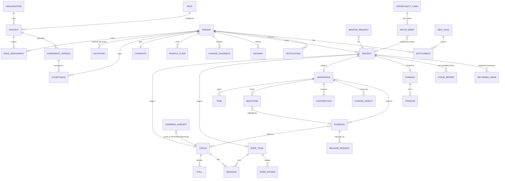

---

# 14. Errors, empty, loading, success and edge cases

## 14.1 Error and denial handling

| Case                                                    | What happens                                                                                           |
| ------------------------------------------------------- | ------------------------------------------------------------------------------------------------------ |
| Required field missing / invalid                        | Inline red message under the field; some forms also a summary banner; form stays open with values kept |
| Action not permitted (guard)                            | Modal closes; red toast "Not permitted: <reason>"; audit entry with result denied; nothing changes     |
| Route not permitted                                     | Access-denied panel with effective permission explanation; audited                                     |
| Record not found (stale link)                           | Empty state "Project not found" / "Circle not found" / "Not found"                                     |
| Screen render error                                     | Red banner "Something went wrong on this screen" with the error message (no crash of the whole app)    |
| AI unavailable                                          | Banners on AI entry points; requests "fail safely" (audited); drafting disabled; manual path offered   |
| AI consent off                                          | AI buttons disabled or denied with "AI processing consent is not granted"; manual path offered         |
| AI quota reached                                        | Ask PHOENIX: "AI is unavailable. Your request was not processed."                                      |
| Prompt injection / other people's data in Ask PHOENIX   | Refused answer + audit "AI request refused"                                                            |
| Invalid invitation                                      | Denial screen, audited, request-new-invitation form                                                    |
| File checks                                             | Over 100 MB, video, executable, simulated malware (see 11.6)                                           |
| Payment failure / cancel                                | No entitlement; red / amber toast                                                                      |
| Duplicate webhook                                       | Stored as duplicate; ignored ("Duplicate — ignored")                                                   |
| Funding tranche out of order                            | Release blocked with reason                                                                            |
| Milestone without approved evidence                     | Validation denied                                                                                      |
| Brief with blockers                                     | Approve disabled; guard also denies                                                                    |
| Sponsor added to a Room                                 | Declined join record + error toast                                                                     |
| Research / institutional join without consent / mandate | Denied                                                                                                 |
| Seat pool full                                          | Denied                                                                                                 |
| Card expiry passed                                      | Cannot publish/resume; auto-expires and closes pending briefs                                          |
| Circle paused / closed                                  | Read-only banners; chat locked; posting denied                                                         |
| Mentor exited / member removed                          | Loses access (deniedView)                                                                              |
| Agreement not accepted                                  | Only the agreement screen is available in that context                                                 |

## 14.2 Empty states (examples)

"You have no projects yet…", "No Circles", "No Rope Teams. One is formed when a mentor accepts a Mentor Request.", "No Action Rooms yet.", "No cards match these filters.", "No Match Briefs.", "No evidence here yet.", "No records.", "No Harvests yet.", "No funding", "No pitches", "No initiatives published yet", "Nothing waiting. Well done." (inbox), "You are all caught up" (pending decisions), "No conversations" / "Choose a conversation" / "No messages yet", "Nothing shared for review yet", "No contributions yet", "No milestones yet", "No updates yet", "No reports yet.", "No concerns raised", "No notifications yet", "You are up to date" (next action), "No projects match these filters" (sponsor).

## 14.3 Loading states

Data is local, so screens render instantly. A **busy overlay** with spinner appears only for the simulated AI Circle summary (~0.7 s). There are no skeleton loaders.

## 14.4 Success feedback

Green toasts (e.g. "Submitted for Faculty/Steward review.", "Agreement accepted. Receipt stored.", "Vote recorded.", "Accepted. You have joined the Rope Team.", "Report sent to …", "Returned to … Work moves forward again once it is resolved.", "Payment verified. Entitlement active.", "Milestone recorded as achieved."), state pills changing colour, system messages in chat, and notifications for other parties.

## 14.5 Edge cases worth knowing

1. **Browser Back** does not navigate between screens; it may leave the prototype page.
2. **Data is per browser**; two people cannot collaborate across devices.
3. **Locked-account banner is cosmetic**; correct password still works.
4. **Keep me signed in** has no effect.
5. **Forgot password** never changes the password.
6. **Participant-created Circles** start Pending Review and are assigned to the first Facilitator in the context.
7. **Default stewards**: if a project has none when submitted, all active Facilitators in the context become stewards.
8. **Skipped Rope Team** (support path Circle → Action Room) is shown as "Skipped" on the journey; tranche 2 (Rope Team) can still be released because stage ordering is used (OI-12 open).
9. **Votes can be changed** until the poll closes; the poll closes automatically when all eligible voters have voted or the closing date passes (checked whenever any signed-in screen renders).
10. **Facilitators and mentors cannot vote** unless listed as Member/Project owner.
11. **Open Mentor Requests**: the first mentor to accept takes it; declining mentors stop seeing it.
12. **Mentor exit** removes the mentor's access; Rope Team continues with no mentor until a new request is accepted (new mentor becomes the Rope Team mentor).
13. **Final approval** closes Room and Rope Team and completes the Circle even without a Harvest (toast reminds about the Harvest).
14. **Room creation from a project** invites the Circle's Members (not mentors/partners) and queued collaborators.
15. **Org Rep invitations** cannot target Sponsor or Programme Administrator roles or other contexts.
16. **Non-material agreement changes** silently carry acceptances forward with auto receipts.
17. **Withdrawing matching consent** blocks open briefs involving the person; re-granting unblocks them.
18. **Withdrawing AI consent** cancels the person's Draft/Queued AI jobs.
19. **Emergency pause** matches the Circle by name inside the incident's "Where" text; if no match, nothing is paused (only the flag is set).
20. **Audit export** downloads metrics JSON, not audit rows.
21. **Configuration restore** of seed versions has no snapshot (log only).
22. **Notifications are never deleted**; only marked read.
23. **Reset demo data** discards everything including registered users.
24. **Dates**: due/closing dates must be today or later; sessions may be in the past; "Overdue" tags compare with the device date, so seed items may already appear overdue.
25. **Two contexts for one person**: records from one context are hidden in the other (`ctx` filter), but some lists (e.g. Evidence review queue, Match Briefs for A) are not context-filtered (Section 18).

---

# 15. Navigation map

## 15.1 Screen-to-screen table

| From                   | To (via)                                                                                                                                   |
| ---------------------- | ------------------------------------------------------------------------------------------------------------------------------------------ |
| Sign in                | Register; Invitation; Forgot password; LMS arrival; Two-step verification; Verify email; My PHOENIX / Onboarding / Pending (after sign-in) |
| Register               | Verify email; Sign in (existing email)                                                                                                     |
| Invitation             | Register; Sign in                                                                                                                          |
| Verify email           | My PHOENIX (via gates)                                                                                                                     |
| Onboarding             | My PHOENIX; Sign in (Save and exit)                                                                                                        |
| Top bar                | Role switcher → My PHOENIX; Ask PHOENIX; Notifications → any target; Profile                                                               |
| My PHOENIX             | Every module via tiles, cards, Next action, header buttons                                                                                 |
| Projects               | Define a project; Project detail                                                                                                           |
| Project detail         | Sections editor; Circle; Rope Team; Room; Funding; Find collaborator → Match Brief                                                         |
| Circles                | Circle detail                                                                                                                              |
| Circle detail          | Messages (Open in Messages); Project; Rope Team (via journey); New card (from Circle); Harvest; Room                                       |
| Rope Teams             | Rope Team detail                                                                                                                           |
| Rope Team detail       | Messages; Circle; Project; Room (create)                                                                                                   |
| Action Rooms*             | Room detail                                                                                                                                |
| Room detail            | Evidence (upload / detail); Project; Rope Team / Circle (returns, journey); Harvest                                                        |
| Messages               | Circle / Rope Team (Open …)                                                                                                                |
| Opportunities          | New card; Card detail                                                                                                                      |
| Card detail            | Edit card; Match Brief (nominate); Room create (Route B)                                                                                   |
| Match Briefs           | Match detail → Room create/link                                                                                                            |
| Evidence               | Upload evidence; Evidence detail                                                                                                           |
| Repository             | Record details (modal)                                                                                                                     |
| Harvests               | Harvest detail                                                                                                                             |
| Funding                | Profile (edit interests) — via link text; Billing (initiatives)                                                                            |
| Review inbox           | Any item's screen                                                                                                                          |
| Admin / Org / Platform | Internal tabs; Audit                                                                                                                       |
| Notifications          | Target screen of each notification                                                                                                         |

## 15.2 Navigation diagram

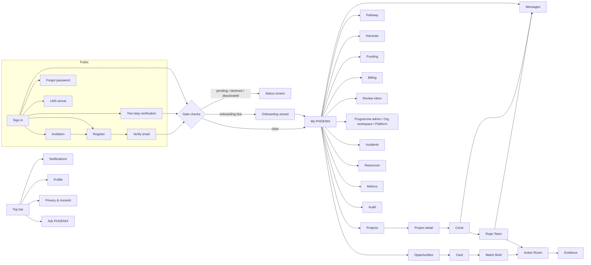

---

# 16. Flowcharts

## 16.1 Overall product flow

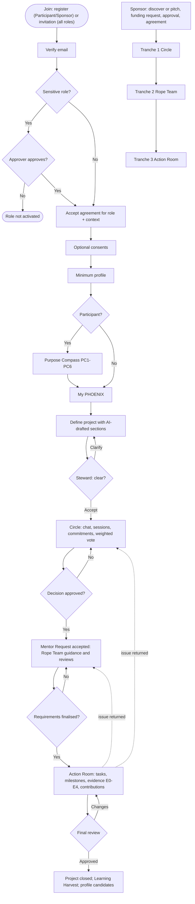

## 16.2 Participant

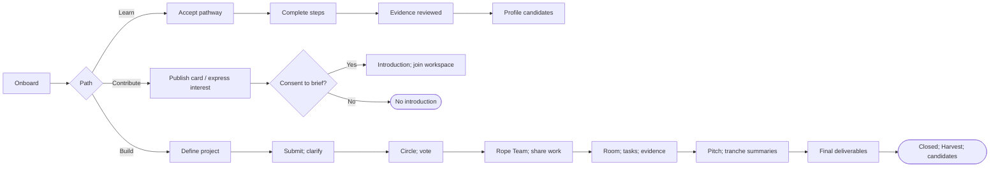

## 16.3 Facilitator / Steward

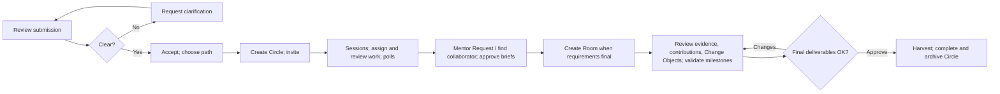

## 16.4 Mentor

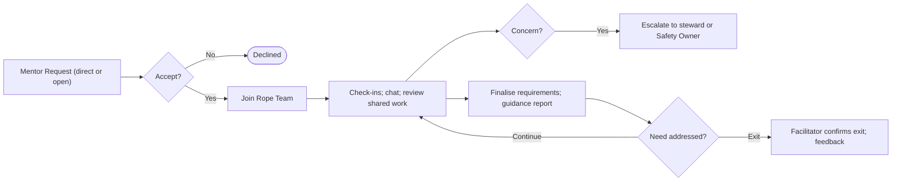

## 16.5 Partner / Collaborator

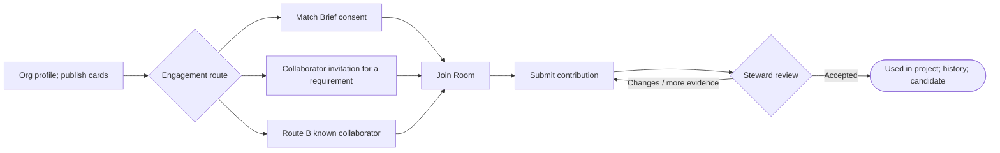

## 16.6 Organization Representative, Sponsor, Programme Admin, Platform Admin

```mermaid
flowchart TB
  subgraph ORG["Organization Representative"]
    O1["Invite cohort"] --> O2["Approve roles; mandates; bundles"] --> O3["Configure labels and templates"] --> O4["Projects and spaces; institutional Room"] --> O5["Seats; package; cohort request"] --> O6["Reports; exports; cross-org request"]
  end
  subgraph SPN["Sponsor"]
    S1["Interests"] --> S2["Discover or pitches"] --> S3["Funding request"] --> S4["Finance Owner approves"] --> S5["Sign agreement"] --> S6["Release tranche; review summary"] --> S7["Approved outcomes; transactions"]
    S1 --> S8["Seats or donation; checkout"] --> S9["Seat pool; assign seats"]
  end
  subgraph PA["Programme Administrator"]
    A1["Invitations; role approvals"] --> A2["Agreements; consent purposes"] --> A3["Packs; templates; voting; metrics"] --> A4["Review inbox; incidents; disclosure review"] --> A5["Products; entitlements; seat pools; payments"] --> A6["Announcements; initiatives; reports"]
  end
  subgraph PLT["Platform Administrator"]
    T1["Contexts; administrators"] --> T2["Integrations; providers"] --> T3["Security; sessions; keys"] --> T4["Health; alerts; backups; LMS"]
  end
```

## 16.7 Project stage model with gates and returns

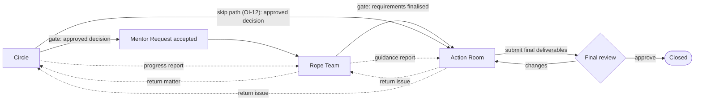

## 16.8 Chat message lifecycle

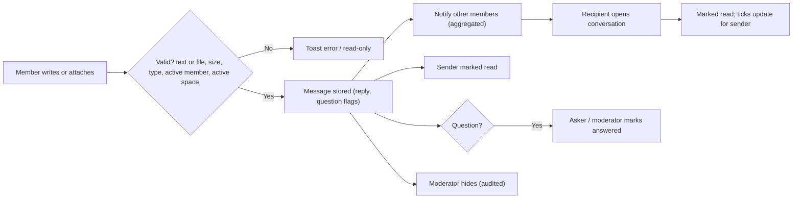

## 16.9 Matching (F06)

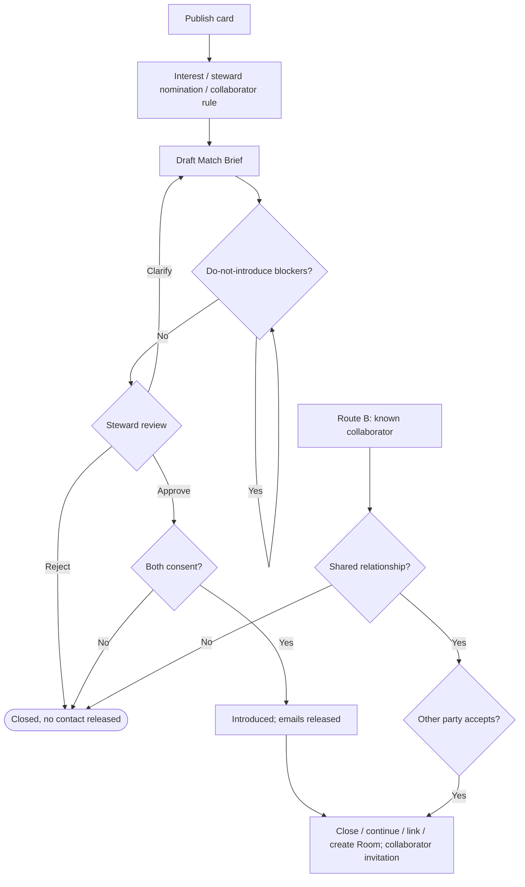

## 16.10 Evidence (F08)

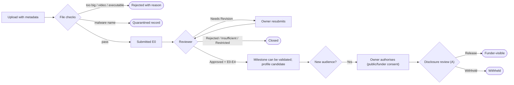

## 16.11 Funding tranches

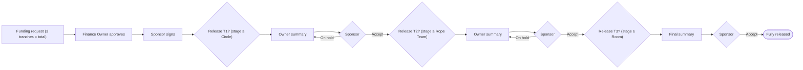

## 16.12 Incident (F11)

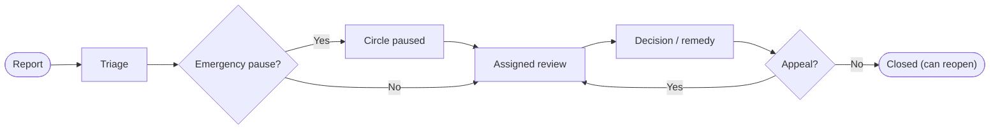

---

# 17. Prototype vs intended functionality

Status key: **Impl** implemented · **Sim** simulated · **Part** partially implemented · **UI** UI-only · **Miss** missing · **Undef** behaviour undefined in the spec (open item) · **N/A** deliberately out of scope.

## 17.1 Platform-level

| Spec requirement                                                                                    | Status | Notes                                                                                                                                                                                                                                         |
| --------------------------------------------------------------------------------------------------- | ------ | --------------------------------------------------------------------------------------------------------------------------------------------------------------------------------------------------------------------------------------------- |
| Responsive PWA (1.2)                                                                                | Part   | Responsive layouts implemented; no PWA manifest, service worker or offline mode                                                                                                                                                               |
| Multi-tenant isolation by context (3.6)                                                             | Part   | Most lists filter by the active context; some admin/reviewer lists (evidence review queue, Match Briefs for A, incidents for the Safety Owner) are not context-filtered                                                                       |
| Service-layer authorization (E01)                                                                   | Sim    | Guard layer enforces permissions in the action layer, but it runs in the browser                                                                                                                                                              |
| One common domain and login (3.6)                                                                   | Impl   | Single sign-in screen; no subdomains                                                                                                                                                                                                          |
| Shared services: notifications, review queues, audit, policy checks, AI gateway, entitlements (3.7) | Part   | All present in simplified, local form                                                                                                                                                                                                         |
| Environments dev/staging/production (PFA-03, 6.8)                                                   | Miss   | Not represented                                                                                                                                                                                                                               |
| Next-action authority: Recommend → Accept/Approve → Execute (3.4)                                   | Impl   | Mentors/facilitators propose pathways and the participant accepts; members propose tasks and the lead approves; reviewers validate evidence-linked milestones; the dashboard Next action is rule-derived, not AI-ranked                       |
| Delegated authority levels (3.3)                                                                    | Part   | Platform Admin assigns administrators but has no content access; Org Rep cannot grant high-trust bundles; Circle facilitator assigns member roles; Programme Admin "eligibility for governance roles" is not modelled separately from bundles |
| Effective permission formula (3.5)                                                                  | Part   | Shown on the access-denied panel; role, context, mandate (some join cases), object ownership, consent (AI, matching, research, release) and lifecycle state are checked; entitlement never gates features in the prototype                    |
| Pathway step requires ≥ 1 Circle or Action activity (F04)                                           | Part   | Steps are self-marked complete by the participant; no automatic link to activities or evidence                                                                                                                                                |
| Default field visibility (Table 14) and Purpose Compass viewer rules (Table 13)                     | Part   | Visibility hints on fields; claims default to "Only me"; other-person profile view hides raw Compass and hurdle and shows the goal only to F/M; not every Table 13/14 cell is enforced                                                        |

## 17.2 By epic

| Epic / feature                                                                                                                     | Status   | Notes                                                                                                                                          |
| ---------------------------------------------------------------------------------------------------------------------------------- | -------- | ---------------------------------------------------------------------------------------------------------------------------------------------- |
| **E01** Invitations (create, bulk ≤ 1,000, validity, single-use, statuses)                                                         | Impl     | Bulk = pasted list; no CSV file upload; emails simulated                                                                                       |
| E01 Direct registration (D-01)                                                                                                     | Impl     | Participant/Sponsor only                                                                                                                       |
| E01 Email verification                                                                                                             | Sim      | Buttons simulate links                                                                                                                         |
| E01 Existing email adds scoped role                                                                                                | Impl     | via sign-in                                                                                                                                    |
| E01 Role approval + history                                                                                                        | Impl     |                                                                                                                                                |
| E01 Role scope and expiry                                                                                                          | Part     | Mandate has a valid-until date but does not auto-expire; assignments have no end date                                                          |
| E01 Audit                                                                                                                          | Impl     |                                                                                                                                                |
| **E02** Versioned agreements, acceptance receipts, re-acceptance on material change                                                | Impl     |                                                                                                                                                |
| E02 Purpose-specific consent (6 purposes)                                                                                          | Impl     | Spec also lists "profile visibility" and "recording/transcript processing" as purposes — handled as claim visibility and record consent fields |
| E02 Withdrawal effects                                                                                                             | Part     | AI jobs cancelled, matching blocked; "derivatives, indexes, caches restricted pending re-review" not modelled                                  |
| E02 Visibility levels (private, named users, Circle, Room, organisation, aggregate)                                                | Part     | Claims: 5 options (Named users has no picker); evidence: 4 options                                                                             |
| E02 Permission grants with validity                                                                                                | Miss     |                                                                                                                                                |
| E02 Correction and revocation                                                                                                      | Part     | Claims corrected/revoked; privacy requests are recorded and marked complete manually                                                           |
| E02 Governance console                                                                                                             | Part     | Spread across Programme admin tabs                                                                                                             |
| E02 Governance cases                                                                                                               | Impl     | Incidents (F11)                                                                                                                                |
| **E03** Claims with provenance labels                                                                                              | Impl     | Imported provenance not used (Phase 2)                                                                                                         |
| E03 Profile versioning, compare versions                                                                                           | Part     | Version history table; no side-by-side version comparison or immutable snapshots                                                               |
| E03 Purpose Compass PC1–PC12                                                                                                       | Impl     |                                                                                                                                                |
| E03 Purpose pathway                                                                                                                | Impl     | Template-based; no "goals/hurdles/context" pathway editor                                                                                      |
| E03 User control (accept/edit/reject/defer/correct)                                                                                | Impl     |                                                                                                                                                |
| E03 Collaboration history                                                                                                          | Impl     | Simple table                                                                                                                                   |
| E03 Community context layer                                                                                                        | **Miss** | Not implemented                                                                                                                                |
| **E04** Circle creation, membership, sessions, collaboration, weighted voting, action transition, lifecycle, pause/repair, closure | Impl     | Draft state unused                                                                                                                             |
| E04 Real-time chat with media (D-04)                                                                                               | Part     | See Section 10.8                                                                                                                               |
| E04 Rope Team: charter, membership, mentor, chat, support requests                                                                 | Impl     |                                                                                                                                                |
| E04 Participant support indicators                                                                                                 | Part     | Seeded/static values; not computed from activity; new Rope Teams start with defaults                                                           |
| E04 Concern and escalation                                                                                                         | Impl     |                                                                                                                                                |
| E04 Linking Rope Teams to pathways/opportunities                                                                                   | Part     | Linked to Circle/project/Room only                                                                                                             |
| **E05** Need/Asset/Offer/Opportunity cards, lifecycle, owner visibility, withdrawal, expiry                                        | Impl     |                                                                                                                                                |
| E05 Discovery filters (type, category, availability, status, visibility, purpose, organisation, project)                           | Part     | Type, status, category, text search, sort                                                                                                      |
| E05 Purpose linkage                                                                                                                | Part     | Link to project; created-from Circle                                                                                                           |
| **E06** Rule-based matching, fit dimensions, gaps, Match Brief, AI rationale                                                       | Part     | Simple rules (interest, nomination, collaborator keyword match); rationale partly canned                                                       |
| E06 Steward review, mutual consent, introduction                                                                                   | Impl     |                                                                                                                                                |
| E06 Outcomes                                                                                                                       | Part     | "Conversation completed" outcome missing                                                                                                       |
| E06 Direct collaboration (Route B)                                                                                                 | Impl     |                                                                                                                                                |
| **E07** Workspace creation with primary origin and related objects                                                                 | Impl     |                                                                                                                                                |
| E07 Minimum execution features                                                                                                     | Impl     |                                                                                                                                                |
| E07 Change Object composer and lifecycle                                                                                           | Impl     |                                                                                                                                                |
| E07 Record Passport-lite                                                                                                           | Part     | Governance metadata shown on evidence and repository records; no unified passport panel                                                        |
| E07 Extra approval for flagged workspaces; join rules                                                                              | Impl     |                                                                                                                                                |
| **E08** Repository records, metadata, authorised upload, consent control, search, versioning                                       | Part     | One linked space per upload; corrected versions do not take a file                                                                             |
| E08 Retention and authorised deletion                                                                                              | Part     | Retention displayed; deletion request → admin approval                                                                                         |
| E08 Storage management, quarantine                                                                                                 | Part     | Quota banner; simulated quarantine                                                                                                             |
| E08 Export                                                                                                                         | Sim      |                                                                                                                                                |
| **E09** Evidence locker, metadata, review (status + E0–E4 + limitations), taxonomy A–J, negative findings                          | Impl     |                                                                                                                                                |
| E09 Release decisions and disclosure review                                                                                        | Impl     |                                                                                                                                                |
| E09 Portfolio aggregation                                                                                                          | Miss     | No portfolio view (approved evidence becomes profile candidates)                                                                               |
| E09 Learning Harvest (8-section template, AI draft, review, versions, separate release)                                            | Impl     |                                                                                                                                                |
| E09 Starter metrics registry and dashboard                                                                                         | Part     | 10 live metrics; registry lacks version/evidence-level fields; no missing-data states beyond "No data yet"                                     |
| **E10** AI gateway checks                                                                                                          | Sim      | Consent, availability, quota, injection and other-person checks only                                                                           |
| E10 Approved-source Q&A                                                                                                            | Sim      | Keyword-based canned answers                                                                                                                   |
| E10 Requirement gathering, AI Harvest, match rationale, profile evolution proposals                                                | Sim      | Template-generated                                                                                                                             |
| E10 Human review queue (Class B/C)                                                                                                 | Impl     |                                                                                                                                                |
| E10 Evidence narrative                                                                                                             | **Miss** |                                                                                                                                                |
| E10 Transparency and audit (AI job log)                                                                                            | Impl     | Prompt/version/tools not recorded                                                                                                              |
| E10 Resilience (fail safely)                                                                                                       | Impl     | Outage simulation                                                                                                                              |
| **E11** Products, payment types, hosted checkout, webhooks, entitlements, seats, billing portal, history, admin grant/revoke       | Sim      | Provider simulated                                                                                                                             |
| E11 Sponsor project funding (D-02)                                                                                                 | Impl     | Money movement not modelled (OI-03)                                                                                                            |
| E11 Outcome bundles                                                                                                                | UI       | Described in spec; not configurable entities                                                                                                   |
| **E12** User administration                                                                                                        | Impl     |                                                                                                                                                |
| E12 Agreement and consent administration                                                                                           | Impl     | Consent purposes view-only                                                                                                                     |
| E12 Collaboration templates                                                                                                        | Part     | Free-text template descriptions only                                                                                                           |
| E12 Profile configuration (fields, Compass questions, milestones, hurdles)                                                         | **Miss** | Only "ask optional PC7–PC12" toggle                                                                                                            |
| E12 Opportunity configuration                                                                                                      | Part     | Categories only                                                                                                                                |
| E12 Evidence configuration                                                                                                         | **Miss** |                                                                                                                                                |
| E12 Metrics configuration                                                                                                          | Part     | Hide/show                                                                                                                                      |
| E12 AI administration                                                                                                              | Part     | Sources and job log; no prompt/model registry                                                                                                  |
| E12 Payment administration                                                                                                         | Impl     |                                                                                                                                                |
| E12 Notifications (transactional email + in-app; templates)                                                                        | Part     | In-app only; no template management                                                                                                            |
| E12 Reports and exports                                                                                                            | Sim      | Small JSON exports                                                                                                                             |
| E12 Audit views                                                                                                                    | Impl     |                                                                                                                                                |
| E12 Configuration versions export/restore                                                                                          | Part     | Snapshots only for versions saved in the prototype                                                                                             |
| E12 Use-case packs incl. fourth pack without code                                                                                  | Part     | Activation and workspace label work; Circle/Rope Team labels stored but **not applied**; flows/evidence types/metrics per pack not enforced    |
| **7.13** LMS deep links                                                                                                            | Part     | Arrival screen, configuration, test; no routing to the deep-link target or return link                                                         |
| **Section 9** My PHOENIX components and role emphasis                                                                              | Impl     |                                                                                                                                                |
| **Section 5.3** Stage model, forward/backward movement, accountability reports, lineage                                            | Impl     |                                                                                                                                                |
| **Section 5.4** Weighted voting                                                                                                    | Impl     | Relative weights (OI-01)                                                                                                                       |
| **Section 5.5** Sponsor-visible information and tracking                                                                           | Impl     |                                                                                                                                                |
| **Section 5.6** Project policies (OI-06), peer ratings (OI-07), AI suggestions everywhere                                          | N/A      | Pending confirmation; not built                                                                                                                |

---

# 18. Missing requirements, ambiguities and assumptions

## 18.1 Open items in the specification and how the prototype treats them

| Sr. No. | Topic                                                   | Prototype behaviour (assumption shown on screen where relevant)                                                                                                                                                                                                                                                                      |
| ------- | ------------------------------------------------------- | ------------------------------------------------------------------------------------------------------------------------------------------------------------------------------------------------------------------------------------------------------------------------------------------------------------------------------------ |
| 01      | Weighted-voting arithmetic                              | Relative weights: owner 2, member 1; approval = leading option weight ÷ total eligible weight ≥ 60%; eligible = Active Project owner + Members (facilitators, mentors, observers excluded); abstentions count as not approving; no quorum; poll closes when all eligible voted, at the closing date, or manually. Configurable by A. |
| 02      | Tranche split, triggers, rejection, withdrawal, refunds | Sponsor sets any split summing to the total; release requires the previous summary accepted and the project to have reached that stage; "On hold" for more information; no withdrawal/refund path.                                                                                                                                   |
| 03      | How funds move                                          | PHOENIX only records commitments and releases.                                                                                                                                                                                                                                                                                       |
| 04      | Self-registered context, verification, abuse controls   | User picks an open programme; no spam/abuse controls.                                                                                                                                                                                                                                                                                |
| 05      | Chat governance                                         | See Section 10.8; Rooms have no chat.                                                                                                                                                                                                                                                                                                |
| 06      | Project-owner policies                                  | Not built.                                                                                                                                                                                                                                                                                                                           |
| 07      | Peer ratings                                            | Not built.                                                                                                                                                                                                                                                                                                                           |
| 08      | Agreement lifecycle details                             | Generic agreement types, manual material flag.                                                                                                                                                                                                                                                                                       |
| 09      | Configurable vs locked                                  | Lock panel lists platform-controlled items; only a few items configurable.                                                                                                                                                                                                                                                           |
| 10      | Pending AI uses                                         | Not built (no Partner opportunity drafting, Org Rep report drafts, etc.).                                                                                                                                                                                                                                                            |
| 11      | Product-validation measures                             | Not in the metrics registry.                                                                                                                                                                                                                                                                                                         |
| 12      | Skipping the Rope Team                                  | Support path "Circle → Action Room" allowed; journey shows "Skipped"; tranche logic uses stage order.                                                                                                                                                                                                                                  |
| 13      | Per-tenant branding                                     | Not built (workspace label only).                                                                                                                                                                                                                                                                                                    |
| 14      | Who assigns Organization Administrators                 | Both: Programme Admin invites Org Reps; Platform Admin can assign Org Rep or Programme Admin to a context.                                                                                                                                                                                                                           |
| 15      | Mentor engagement model                                 | Both direct requests and open requests visible to all active mentors in the context (no skill filtering).                                                                                                                                                                                                                            |

## 18.2 Prototype assumptions not stated in the specification (review with WSS)

1. **Circle → Rope Team gate** requires at least one recorded Circle decision (poll-approved or facilitator-recorded). Spec: "when the matter is discussed and agreed".
2. **Rope Team → Action Room gate** requires the mentor to mark requirements finalised; only a Faculty/Steward (or A) creates the Room from there.
3. **Rope Team owner** = project owner; **Circle owner** = project owner. Reports can also be sent by the Circle facilitator or Rope Team mentor.
4. **Rope Team members** on creation: project owner, Circle Members, the accepting mentor and the requesting facilitator.
5. **Assigned responsibilities** in Circles go through facilitator review before counting as done (spec: Fig. 8 "Work acceptable?").
6. **Mentor exit** needs facilitator confirmation; exited mentors lose access.
7. **Collaborator matching rule**: keyword overlap between the requirement and the partner's organisation profile, active offers and shared claims; missing matching consent is a blocker; missing mandate is a gap (extra approval at join time).
8. **Collaborator invitation** goes to the project's Room (queued if none yet).
9. **Sponsor matching** uses the project's "areas of interest" tags vs the sponsor's funding interests (case-insensitive exact match).
10. **Default stewards** = all active facilitators in the context when none assigned.
11. **Participant-created Circle facilitator** = first facilitator in the context.
12. **Final approval** auto-closes Room and Rope Team and completes the Circle.
13. **Evidence approval** creates a "Capability" profile candidate from the claim text.
14. **One-time pass** entitlement lasts 3 months; invoice seat pools default to 10 seats until 30 Sep 2027.
15. **Password policy** ≥ 10 characters with a digit.
16. **Lock after 5 failures** is informational only.
17. **"Inactive users"** for the Programme Admin = active assignments with incomplete profile or compass.
18. **Programme purpose** text on the facilitator dashboard is fixed sample copy.
19. **Notifications** are in-app only.

## 18.3 Known limitations and defects found while documenting

| #   | Item                                                                                                               | Impact                                                                           | Suggested owner                   |
| --- | ------------------------------------------------------------------------------------------------------------------ | -------------------------------------------------------------------------------- | --------------------------------- |
| 1   | Circle and Rope Team labels from pack configuration are not applied                                                | Seva "Seva Circle" label never appears                                           | Developer                         |
| 2   | Audit **Export** downloads metrics JSON, not audit entries                                                         | Misleading export                                                                | Developer                         |
| 3   | "Named users" visibility has no way to name users                                                                  | Option has no effect                                                             | Product owner + developer         |
| 4   | Browser Back/Forward and deep links do not work                                                                    | Demo navigation                                                                  | Developer (if needed for testing) |
| 5   | Facilitator can reach the project intake route by internal navigation (matrix gives "V") though no button exists   | Low                                                                              | Developer                         |
| 6   | Some lists are not context-filtered (evidence review queue, A's Match Briefs, Safety Owner incidents)              | Cross-context visibility for multi-context users                                 | Developer + Trust/Data Steward    |
| 7   | Repository upload links one space only; corrected versions take no file                                            | Partial E08                                                                      | Developer                         |
| 8   | Agreement upload and resource upload ignore the file                                                               | UI-only                                                                          | —                                 |
| 9   | Revoke all sessions does not sign anyone out                                                                       | Simulated                                                                        | —                                 |
| 10  | Emergency pause matches the Circle by name in free text                                                            | Fragile                                                                          | Developer                         |
| 11  | Org Rep cannot create projects (spec 6.5: "create projects and their Circle, Rope Team and Action Room structure") | Partial; Org Rep can create Circles and institutional Rooms                      | Product owner                     |
| 12  | Programme Admin "define who is eligible for governance roles" is represented only by bundle assignment             | Partial                                                                          | Product owner                     |
| 13  | Partner "invite additional partners, subject to approval" (6.4)                                                    | Partners can request Room joins only via a lead; no partner-initiated invitation | Product owner                     |
| 14  | Org Rep "share aggregate evidence with funders and stakeholders"                                                   | Only exports                                                                     | Product owner                     |
| 15  | Sponsor "review meetings or showcases"                                                                             | Outside platform by spec — not represented                                       | —                                 |
| 16  | PGA-10 analyse feedback and usage patterns                                                                         | No analytics view                                                                | Product owner                     |
| 17  | Per-message chat attachments are not stored or scanned                                                             | Simulated                                                                        | Developer                         |
| 18  | Harvest "Released" is a separate release field, not a Harvest state                                                | Naming difference vs spec                                                        | —                                 |

---

# 19. QA checklist

Use a fresh state (**Reset demo data**) before each section. Expected results are written so a tester who has never seen the prototype can verify them.

## 19.1 Access and onboarding

- [ ] Sign in with a wrong password → red "Email or password is incorrect"; audit entry (check as Priya).
- [ ] 5 wrong attempts → "Account temporarily locked" banner (note: correct password still works — known limitation).
- [ ] Sign in as priya@demo.phoenix / demo1234 → two-step screen; 111111 → error; 123456 → dashboard.
- [ ] One-click demo account → no two-step screen.
- [ ] Register a new Participant with password "short" → policy error; mismatched confirm → error; valid → Verify email screen.
- [ ] Register with mary@demo.phoenix → "already has a PHOENIX account" → Sign in adds the role.
- [ ] Invitation screen: each demo token shows the correct state (valid, expired, revoked, used, existing account, unknown).
- [ ] Request a new invitation → "Request sent"; Programme Admin gets a notification.
- [ ] Verify (simulated) → dashboard or onboarding; expired link → resend.
- [ ] Sign in as Grace (pending mentor) → pending screen; approve her as Priya → Grace reaches onboarding.
- [ ] Sign in as Ravi → onboarding resumes at Purpose Compass; "Save and finish later" logs out; returning resumes at the first unanswered question.
- [ ] Onboarding progress bar matches "% complete".
- [ ] Agreement "Not now" → stays on agreement; "Compare" modal shows versions.
- [ ] Publish Participant Agreement v3 (material) as Priya → Mary is routed to re-accept on next screen.

## 19.2 Navigation and shell

- [ ] Each role's sidebar matches Section 2.2; Messages appears only for members of a Circle/Rope Team.
- [ ] Mary's context chip opens the switcher; switching to Riverside Seva Hub changes the workspace label to "Action Room".
- [ ] Phone width: bottom bar + More menu (left-aligned items, includes Ask PHOENIX and Log out).
- [ ] Tablet width: icon rail with badges on icon corners; wide tables keep the action column visible.
- [ ] Access-denied panel when opening a forbidden module (e.g. Sponsor → Circles via a notification link).
- [ ] Toasts auto-dismiss and can be closed.

## 19.3 Projects and Circle stage

- [ ] As Mary, Start a project with a 20-character description → "Enter at least 40 characters."
- [ ] Draft sections (AI on) → 8 AI drafts; Accept all → submit enabled only after both confirmations.
- [ ] AI consent off (Privacy) → intake shows "AI processing is off", sections empty.
- [ ] As Asha, request clarification (< 10 chars → error) → Mary sees banner and Next action; resubmit.
- [ ] As Daniel, cannot accept another's project (denied).
- [ ] As Asha, accept → Create Circle → Circle Active, project stage Circle, journey shows Circle current.
- [ ] As a participant, create a Circle → Pending Review; facilitator approves.
- [ ] Request to join a Circle → Pending shown to requester; facilitator and project owner notified; decline → Request to join again; approve in Members.
- [ ] Participant with an accepted project creates its Circle → Active, steward becomes facilitator; member picker search and chips work.
- [ ] Card from a Circle defaults to Circle members; non-members cannot see it; Named people widens it; interest → brief for the Circle facilitator.
- [ ] Rope Team: mentor sees no Invite and is refused if attempted; owner and steward can invite; join request approved by owner.
- [ ] Space roles: Observer cannot post or add records; room Reviewer reviews contributions, Member submits.
- [ ] Mentor Request Details shows project, need and time commitment; accept from Details.
- [ ] Pathway: complete a step with note and files; View activity shows them for participant and facilitator; Return needs a reason; Revise and re-propose.
- [ ] Evidence grouped by project; project page Evidence card.
- [ ] Assign a responsibility → assignee "Submit as done" → Awaiting review → Accept / Request changes.
- [ ] Poll with one option → error; closing date in the past → error.
- [ ] Owner + member vote → poll auto-closes; approved result recorded as decision; system message in chat.
- [ ] Set a poll's closing date in the past (re-poll) and revisit → poll closes automatically.
- [ ] Facilitator/mentor have no Vote button.
- [ ] Pause and repair → members read-only, chat locked; Resume.
- [ ] Complete Circle without Harvest → warning and Harvest modal; with approved Harvest → Completed; Archive asks confirmation.
- [ ] Concern: anonymous option; Escalate creates an incident visible to Priya.

## 19.4 Rope Team stage

- [ ] Circle gate disabled until a decision exists.
- [ ] Mentor Request (direct) → Samuel accepts → Rope Team formed with Circle members; stage Rope Team.
- [ ] Open Mentor Request → visible to mentors; a declining mentor stops seeing it; first acceptor takes it.
- [ ] Share work for review (participant) → mentor reviews → outcome and contribution recorded; "Changes recommended" appears in participant Next action until resubmitted.
- [ ] Check-in types; support request lifecycle; private notes hidden from participants.
- [ ] Indicators visible only to mentor and facilitator.
- [ ] Room gate disabled until requirements finalised; mentor finalises → facilitator can create the Room.
- [ ] Mentor proposes exit → facilitator confirms → mentor loses access.
- [ ] Close Rope Team requires an outcome; becomes read-only.
- [ ] Stage reports: Circle → Rope Team, Rope Team → Room appear on both sides and on the project.

## 19.5 Action Room stage

- [ ] Room with an approval flag → Pending approval; F/A approve or decline (reason required → Draft).
- [ ] Participant proposes a Room → Proposed; authorised creator activates.
- [ ] Overview KPIs, timeline, gate, updates feed work; empty update → warning.
- [ ] Task board: drag own task to Done; member cannot drag others' tasks; owner drags a proposal into To do (approved); reorder; filters; list view; task detail edits.
- [ ] My tasks on My PHOENIX lists assigned tasks with overdue flag; Open task opens the board and the task.
- [ ] Action Room chat: post, notification, unread in Messages, owner hides a message, non-member denied.
- [ ] Member proposes a task → lead approves/declines.
- [ ] Validate milestone without approved evidence → denied; after approval → Achieved and candidate created.
- [ ] Return issue to Rope Team / Circle → appears in target; resolve → source notified, journey strip clears.
- [ ] Invite a Sponsor → declined record; research join without consent → denied; institutional join without mandate → denied.
- [ ] Change Object full lifecycle and revision.
- [ ] Contribution submit → steward review (changes / more evidence / accept with "used in").
- [ ] Link by reference adds a learning activity to Charter & lineage.
- [ ] Submit final deliverables shows readiness; steward Request changes → back to Room; Approve → project, Room, Rope Team closed, Circle completed.

## 19.6 Messages

- [ ] Unread badges consistent between sidebar, list, tab and home; opening clears them.
- [ ] Enter sends, Shift+Enter new line; empty send → warning.
- [ ] Attachment chip appears and can be removed; > 100 MB rejected; .exe rejected.
- [ ] Reply quote; question toggle; mark answered; open-questions filter.
- [ ] Moderator hide (Asha in her Circle) replaces text; non-moderator has no Hide.
- [ ] Ticks: send as Mary, switch to Daniel and open, switch back → double tick and "Seen by Daniel".
- [ ] Notifications aggregate "N new messages".
- [ ] Paused/closed/non-member → read-only line.
- [ ] Phone: list ↔ conversation with back button.

## 19.7 Opportunities and matching

- [ ] Card validation (description < 20, past expiry); "Only me" forces Draft.
- [ ] Express interest → brief In steward review; steward approve → consent → Introduced (emails shown); decline → Closed, no emails.
- [ ] Brief with blocker (mb3) → Approve disabled.
- [ ] Withdrawing matching consent adds a blocker to open briefs.
- [ ] Route B without shared relationship → denied; with relationship → consent → create/link Room.
- [ ] Find a collaborator (Asha on pr1) → Leah listed with reason → brief → consents → invitation in Room or queued.
- [ ] Expired cards auto-expire and close pending briefs.

## 19.8 Evidence, repository, Harvest

- [ ] Upload validations (no file, > 100 MB, .mp4, .exe, "virus" in name → quarantined).
- [ ] Reviewer cannot review own evidence; review requires limitations.
- [ ] Release blocked without public/funder consent; with consent → disclosure review → Released; sponsor aggregate updates.
- [ ] Repository search; deletion request → A approves → removed, audit kept.
- [ ] Missing recording consent shows AI-blocked banner and is excluded from AI Harvest drafts.
- [ ] Harvest approve requires 4 sections; Reject → Revise and redraft; release request → A approves.

## 19.9 Pathways and profile

- [ ] Propose pathway modes 1/2/3 (Update button switches fields; 3–5 steps).
- [ ] Mode 3 → Reviewer approves/returns.
- [ ] Participant accepts (old one Superseded) or requests change.
- [ ] Complete steps → candidates; all steps → Completed.
- [ ] Claim add/correct/revoke (confirmation)/visibility change → versions.
- [ ] Candidate accept/edit/defer/reject.

## 19.10 Funding and payments

- [ ] Sponsor Discover defaults to interest matches; "All eligible" shows more; filters work.
- [ ] Funding request tranches not summing → error.
- [ ] Release order enforced; summaries; hold; full release toast.
- [ ] Pitch validation (≥ 40 chars).
- [ ] Checkout success/fail/cancel; duplicate webhook ignored; reconcile.
- [ ] Billing portal grace → retry; cancel; refund.
- [ ] Seat assign/suspend/reactivate/release with confirmations; full pool denied; invoice pool activation by Finance Owner.
- [ ] Product draft → release → retire (Finance Owner only).

## 19.11 Administration and platform

- [ ] Invitations: invalid emails listed; duplicates skipped; Org Rep cannot invite Sponsors/Admins.
- [ ] Role approvals; deactivate (confirmation); Org Rep cannot assign high-trust bundles.
- [ ] Pack configuration changes workspace label everywhere; fourth pack activation.
- [ ] Voting rule change affects tallies.
- [ ] Announcement reaches the chosen audience.
- [ ] Cross-org request (Leah) → Priya approves.
- [ ] Cohort request (James) → Tom creates context → James gets an assignment there.
- [ ] Platform: AI outage disables AI entry points everywhere and Ask PHOENIX fails safely; restore.
- [ ] Platform administration has no API keys tab.
- [ ] Audit log shows denied actions with "Rejected" result; Org Rep sees own context only.

## 19.12 Incidents and governance

- [ ] Report incident validation (≥ 10 chars).
- [ ] Safety Owner: triage, emergency pause (Circle becomes Paused/Repair), review, decision, close, reopen.
- [ ] Reporter appeals after decision.

## 19.13 Cross-cutting

- [ ] Every destructive action shows "Please confirm".
- [ ] Every denied action shows "Not permitted: …" and appears in the audit log.
- [ ] No screen shows "Something went wrong" for any demo role.
- [ ] Reset demo data restores everything including project sections.

---

# 20. Feature inventory and glossary

## 20.1 Feature inventory

| Area                     | Features                                                                                                                                                                                                                                                                                                                                                                                          |
| ------------------------ | ------------------------------------------------------------------------------------------------------------------------------------------------------------------------------------------------------------------------------------------------------------------------------------------------------------------------------------------------------------------------------------------------- |
| Access                   | Sign in, demo accounts, MFA, forgot password (sim), register (P/S), invitation tokens, request new invitation, email verification (sim), existing-email role addition, pending/declined/deactivated screens, LMS arrival (part), reset demo data                                                                                                                                                  |
| Onboarding               | Agreement with receipt, compare versions, not now; 6 consents; minimum profile; Purpose Compass with resume                                                                                                                                                                                                                                                                                       |
| Shell                    | Role-aware sidebar, icon rail, bottom bar + More, context switcher, Ask PHOENIX button, notification bell, profile avatar, toasts, modals, confirmations, access-denied panel, busy overlay                                                                                                                                                                                                       |
| Dashboard                | Role-specific My PHOENIX, Next action rules, stat tiles, pending decisions, reminders                                                                                                                                                                                                                                                                                                             |
| Messages                 | Conversation hub, search, filters, unread, day separators, grouping, ticks, seen-by, replies, questions, attachments (sim), system messages, moderation, AI question summary, drafts, Enter-to-send, mobile two-pane                                                                                                                                                                              |
| Profile & privacy        | Basics, claims with provenance and visibility, correct, revoke, add, Purpose Compass, candidates, versions, collaboration history, organisation profile, consent toggles and history, agreements and receipts, data held, personal JSON export, privacy requests                                                                                                                                  |
| Pathways                 | Propose (3 modes), draft own, reviewer approval, accept, change request, step completion, history, template library                                                                                                                                                                                                                                                                               |
| Projects                 | Intake, AI sections, section review, submit, clarify, accept with support path, assign stewards, lifecycle timeline, journey, reports, linked spaces, history, find collaborator, final submission with readiness, final review                                                                                                                                                                   |
| Circles                  | Create (incl. participant Pending Review), invite, join request, members/roles, sessions, responsibilities with review, reflections, concerns (anonymous, escalate), decisions, weighted polls (auto-close), lifecycle (pause/repair, complete with Harvest, archive), AI summary, Opportunity Card from Circle, stage gate, reports, returned issues                                             |
| Rope Teams               | Mentor Requests (direct/open), formation, chat, work reviews, check-ins and sessions, support requests, indicators, private notes, contributions, feedback, suggest opportunity, escalation, finalise requirements, engagement continue/exit, close, project context, gate, reports, returns                                                                                                      |
| Action Rooms             | Create/propose with origin and flags, activation approval, invitations incl. collaborator invitations, overview KPIs and timeline, updates feed, group chat, Kanban task board with drag and drop and My tasks, tasks (proposal/approval), milestones (evidence validation), decisions, risks, dependencies, resources, wins, Change Objects, contributions with review, evidence tab, members and join rules, link by reference, returns, final submission gate |
| Opportunities & matching | Cards (4 types, lifecycle, audience, expiry, save, interest), filters/search/sort, steward nomination, Match Briefs (fit, gaps, blockers, AI tag, edit, clarify, reject, approve), mutual consent, introduction, post-introduction options, Route B, collaborator requirement match                                                                                                               |
| Evidence & records       | Upload with checks, review E0–E4, resubmit, withdraw, releases with disclosure review, aggregate sponsor/org views, repository (upload, search, details, correction, export, deletion workflow, quarantine), Learning Harvest (AI draft, contributions, review, versions, release, profile candidates, redraft)                                                                                   |
| Funding & payments       | Sponsor discovery with interest filters, sponsor brief, pitches, funding request, Finance Owner approval, agreement, 3 tranches with summaries/hold, initiatives, checkout (sim), donation, entitlements, billing portal (sim), seat pools (assign/suspend/reactivate/release, invoice activation), products, grants/revocations, webhooks, reconciliation, institution package request           |
| Administration           | Invitations (bulk), users, role approvals, bundles, mandates, agreements, consent purposes, pathway library, packs and labels, templates, voting rule, config versions, metrics registry, AI sources and job log, announcements, cross-org approvals, sponsor initiatives, support and privacy requests, reports and exports, Org workspace, cohort requests                                      |
| Platform                 | Contexts, administrator assignment, cohort context creation, roles and bundles reference, role × module matrix, integrations and AI outage simulation, provider settings, security events, revoke sessions (sim), health and alert rules, backups and restore tests, storage, LMS configuration                                                                                         |
| Governance               | Incidents (report, triage, pause, review, decide, appeal, close, reopen), review inbox, audit log, resources moderation, metrics                                                                                                                                                                                                                                                                  |

## 20.2 Glossary

| Term                                                           | Meaning                                                                                        |
| -------------------------------------------------------------- | ---------------------------------------------------------------------------------------------- |
| Action Workspace / Action Room | One execution-space service, called Action Room everywhere |
| Assignment                                                     | Person + role + context (+ bundles, mandate, status)                                           |
| Assumed rule                                                   | On-screen tag for a behaviour chosen while a spec open item is unresolved                      |
| Bundle                                                         | Specialist permission set added to a role                                                      |
| Candidate                                                      | Proposed profile change awaiting the participant's decision                                    |
| Change Object                                                  | Versioned record of an intended change needing human approval                                  |
| Circle                                                         | Stage-1 collaboration space with chat and weighted voting                                      |
| Claim                                                          | One profile item with provenance and visibility                                                |
| Context                                                        | Programme, cohort or platform in which roles are valid                                         |
| Contribution                                                   | Work a partner/collaborator submits against a defined responsibility                           |
| Disclosure review                                              | Programme Admin check before evidence is released to a new audience                            |
| E0–E4                                                          | Evidence Support Level: missing, self-report, documented, corroborated, independently verified |
| Entitlement                                                    | Commercial access right; never authority                                                       |
| Gate                                                           | Conditions required to move a project to the next stage                                        |
| Guard                                                          | Permission check run for every action                                                          |
| Harvest                                                        | Learning Harvest — governed reflection record                                                  |
| Mandate                                                        | Authority to bind an organisation                                                              |
| Match Brief                                                    | Explainable introduction proposal needing steward approval and mutual consent                  |
| Mentor Request                                                 | Steward's request for mentor support; accepting forms the Rope Team                            |
| My PHOENIX                                                     | Role-aware home dashboard                                                                      |
| North Star                                                     | The participant's self-declared goal (PC2)                                                     |
| OI-nn                                                          | Open item in Appendix C of the specification                                                   |
| Pack                                                           | Use-case configuration (labels, flows, evidence types, metrics)                                |
| Purpose Compass                                                | 12-question reflective questionnaire; PC1–PC6 required at onboarding                           |
| Returned issue                                                 | Backward movement from a later stage to an earlier space                                       |
| Rope Team                                                      | Stage-2 mentoring and support group                                                            |
| Route A / Route B                                              | PHOENIX-generated match vs direct authorised collaboration                                     |
| Stage report                                                   | Accountability report from Circle owner to Rope Team, and from Rope Team to Room               |
| Steward                                                        | Faculty/Facilitator assigned to review and support a project                                   |
| System message                                                 | Automatic chat line recording an event                                                         |
| Tranche                                                        | One of three funding releases tied to project stages                                           |
| Workspace                                                      | Short for Action Workspace; shown in the product as Action Room                                                                     |

---

# 21. Specification coverage check

This section compares the document (and the prototype) with every role, flow and user story in the specification.

## 21.1 Structural coverage

| Spec element                                     | Count in spec | Documented in this file | Prototype status                                      |
| ------------------------------------------------ | ------------- | ----------------------- | ----------------------------------------------------- |
| Primary roles (4.1)                              | 8             | 8 (Section 2)           | All implemented                                       |
| Specialist bundles (4.2)                         | 6             | 6 (2.1, 3.2)            | All implemented                                       |
| Registration routes (4.3, D-01)                  | 2             | 4.5, 4.6                | Implemented                                           |
| Lifecycle stages (Table 5)                       | 10            | 8.1–8.13                | Implemented                                           |
| Collaboration spaces (Table 6)                   | 3             | 5.12–5.16, 8.3–8.7      | Implemented                                           |
| Process flows F01–F12                            | 12            | 8.1–8.17                | Implemented (F09, F10 simulated providers)            |
| Dashboard components (Table 28)                  | 8             | 5.1, 2.3                | Implemented                                           |
| Role emphasis (Table 29)                         | 8             | 2.3                     | Implemented                                           |
| Role × module matrix (Table 30)                  | 23 modules    | 3.1                     | Implemented                                           |
| Evidence taxonomy (Table 19) / levels (Table 20) | 10 / 5        | 7.8, 12                 | Implemented                                           |
| Harvest template sections (Table 22)             | 8             | 5.21, 7.8               | Implemented                                           |
| Purpose Compass (Table 12)                       | 12            | 4.10, 5.4               | Implemented                                           |
| Pathway modes (Table 15)                         | 3             | 8.9                     | Implemented                                           |
| Join rules (Table 18)                            | 10            | 8.6                     | Implemented (9 cases + PHOENIX match via invitations) |
| AI classes (Table 24)                            | 3             | 6.9                     | Simulated                                             |
| Products (Table 27)                              | 8             | 8.14                    | Simulated (project funding implemented)               |
| Open items (Appendix C)                          | 15            | 18.1                    | All accounted for                                     |

## 21.2 User stories

Status: ✓ implemented · ◐ partial / simulated · ✗ missing.

| ID     | Story (short)                                                   | Status                                                                  | Where      |
| ------ | --------------------------------------------------------------- | ----------------------------------------------------------------------- | ---------- |
| PLP-01 | Join by registration or invitation, verify, activate            | ✓ (email sim)                                                           | 4.5–4.7    |
| PLP-02 | Accept agreement; consent and visibility                        | ✓                                                                       | 4.10       |
| PLP-03 | Profile and Purpose Compass                                     | ✓                                                                       | 4.10, 5.4  |
| PLP-04 | Create Circle as group owner; join Circle and Rope Team         | ✓                                                                       | 8.3, 8.4   |
| PLP-05 | Needs/assets/offers; discover                                   | ✓                                                                       | 8.10       |
| PLP-06 | Review match and consent                                        | ✓                                                                       | 8.10       |
| PLP-07 | Join or create Action Room; tasks, milestones                   | ✓ (create = propose)                                                    | 8.6        |
| PLP-08 | Upload evidence                                                 | ✓                                                                       | 8.11       |
| PLP-09 | Review Learning Harvest and AI suggestions                      | ✓                                                                       | 8.12       |
| PLP-10 | AI assistant on approved sources                                | ◐                                                                       | 6.9        |
| PLP-11 | Accept/edit/reject profile updates                              | ✓                                                                       | 5.4        |
| PLP-12 | Progress view; export record                                    | ✓                                                                       | 5.1, 5.5   |
| PLP-13 | Plan, receipt, entitlement via billing                          | ◐                                                                       | 8.14       |
| PLP-14 | AI requirement drafting                                         | ◐ (template AI)                                                         | 8.2        |
| PLP-15 | Chat with media; vote                                           | ◐ (chat single-browser)                                                 | 10, 8.3    |
| PLP-16 | Pitch; stage summaries                                          | ✓                                                                       | 8.13       |
| FCS-01 | Invitation, activation, agreement                               | ✓                                                                       | 8.1        |
| FCS-02 | Facilitator profile; pack templates and guidance                | ◐ (generic profile; templates on Resources)                             | 5.31       |
| FCS-03 | Create and configure Circle                                     | ✓                                                                       | 8.3        |
| FCS-04 | Sessions, reflections, commitments, concerns, decisions         | ✓                                                                       | 8.3        |
| FCS-05 | Track needs, coordinate mentors, escalate                       | ✓                                                                       | 2.3, 8.5   |
| FCS-06 | Review cards; approve Match Briefs; introductions after consent | ✓                                                                       | 8.10       |
| FCS-07 | Create/link Action Rooms; track wins                            | ✓                                                                       | 8.6        |
| FCS-08 | Evidence review; approve AI Harvests                            | ✓                                                                       | 8.11, 8.12 |
| FCS-09 | AI summaries with review                                        | ◐                                                                       | 6.9        |
| FCS-10 | Review progress; complete/pause; final Harvest                  | ✓                                                                       | 8.3, 8.8   |
| FCS-11 | Review submission, clarify, accept                              | ✓                                                                       | 8.2        |
| FCS-12 | Mentor Request or invite collaborator                           | ✓                                                                       | 8.4, 9.4   |
| FCS-13 | Final deliverables review                                       | ✓                                                                       | 8.8        |
| MAC-01 | Invitation, agreement, consent                                  | ✓                                                                       | 8.1        |
| MAC-02 | View assigned Rope Teams within consent rules                   | ✓                                                                       | 2.3        |
| MAC-03 | Guidance, resources, goals                                      | ◐ (check-ins, chat, suggestions; no resource sharing tool beyond chat)  | 8.5        |
| MAC-04 | Authorised progress and milestones                              | ◐ (indicators, project context; Room milestones not shown in Rope Team) | 5.14       |
| MAC-05 | Support requests; connect to opportunities                      | ✓                                                                       | 8.5        |
| MAC-06 | Record and escalate concerns                                    | ✓                                                                       | 8.5        |
| MAC-07 | Contribute to Harvests and refinement                           | ✓                                                                       | 8.12       |
| MAC-08 | AI summaries of participant progress                            | ◐ (question summary only)                                               | 6.9        |
| MAC-09 | Review outcomes, feedback, next steps                           | ✓                                                                       | 8.5        |
| MAC-10 | See matching Mentor Requests; accept/decline                    | ◐ (open requests visible to all mentors, no skill matching)             | 8.4        |
| MAC-11 | Review deliverables; record contributions                       | ✓                                                                       | 8.5        |
| PCP-01 | Invitation, organisation, partner agreement                     | ✓                                                                       | 8.1, 5.4   |
| PCP-02 | Organisation profile; publish cards                             | ✓                                                                       | 5.4, 8.10  |
| PCP-03 | Search, filter, save opportunities                              | ✓                                                                       | 5.17       |
| PCP-04 | Review Match Brief; consent                                     | ✓                                                                       | 8.10       |
| PCP-05 | Join or create Action Room                                      | ✓                                                                       | 8.6        |
| PCP-06 | Upload and link evidence                                        | ✓                                                                       | 8.11       |
| PCP-07 | AI questions on opportunities/resources                         | ◐                                                                       | 6.9        |
| PCP-08 | View progress, metrics, reports                                 | ✓                                                                       | 5.29       |
| PCP-09 | Collaborator invitation with requirement; accept/decline        | ✓                                                                       | 9.4        |
| PCP-10 | Submit contribution; see use; history                           | ✓                                                                       | 8.6, 2.3   |
| OUR-01 | Activate org; agreement                                         | ✓                                                                       | 8.1        |
| OUR-02 | Configure workspace                                             | ◐ (labels, templates, toggles)                                          | 8.17       |
| OUR-03 | Invite and track cohort; assign roles                           | ✓                                                                       | 8.1        |
| OUR-04 | Create/support Circles and Rooms; encourage cards               | ✓                                                                       | 5.11, 5.15 |
| OUR-05 | Dashboard of metrics and activity                               | ✓                                                                       | 2.3        |
| OUR-06 | Aggregated approved evidence and Harvests                       | ✓                                                                       | 5.19, 5.21 |
| OUR-07 | Seats and entitlements                                          | ✓                                                                       | 8.14       |
| OUR-08 | Reports, exports, share aggregates                              | ◐                                                                       | 5.29       |
| OUR-09 | Refine configuration; new cohorts                               | ✓                                                                       | 8.17, 8.18 |
| OUR-10 | Isolated organisation workspace                                 | ◐ (context filtering)                                                   | 17.1       |
| SFO-01 | Register or invitation; agreement                               | ✓                                                                       | 4.5        |
| SFO-02 | Explore sponsorship options and pricing                         | ✓                                                                       | 8.14       |
| SFO-03 | Hosted payment, receipt                                         | ◐ (sim)                                                                 | 8.14       |
| SFO-04 | Seat utilisation and outcome dashboards                         | ✓                                                                       | 2.3        |
| SFO-05 | Transactions, entitlement, seat status                          | ✓                                                                       | 2.3, 5.23  |
| SFO-06 | Initiative summaries                                            | ✓                                                                       | 5.22       |
| SFO-07 | Interest-matched projects; pitches                              | ✓                                                                       | 8.13       |
| SFO-08 | Stage-wise tranche release                                      | ✓                                                                       | 8.13       |
| PGA-01 | Dashboard with goals, scope, permissions                        | ✓                                                                       | 2.3        |
| PGA-02 | Invitations; approvals                                          | ✓                                                                       | 8.1        |
| PGA-03 | Programme, packs, templates, categories                         | ◐                                                                       | 8.17       |
| PGA-04 | Agreements, consent purposes, visibility                        | ◐ (visibility rules not configurable)                                   | 8.16       |
| PGA-05 | Resources; moderation                                           | ✓                                                                       | 5.31       |
| PGA-06 | Metrics; activation; inactive users                             | ✓                                                                       | 2.3        |
| PGA-07 | Consent config; incidents; AI queues; escalation                | ✓                                                                       | 5.25, 8.15 |
| PGA-08 | Products, bundles, payment and seats                            | ✓                                                                       | 8.14       |
| PGA-09 | Notifications and templates                                     | ◐ (no template management)                                              | 8.17       |
| PGA-10 | Analyse feedback and usage                                      | ✗                                                                       | 18.3       |
| PGA-11 | Assign stewards; governance eligibility                         | ◐                                                                       | 8.2        |
| PGA-12 | Programme-level approvals                                       | ✓                                                                       | 8.17       |
| PFA-01 | MFA; health and alerts                                          | ✓ (MFA sim)                                                             | 4.3, 5.26  |
| PFA-02 | Contexts; org admins; isolation                                 | ✓                                                                       | 8.18       |
| PFA-03 | Environments under WSS control                                  | ✗                                                                       | 17.1       |
| PFA-04 | Roles, bundles, API keys, least privilege                       | Partial — API keys removed from Platform administration at the client's request (October 2026); roles, bundles and least privilege remain | 8.18       |
| PFA-05 | AI and payment settings; integration health                     | ✓                                                                       | 8.18       |
| PFA-06 | Health, uptime, logs, alerts                                    | ✓ (static data)                                                         | 5.26       |
| PFA-07 | Security events; encryption/backup policies                     | ◐ (policies displayed, not configurable)                                | 5.26       |

## 21.3 Result of the comparison

- All **8 roles**, **6 bundles**, **12 flows**, the **dashboard** and the **role × module matrix** in the specification are covered by this document and present in the prototype.
- Of **87 user stories**: 65 implemented, 20 partial or simulated, 2 missing (PGA-10 analytics of feedback and usage; PFA-03 environments).
- Spec capabilities **missing** from the prototype: community context layer (E03), permission grants with validity (E02), portfolio view (E09), AI evidence narrative (E10), profile/evidence configuration (E12), notification template management (E12), PWA packaging, environments.
- Behaviours the prototype **adds by assumption** (not stated in the specification) are listed in Section 18.2 and should be confirmed with WSS before they are treated as requirements.
